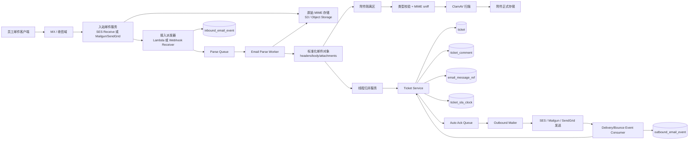
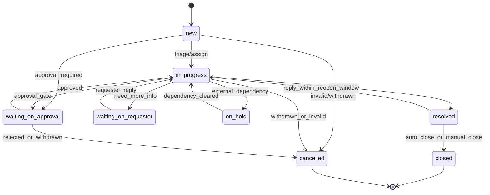

# QueueDesk Email Intake 模块完整技术设计

## 设计目标与推荐结论

你上传的产品资料已经把这个模块的边界说得很清楚：Email 是 QueueDesk MVP 的首发入口之一，系统需要支持“发邮件到 `support@company.com` 自动建单/续帖、P95 60 秒内完成处理、使用 `Message-ID / In-Reply-To / References` 做线程归并、命中 `closed` 时创建 follow-up ticket、请求人通过签名链接查看工单、附件扫描通过前不可下载、关键动作全量审计”。同时，QueueDesk 的总体技术路线被建议为“模块化单体 + 异步工作流 + 明确扩展接口”，底座是 TypeScript 后端、PostgreSQL、Redis/BullMQ、S3 兼容对象存储。这个 Email Intake 方案应完全贴合这组约束，而不是另起一套。  
（内部资料：《QueueDesk MVP 产品需求文档》L88-L125、L260-L275、L452-L455、L493-L505、L519-L523；《QueueDesk 开发与增长研究报告》L169-L211；《QueueDesk PostgreSQL 数据模型研究报告》L5-L11、L542-L579、L691-L790）

我的最终建议是：**选择“第三方收信服务 + 原始 MIME 自主解析 + 异步建单”路线，而不是自建 SMTP Server。具体默认实现建议采用 `Amazon SES Receive + S3 保存原始 MIME + Lambda/SQS 派发 + QueueDesk Worker 解析/归并/建单`。** 这样做的关键收益不是“省事”这么简单，而是三个更重要的点：第一，**把 MTA 级别的收信、MX、基础抗压与投递链路交给成熟服务**；第二，**把 QueueDesk 的核心竞争力放在“原始 MIME 标准化、线程归并、工单状态机、审计、附件安全”上**；第三，**通过保存原始 MIME，避免被某个供应商的“已解析 payload 结构”锁死**。SES 官方文档明确支持通过 Receipt Rules 把原始、未经修改的邮件保存到 S3，默认上限 40 MB；但 Lambda 收到的只是元数据和部分头部，不包含正文，所以正确架构一定是“原始邮件进 S3，业务 Worker 再去取原件解析”。SES 还明确说明收信只在支持 Email Receiving 的 AWS Region 可用，SNS 直接收原始邮件时又只有 150 KB，上大附件会退信，因此不能把 SNS 当正文通道。citeturn12view5turn13view0turn12view6turn11view3

如果你的部署环境**不在 AWS**，或者你特别偏好“HTTP 回调优先”的接入体验，那么 **Mailgun Routes + HTTP forward/raw-mime** 是更顺手的第二选择；**SendGrid Inbound Parse** 也能做，但我把它排在第三，是因为它同样能直达 Webhook、支持 raw full MIME 和签名/OAuth 校验，但其 30 MB 上限、某些运行细节，以及对解析 payload 的依赖，使它在“QueueDesk 自己掌控 MIME 解析”这件事上不如 SES 架构天然稳。Mailgun 官方文档说明 Routes 可以把命中的邮件转发到 HTTP 或暂存 3 天，并支持 HMAC 签名验证、`body-mime` 原始 MIME 模式、附件 multipart/form-data 交付，以及非 200/406 时的 8 小时重试；SendGrid 官方文档说明 Inbound Parse 可把解析后的内容和附件 POST 到指定 URL，支持 `POST the raw, full MIME message`、ECDSA/OAuth 安全策略、5xx 自动重试，以及 30 MB 的上限。citeturn12view8turn17view3turn17view1turn17view4turn18search1turn11view2turn16view3turn16view4turn11view1turn12view7turn18search0

## 整体架构

推荐把 Email Intake 做成 **“收信适配器 + 原始邮件仓库 + 异步解析 + 线程归并 + 工单写模型 + 出站回执/事件回流”** 六段式流水线。这样 QueueDesk 的 Email 能做到两个目标同时成立：一边尽快 ack provider，降低 webhook 重试和 provider 侧拥塞；另一边保留对原始 MIME 的完全控制，方便之后修复解析 bug、补建索引、重新归并线程、做法证审计。RFC 5322 明确把“传输信封”和“消息内容”视为两个层次；在工程实现上，这意味着你应该把 **SMTP envelope、头部、正文、附件、provider event** 分层存，而不是只留下一个“解析好的 JSON”。citeturn0search0turn17view4turn16view4



这套架构与 QueueDesk 已有内部建议是一致的：业务仍然保持“模块化单体 + 异步 Worker”，数据库仍然以 Ticket 为中心聚合根，附件、SLA、审计、AI 等作为围绕 Ticket 的一等对象，而 Email Intake 只是给 Ticket 写模型增加一个强约束更高的入口。  
（内部资料：《QueueDesk 开发与增长研究报告》L169-L211；《QueueDesk PostgreSQL 数据模型研究报告》L5-L11、L542-L579、L691-L790）

为了让这条链路真正可实现，我建议在现有 Ticket 模型之外新增四张 Email 专属表，并保持所有表携带 `tenant_id`：

```sql
create table inbound_email_event (
  id uuid primary key default gen_random_uuid(),
  tenant_id uuid not null,
  provider text not null,                    -- ses | mailgun | sendgrid
  provider_event_id text,
  envelope_to text not null,
  envelope_from text,
  raw_object_key text not null,
  raw_sha256 text not null,
  message_id_raw text,
  message_id_norm text,
  parse_status text not null default 'queued',
  dedupe_key text not null,
  ticket_id uuid,
  created_at timestamptz not null default now(),
  unique (tenant_id, dedupe_key)
);

create table email_message_ref (
  tenant_id uuid not null,
  message_id_norm text not null,
  direction text not null check (direction in ('inbound','outbound')),
  ticket_id uuid not null,
  comment_id uuid,
  inbound_email_event_id uuid,
  created_at timestamptz not null default now(),
  primary key (tenant_id, message_id_norm)
);

create table outbound_email_log (
  id uuid primary key default gen_random_uuid(),
  tenant_id uuid not null,
  ticket_id uuid not null,
  comment_id uuid,
  provider text not null,
  provider_message_id text,
  message_id_norm text not null,
  recipient text not null,
  subject text not null,
  send_status text not null default 'queued',
  created_at timestamptz not null default now(),
  unique (tenant_id, message_id_norm)
);

create table email_dlq (
  id uuid primary key default gen_random_uuid(),
  tenant_id uuid not null,
  inbound_email_event_id uuid,
  stage text not null,                       -- ingest | parse | thread | ticket | ack
  error_class text not null,                -- transient | permanent | malware | ambiguous
  error_code text,
  error_detail jsonb not null default '{}'::jsonb,
  replayable boolean not null default true,
  created_at timestamptz not null default now()
);
```

这里最关键的不是表名，而是三个约束。第一，**原始 MIME 永不丢**；第二，**每一个 `Message-ID` 都要有独立映射表，而不是只塞进 `ticket.source_ref`**；第三，**所有 provider 的 at-least-once 交付都统一收敛为 `dedupe_key` 幂等写入**。这和你上传的数据模型报告里“多租户强约束、`ticket_no`、`channel_ref`、`lock_version`、`attachment`、`ticket_sla_clock`”的建模方向完全一致。  
（内部资料：《QueueDesk PostgreSQL 数据模型研究报告》L5-L11、L542-L579、L691-L790）

## SMTP 接收方案

**选项 A：自建 SMTP Server。**  
这条路的最大优点，是你能在 SMTP 会话阶段拿到最完整的 envelope 上下文，也能在 `RCPT TO` / `DATA` 阶段做更细粒度的拒绝、限流、灰名单、地址路由、租户隔离和本地化策略；同时，自建对**私有化部署、政府/金融内网、完全不经过第三方邮件 SaaS** 的场景尤其重要。成熟开源 MTA 生态也确实很强：Postfix 文档覆盖 TLS、SMTPUTF8、content inspection、performance tuning、logging 等广泛主题；Haraka 是 Node.js 的高性能可插件 SMTP server；Exim 和 OpenSMTPD 也是完整的 SMTP 服务实现。也正因为这些能力面太宽，自建 SMTP 的真正成本并不在“把 25 端口监听起来”，而在 **MX/DNS 运维、TLS 证书、反垃圾/返投/环路治理、backscatter、日志与监控、IPv4/IPv6、SMTPUTF8、性能调优、异常排查** 这些长期责任上。对 QueueDesk 这种 MVP 来说，这条路不是不能走，而是**过早承担了不产生产品差异化的复杂度**。citeturn5search0turn5search1turn5search2turn5search3

**选项 B：第三方邮件服务转发。**  
这条路把“收信 MTA”的复杂度最大限度外包，只保留 QueueDesk 真正关心的几个点：原始 MIME、线程归并、Ticket 状态、附件安全、审计和回执。SendGrid 的 Inbound Parse 是“直达 URL”的 Webhook 模式，可用 raw full MIME、安全策略、5xx 自动重试，且解析后的 payload 内置 `headers/text/html/envelope/sender_ip` 等字段；Mailgun 的 Routes 支持 recipient/header/catch-all 过滤，可直接 forward 到 HTTP、支持 HMAC 校验、`body-mime/raw-mime`、附件 `multipart/form-data`，并在非 200/406 情况下按固定时间表重试；SES 更偏“云原生流水线”，通过 Receipt Rules 把邮件送到 S3 / SNS / Lambda / WorkMail / Bounce Action，其中 S3 是拿到原始 MIME 的最佳通道。citeturn16view3turn16view4turn11view1turn12view7turn18search0turn12view8turn17view0turn17view3turn18search1turn11view2turn11view3turn12view5turn12view6turn13view0

**推荐方案：QueueDesk 默认选择 Option B，并以 SES 为主实现。**  
推荐理由很直接。第一，QueueDesk 是内部服务台，不是邮件基础设施产品；你的核心价值是“把 Email 变 Ticket”，不是“自己再造一套收信 MTA”。第二，SES 的 **raw MIME on S3** 非常适合把 QueueDesk 的解析能力做成 provider-neutral：今天用 SES，明天切 Mailgun，**从 `raw.eml` 开始的后半段逻辑完全不变**。第三，SES 天然适合你上传文档里建议的技术基线：TypeScript 后端 + PostgreSQL + Redis/BullMQ + S3 兼容对象存储。第四，Mailgun 和 SendGrid 更适合做备用接入器，而不是把业务逻辑绑死在 provider 解析后的字段结构上。  
对外给客户的产品表述可以很简单：**“QueueDesk 支持托管收信模式与企业私有收信模式；SaaS 默认采用托管收信。”**  
（内部资料：《QueueDesk 开发与增长研究报告》L19-L27、L142-L144、L163-L170）

## 邮件解析与安全

Email Intake 的解析模块必须坚持一个约束：**原始 MIME 是唯一权威输入，provider 解析结果只是加速器，不是事实源。** 这件事非常重要。SES 官方明确说明保存到 S3 的是原始、未经修改的 MIME；SendGrid 明确支持 raw full MIME；Mailgun 也提供 `body-mime/raw-mime` 模式。只要把 raw MIME 作为基准，你就可以在发现解析 bug、字符集 bug、附件识别 bug、引用误判 bug 后做重放，而不必依赖 provider 曾经发给你的“被截断的 webhook 字段”。citeturn12view5turn16view4turn17view1

建议统一把解析结果规整成下面这个领域对象：

```ts
export interface NormalizedEmail {
  tenantId: string;
  provider: "ses" | "mailgun" | "sendgrid";
  rawObjectKey: string;
  rawSha256: string;

  envelope: {
    mailFrom?: string;
    rcptTo: string[];
    receivedAt: string;
    senderIp?: string;
  };

  headers: {
    from: string[];
    to: string[];
    cc: string[];
    subject?: string;
    date?: string;
    messageId?: string;
    inReplyTo: string[];
    references: string[];
    replyTo: string[];
    returnPath?: string;
    autoSubmitted?: string;
    listId?: string;
    resent: Record<string, string[]>;
    raw: Array<{ key: string; value: string }>;
  };

  body: {
    textFull?: string;
    textLatest?: string;
    htmlRaw?: string;
    htmlSanitized?: string;
    snippet?: string;
    charsetWarnings: string[];
  };

  attachments: Array<{
    fileName: string;
    contentType: string;
    contentDisposition: "inline" | "attachment" | "unknown";
    contentId?: string;
    byteSize: number;
    sha256: string;
    storageKey: string;
    status: "uploading" | "scanning" | "available" | "quarantined";
  }>;
}
```

字段提取上，必须同时保存 **头部语义字段** 和 **SMTP envelope 语义字段**。这不是重复建设，而是因为 `MAIL FROM` / `RCPT TO` 与 `From:` / `To:` 不是一回事。Mailgun 官方文档就明确区分了 `sender`（SMTP `MAIL FROM`）与 `from`（MIME `From` 头），SendGrid 的 payload 也提供 `envelope` 字段。因此 `From/To/Cc/Subject/Date/Message-ID/In-Reply-To/References/Body` 是业务必需字段，但 `envelope.from / envelope.to / sender_ip / return-path / auto-submitted / list-id` 也必须留存到 `meta`，因为这些字段在反垃圾、回执抑制、线程误判回溯、法律取证上都很关键。citeturn17view3turn16view4

HTML 到 Text 的策略不要偷懒。Mailgun 会尝试生成 `body-plain` 和 `stripped-*` 字段，SendGrid 也会给出 `text/html`，但官方都没有承诺这些派生文本就是你的业务“最终真相”；尤其 Mailgun 文档明确说明，`stripped-*` 可能因为 HTML 质量差而失败。因此，建议维护三份正文：**`textFull`、`textLatest`、`htmlSanitized`**。  
`textFull` 用于审计与法证；`textLatest` 用于线程最新回复抽取；`htmlSanitized` 用于前端安全展示。规则是：若 MIME 中存在优先级合理的 `text/plain`，它是 `textFull` 首选；否则从 HTML 安全下采样为文本；`textLatest` 再在 `textFull` 上做 quote/signature stripping。Provider 提供的 `stripped-text/stripped-html` 只能作为启发，不作为最终来源。citeturn17view4turn16view4

附件处理建议分成五个状态，与你上传的 PRD 一致：`uploading -> scanning -> available | quarantined -> deleted/expired`。落地流程是：**先写隔离区对象存储，再做 MIME sniff + 扩展名 allowlist + 字节数校验 + 杀毒，再转正式可访问区**；未通过扫描前，Ticket 可以创建，但附件只显示为“处理中”。PRD 已明确要求“默认单文件 25 MB，上限直接拒绝；所有附件必须先扫描和 MIME 校验；下载必须是短时签名链接且二次鉴权”；ClamAV 官方文档建议在 daemon 模式运行 `clamd`，并通过 `freshclam` 持续更新签名库；S3 官方文档说明预签名 URL 本质上是临时 bearer token，因此 TTL、网络路径限制和签名年龄都可以作为约束条件。citeturn12view2turn12view4  
（内部资料：《QueueDesk MVP 产品需求文档》L260-L275、L493-L494、L521-L523）

字符编码处理必须按邮件标准做，而不能简单 `Buffer.toString('utf8')`。RFC 2047 定义了头部非 ASCII 的 encoded-word 表示；RFC 6532 又把 UTF-8 头部正式带入现代邮件格式。也就是说，QueueDesk 需要同时支持：**传统 ASCII + RFC 2047 编码头、以及 RFC 6532 直接 UTF-8 头**。Python `email` 文档、Go `net/mail` 文档和 `go-message` 文档都明确围绕 RFC 5322 / 6532 / MIME 树来建模；这也是为什么我建议**解析层一定要保留原始字节、解码后 Unicode、以及 decoder warning** 三份信息。对无法解码的部分，不要 silently drop，而是带 warning 持久化。citeturn13view4turn13view5turn11view5turn11view6turn11view7

## 线程归并与工单流转

线程归并必须严格遵循 RFC 5322 的基础语义，再在此之上叠加产品规则。RFC 5322 明确指出：`In-Reply-To` 用于标识父消息，`References` 用于标识讨论线程；回复邮件一般会把父邮件 `Message-ID` 填进 `In-Reply-To`，并把父消息的 `References` 再加上父消息 `Message-ID` 形成新的 `References`。RFC 同时还特别提醒：**多父消息的 `References` 形成方式未被标准定义，尽量不要把它当成“当然可以安全自动合并”的输入。** 这给 QueueDesk 一个非常明确的实现原则：**强匹配走 `In-Reply-To`，次强匹配走 `References`，歧义不自动合并。**citeturn13view3turn14view3

我建议把归并算法设计成“**确定性、可解释、可回放**”，而不是“模糊评分 + AI 猜”。核心逻辑如下：

```ts
async function resolveTicketForInboundEmail(email: NormalizedEmail): Promise<
  | { action: "dedupe"; ticketId?: string }
  | { action: "append"; ticketId: string }
  | { action: "reopen"; ticketId: string }
  | { action: "followup"; parentTicketId: string }
  | { action: "create" }
> {
  // 1) 传输幂等：同一投递事件 / 同一 raw sha / 同一 dedupe_key 直接 no-op
  if (await existsInboundDedupe(email)) return { action: "dedupe" };

  // 2) 消息级幂等：同一 Message-ID 已入库，也视为重复
  if (email.headers.messageId && await existsMessageId(email.headers.messageId)) {
    return { action: "dedupe" };
  }

  // 3) 最强规则：In-Reply-To 命中 email_message_ref
  for (const parent of email.headers.inReplyTo) {
    const hit = await findMessageRef(parent);
    if (hit) return decideByTicketState(hit.ticketId);
  }

  // 4) 次强规则：References 从右向左回扫，命中最近祖先
  for (const ref of [...email.headers.references].reverse()) {
    const hit = await findMessageRef(ref);
    if (hit) return decideByTicketState(hit.ticketId);
  }

  // 5) 弱规则：仅在显式 ticket token 出现时允许主题/正文辅助识别
  // 例如: Subject: Re: [QD-10482] VPN 无法连接
  const ticketNo = extractTicketNoToken(email.headers.subject, email.body.textLatest);
  if (ticketNo) {
    const ticket = await findTicketByTicketNo(ticketNo);
    if (ticket) return decideByTicketState(ticket.id);
  }

  // 6) 否则新建
  return { action: "create" };
}
```

这里的 `decideByTicketState` 直接绑定 QueueDesk 已定义的 Ticket 状态机：`resolved` 可重开，`closed` 不可重开而应创建 follow-up ticket。你上传的 PRD 已经把这条规则写死了，所以实现时不要做“也许 closed 还能 reopen”的模糊逻辑。这个 Email 模块只需要忠实执行产品规则。  
（内部资料：《QueueDesk MVP 产品需求文档》L107-L125、L493-L495）



`closed` 命中新回复时的 follow-up 创建逻辑建议做成显式对象关系，而不是“复制一遍工单然后靠标题猜测关系”。我的实现建议是：新建 Ticket，写入 `parent_ticket_id`、`followup_reason='reply_to_closed_ticket'`、`source_channel='email'`，并自动插入一条系统内部备注：`"Created as follow-up to QD-10482 because inbound email matched closed ticket thread."` 同时复制必要上下文但**不复制 SLA 时钟**，因为 follow-up 是新请求，不是旧票继续计时。若要便于报表，可以再增加 `origin_thread_root_ticket_id`。  
（内部资料：《QueueDesk MVP 产品需求文档》L114-L125；《QueueDesk PostgreSQL 数据模型研究报告》L755-L790）

边缘场景需要单独说清楚。**转发邮件**通常没有可用的 `In-Reply-To/References`，或只带 `Resent-*` 字段。RFC 5322 明确说明 `Resent-*` 是信息性字段，正常回复处理仍应用原始 `From/Reply-To/Message-ID`，不能把 `Resent-*` 当线程主依据。所以 QueueDesk 对转发默认行为应是“**新建 Ticket**”；只有在主题或正文中明确出现 `[QD-12345]` 之类 Ticket token，或者附带原始 `.eml` 且成功解析出其 `Message-ID`、并与现存 Ticket 唯一命中时，才允许续帖。citeturn14view2turn14view3

**多方引用 / 多父消息**不要硬合并。RFC 5322 已经提醒多父 `References` 在标准里没有明确定义；因此当 `References` 右向左回扫命中多个不同 Ticket 时，QueueDesk 应把它判成 `ambiguous_thread`，新建 Ticket 或进入内部 `Intake Errors` 处理流，而不是把两个 Ticket 自动合并。自动 merge 两个活跃工单的代价，远大于多建一张 follow-up 的代价。citeturn14view3

**邮件组 / 自动回复**也要特殊处理。RFC 2919 把 `List-Id` 定义为标识 mailing list 的标准字段；RFC 3834 建议自动回复程序不要回应 `Auto-Submitted` 非 `no` 的邮件，并应显式标记 `Auto-Submitted: auto-replied` 来减少环路。我的建议是：若入站邮件出现 `List-Id`、`Auto-Submitted != no`、或其他明显 list/bulk 模式，则 QueueDesk 仍可建票，但默认**不发送自动回执**，并把 `intake_flags` 记为 `mailing_list` 或 `auto_generated`。citeturn13view8turn21view0turn21view1

## 邮件回执设计

回执是 QueueDesk Email Intake 的“出口契约”。产品上它至少要满足三件事：**告诉请求人 Ticket No、告诉请求人当前状态、给请求人一个安全可访问的签名链接。** 你上传的 PRD 已把这三项写成验收标准，所以这里不建议再发明复杂的“欢迎邮件”。回执应该短、稳定、可机器识别、可被未来回复继续线程化。  
（内部资料：《QueueDesk MVP 产品需求文档》L452-L455、L493-L495）

回执邮件建议由 `Outbound Mailer` 统一生成，并为每一封回执生成新的 `Message-ID`，同时把这条 `Message-ID` 写入 `email_message_ref`，因为**之后员工的回复很可能是回这封回执，而不是回原始首封邮件**。RFC 5322 说明每封邮件都应具备 `Message-ID`，回复邮件则应带上 `In-Reply-To` 和 `References`。因此，回执的头部建议如下：  
`Message-ID: <qd.ticket.<tenant>.<ticketNo>.<uuid>@mail.queuedesk.example>`  
`In-Reply-To: <original-message-id>`  
`References: <original-references...> <original-message-id>`  
`Auto-Submitted: auto-replied`  
这样做兼顾了邮箱客户端显示线程、后续回复归并、以及自动回复抑制。citeturn14view3turn21view0

请求人签名链接不要用“可逆 Ticket ID + HMAC 一把梭”的最简实现，而要做成**独立访问令牌对象**：`token_hash / ticket_id / requester_contact_id / expires_at / revoked_at / last_seen_at / issued_from_message_id`。链接本身只承载 opaque token，不暴露 `ticket_id`。成功访问后可以升级成短会话 Cookie；若安全要求更严，则做成单次魔法链接 + 刷新机制。这样既符合 PRD 对“签名链接”的要求，也便于后续做 link revoke、一次性访问、地区/IP 限制、审计追踪。  
（内部资料：《QueueDesk MVP 产品需求文档》L455、L521-L523）

建议的中文模板：

```txt
Subject: [QueueDesk #{{ticket_no}}] 已收到你的请求：{{subject_short}}

{{requester_name}}，你好：

我们已经收到你的邮件，并创建了工单。

工单编号：#{{ticket_no}}
当前状态：{{status_label}}
所属队列：{{queue_name}}
提交时间：{{submitted_at_local}}

你可以通过下面的安全链接查看进度或补充信息：
{{signed_link}}

如果你直接回复这封邮件，系统会自动把回复归并到同一工单。

此邮件由系统自动发送，请勿修改主题中的工单号。
```

建议的英文模板：

```txt
Subject: [QueueDesk #{{ticket_no}}] We received your request: {{subject_short}}

Hi {{requester_name}},

We have received your email and created a ticket.

Ticket No: #{{ticket_no}}
Current Status: {{status_label}}
Queue: {{queue_name}}
Submitted At: {{submitted_at_local}}

Use the secure link below to view progress or add more details:
{{signed_link}}

If you reply to this email, QueueDesk will attach your reply to the same ticket automatically.

This is an automated email. Please keep the ticket number in the subject.
```

有两个实现细节值得强调。第一，**回执目的地址要遵守自动回复的安全约束**。RFC 3834 认为自动响应一般应优先使用 `Return-Path` / SMTP reverse-path，而不应盲目用 `Reply-To` 或 `From`，因为这会放大邮件组、代发、自动流程的环路风险。对 QueueDesk 来说，稳妥做法是：默认对可信内部域使用 `Return-Path`，若为空、无效或检测到自动提交 / 邮件组特征，则只建单不回执。第二，**主题中必须包含稳定 Ticket token**，哪怕线程主逻辑依赖 `Message-ID`，也要保留 `[QueueDesk #12345]` 作为人工转发、手机端回邮、复制粘贴时的最后一道兜底。citeturn21view1turn21view0

## 退信、性能与可靠性

QueueDesk 的退信处理不要只做一种方式，而应同时走两条链：**provider-native delivery events** 和 **标准 DSN 解析**。前者处理 QueueDesk 自己发出去的回执、公开回复、通知邮件；后者处理系统收到的退信原文邮件。AWS SES 对外发通知的官方结构非常清楚：SNS 通知会以 JSON 形式下发 `notificationType + mail + bounce/complaint/delivery`，但不保证顺序和批次一致，所以消费者必须按 `provider_message_id` 或自定义 correlation id 幂等处理。citeturn13view1

对结构化退信分类，建议以 RFC 3464 和 RFC 3463 为准。RFC 3464 定义了 `message/delivery-status` 的机器可处理格式，典型字段包括 `Action`、`Status`、`Diagnostic-Code`、`Remote-MTA`；RFC 3463 定义了增强状态码。对 QueueDesk 来说，最实用的映射可以这样做：  
`5.1.1 -> mailbox_not_found`，表示邮箱不存在；  
`5.2.2 -> mailbox_full`，表示邮箱满；  
`5.1.2 -> domain_not_found_or_invalid_system`，表示目标域/系统不可达；  
`4.4.1 -> dns_or_host_no_answer`，表示主机无响应；  
`4.4.4 -> unable_to_route`，表示无法路由；  
`5.3.4 -> message_too_large`，表示超大邮件。  
SES 的 Bounce Action 模板本身也使用这些 SMTP reply/status code，例如 `5.1.1`、`5.3.4`。citeturn13view6turn13view7turn19view5turn19view1turn19view2turn19view3turn13view2

一个简单可落地的分类器如下：

```ts
function classifyBounce(status?: string, diagnostic?: string) {
  if (!status) return "unknown";

  if (status.startsWith("5.1.1")) return "mailbox_not_found";
  if (status.startsWith("5.2.2")) return "mailbox_full";
  if (status.startsWith("5.1.2")) return "bad_destination_system";
  if (status.startsWith("4.4.1")) return "no_answer_from_host";
  if (status.startsWith("4.4.4")) return "unable_to_route";
  if (status.startsWith("5.3.4")) return "message_too_large";

  if (diagnostic?.includes("virus")) return "content_rejected";
  return "unknown";
}
```

死信队列建议分成**基础设施 DLQ** 和 **产品可见错误队列** 两层。基础设施层面，所有 ingest/parse/thread/upsert/ack 五个阶段都应有失败重试和最终 DLQ；如果你使用 SQS，AWS 官方把 DLQ 定义为“把未成功处理的消息隔离出来，便于诊断和重放”的标准模式。产品层面，QueueDesk 还应暴露一个内部 `INTAKE_ERRORS` 工作队列，让管理员看见“这封邮件为什么没法自动入票：解析损坏、线程歧义、恶意附件、签名校验失败、租户未识别”。只有这样，Email Intake 才不是“后台默默吞异常”。citeturn12view3

性能目标已经由你的 PRD 定义为 **Email intake P95 < 60s**。要达成这一点，不要把所有事情串行做完再返回。推荐的阶段预算是：**provider 接入持久化 < 500ms，原始 MIME 落对象存储 < 1s，解析与标准化 < 5s，线程归并与工单 upsert < 2s，自动回执进入发送队列 < 1s，邮件实际发出 < 20s**。附件杀毒若耗时较长，不应阻塞工单创建；它应该只阻塞附件从 `scanning` 进入 `available`。  
（内部资料：《QueueDesk MVP 产品需求文档》L493-L495、L519-L523、L260-L275）

幂等性设计必须建立在“provider 可能重复投递、内部 worker 可能重复执行”的事实上。SendGrid 官方说明 5xx 会自动重试；Mailgun 说明除了 200/406 之外的返回码都会按预定义时间表重试；SES/SNS 的通知也不提供全局顺序保证。因此，QueueDesk 不应追求“绝对 exactly-once”，而应实现 **at-least-once delivery + idempotent upsert**。我的建议是同时使用三层幂等键：  
**传输层幂等**：`provider_event_id`，若有则优先；  
**内容层幂等**：`raw_sha256`；  
**业务层幂等**：`dedupe_key = sha256(tenant_id|provider|envelope_to|raw_sha256)`。  
Ticket 更新本身再配合 `lock_version` 做乐观锁，避免两封几乎同时到达的回复把状态和 SLA 时钟写乱。citeturn18search0turn18search1turn13view1  
（内部资料：《QueueDesk PostgreSQL 数据模型研究报告》L542-L579）

重试策略建议按错误类型拆分：  
**瞬时错误**，如 DB deadlock、对象存储短时超时、provider 429/5xx，用指数退避 `1m -> 5m -> 15m -> 1h`；  
**可恢复解析错误**，如 charset 未识别、HTML 清洗异常，允许重新用原始 MIME 重放；  
**永久错误**，如附件命中恶意样本、租户域名未绑定、签名校验失败、歧义线程冲突，则直接进入 DLQ，不做盲目重试。  
同时必须采集一组最低限度指标：`ingest_accept_latency`、`mime_parse_latency`、`thread_hit_rate`、`duplicate_rate`、`followup_create_rate`、`attachment_quarantine_rate`、`ack_send_latency`、`bounce_rate`、`dlq_depth`、`oldest_dlq_age`。这些指标会直接决定你能否证明 P95<60s 和模块可靠性。citeturn12view3turn18search0turn18search1

## ADR 与候选技术栈

下面给出一组我认为最关键、且足以指导实现的 ADR。

**ADR-A：默认不自建 SMTP，采用托管收信。**  
**状态：Accepted**  
**背景**：QueueDesk 的差异化在 Ticket 工作流、线程归并、安全与审计，不在 MTA 本身。  
**决策**：SaaS 默认采用第三方收信服务；私有化版本才考虑自建 SMTP。  
**后果**：MVP 研发速度更快，收信可靠性更高；代价是需要维护 provider adapter。citeturn12view5turn16view3turn12view8turn5search0turn5search1

**ADR-B：原始 MIME 是唯一事实源。**  
**状态：Accepted**  
**背景**：不同 provider 的解析 payload 结构不同，且会随选项变化。  
**决策**：所有入站邮件都先保存 raw MIME，再由 QueueDesk 自己解析。  
**后果**：可重放、可法证、可迁移 provider；代价是需要自建解析 Worker。citeturn12view5turn16view4turn17view1

**ADR-C：线程归并只依赖显式消息身份，不依赖 AI。**  
**状态：Accepted**  
**背景**：RFC 5322 已定义 `Message-ID / In-Reply-To / References` 的语义。  
**决策**：`In-Reply-To` 为主、`References` 为辅、Ticket No token 为兜底；主题相似度不作为自动合并主依据。  
**后果**：误合并率降低，可解释性增强；代价是某些转发邮件会多建 Ticket。citeturn13view3turn14view3

**ADR-D：`resolved` 可 reopen，`closed` 新回复必须创建 follow-up。**  
**状态：Accepted**  
**背景**：产品 PRD 已给出明确状态规则。  
**决策**：不允许对 `closed` 做 reopen；统一走新 Ticket + `parent_ticket_id`。  
**后果**：SLA 与审计口径清晰，历史 closure 稳定；代价是用户偶尔会看到“后续问题”新建一单。  
（内部资料：《QueueDesk MVP 产品需求文档》L114-L125、L493-L495）

**ADR-E：解析器要通过接口隔离，不把具体库焊死在领域层。**  
**状态：Accepted**  
**背景**：Node `mailparser` 已进入 maintenance mode；但 QueueDesk 主后端技术栈又是 TypeScript。  
**决策**：定义 `EmailParser` 抽象，底层实现可替换为 Node / Python / Go。  
**后果**：MVP 可以先快跑，后续可平滑替换解析核心；代价是初期多一层适配代码。citeturn12view0turn11view5turn11view6turn11view7

关于你指定的三种候选技术栈，我给出下面的工程判断。严格说，“Go email”不能只看 `net/mail`，因为 `net/mail` 主要覆盖 RFC 5322 头部和地址/日期读取，真正要处理 MIME 多部分、Content-Disposition、字符集和附件，通常需要配合 `go-message`。而 Python `email` 是标准库级别的完整对象模型；Node `mailparser` 则胜在与 TypeScript/NestJS 主栈贴合，但官方已经明确它处于 maintenance mode，新项目建议考虑 PostalMime。citeturn11view6turn11view7turn11view5turn12view0turn12view1

| 维度 | Node.js `mailparser` | Python `email` | Go `net/mail` + `go-message` |
|---|---|---|---|
| 与 QueueDesk 主栈贴合度 | 最高 | 中 | 中 |
| RFC/MIME 正统性 | 中上 | 最高 | 高 |
| 流式解析能力 | 高 | 中上 | 高 |
| 字符集与编码处理 | 中上 | 高 | 高 |
| 附件/多部分处理 | 高 | 高 | 高 |
| 实现复杂度 | 最低 | 低 | 中 |
| 长期维护风险 | **中高** | 低 | 低 |
| 适合作为 MVP 默认 | **是，但需接口隔离** | 是 | 取决于团队 Go 能力 |
| 适合作为高吞吐专用解析 Worker | 一般 | 好 | **最好** |

我的最终建议分两层看。**系统层面**，QueueDesk 仍应坚持你内部报告建议的 **TypeScript 模块化单体 + 异步 Worker** 路线，因此 **MVP 不要引入多语言微服务复杂度**。**邮件解析层面**，因为 `mailparser` 已经 maintenance only，所以最佳做法不是“直接在业务代码里到处调用 `simpleParser()`”，而是把它包在 `EmailParser` adapter 后面，并始终保存原始 MIME，以便未来迁移。换句话说：  
**MVP 默认方案：TypeScript Worker + `mailparser` adapter + raw MIME 永久保存。**  
**更稳的中期演进：若边缘案例增多，就把解析内核切到 Python `email` 或 Go `go-message` 专用 Worker。**  
如果你今天就愿意为“解析正确性”单独付出一点复杂度，那么在你列出的三者里，我认为 **Python `email` 是最稳的解析核心**；如果你未来面对高吞吐、多租户大附件、大规模 replay，**Go `go-message` 会是性能最漂亮的长期解法**。citeturn12view0turn11view5turn11view6turn11view7

最后给出一个最小可交付实现组合，便于直接开工：

```txt
收信：Amazon SES Receive
原件存储：S3 / S3-compatible bucket
派发：SES Lambda metadata -> SQS(Parse Queue)
后端：TypeScript / NestJS or Fastify
解析：Node mailparser adapter（接口隔离）
数据库：PostgreSQL
队列：BullMQ or SQS + worker
附件扫描：clamd + freshclam
对象访问：短时 signed URL + 二次鉴权
发送：SES Send（或沿用现有 provider）
回流事件：SES SNS bounce/delivery consumer
```

这套组合最符合 QueueDesk 当前资料里“内部服务台、Email/Form/API 首发、P95 < 60s、审计先行、模块化单体 + 异步工作流”的产品与工程边界。  
（内部资料：《QueueDesk MVP 产品需求文档》L452-L455、L493-L505、L519-L523；《QueueDesk 开发与增长研究报告》L169-L211；《QueueDesk PostgreSQL 数据模型研究报告》L5-L11）