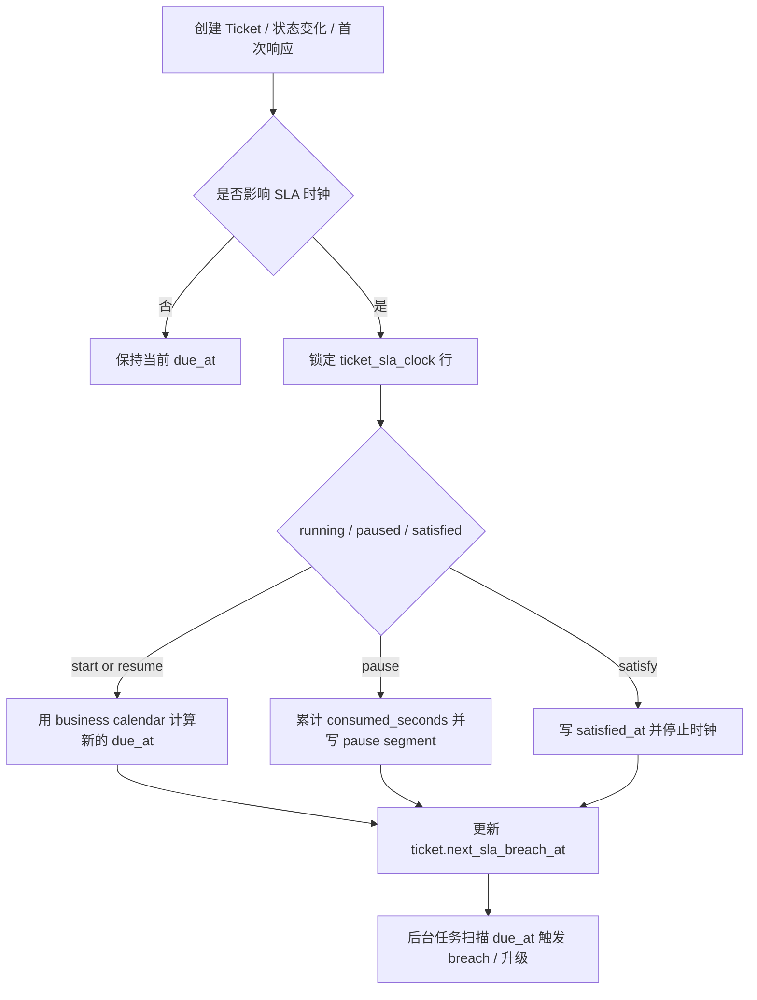
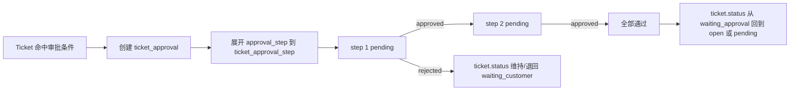

# QueueDesk PostgreSQL 数据模型研究报告

## 执行摘要

对 QueueDesk 这类 **AI-first、内部服务台、多租户 SaaS** 平台，我推荐的数据库基线是：**单库共享 schema + 全表 `tenant_id` + Row-Level Security + 复合外键强制同租户引用 + append-only 审计分区表 + `pgvector` 集成**。这条路线在 PostgreSQL 里最符合“快速迭代、统一 schema 演进、较低运维成本”的目标，同时保留向大租户专库、跨区域复制与分片扩展的迁移出口。RLS 在 PostgreSQL 中是数据库原生能力；策略在查询层执行，能对 `SELECT / INSERT / UPDATE / DELETE` 生效，但**superuser、`BYPASSRLS` 角色与表 owner 默认可绕过 RLS**，因此应用连接角色不能持有这些能力，且关键表应启用 `FORCE ROW LEVEL SECURITY`。AWS 针对 PostgreSQL SaaS 多租户的对比也把“共享表 + RLS”的 pool 模型定义为**租户数大、单租户数据量较小**时的最快 onboarding 选项；Neon 的多租户文档则说明，随着规模与合规要求提升，可以再进入 database-per-tenant 路线。citeturn7view3turn13view0turn13view2turn13view1

在数据模型层，我建议把 Ticket 作为中心聚合根，围绕它放置 `ticket_comment`、`attachment`、`ticket_label`、`ticket_sla_clock`、`ticket_approval` 和 `ticket_status_transition`。这样做的关键收益有两个：其一，**所有跨表外键都把 `tenant_id` 带上**，从关系层阻断跨租户引用；其二，**SLA 不在列表查询时实时计算**，而是在状态变更、暂停/恢复、首次响应、解决等事件上，把 `due_at / consumed_seconds / state` 持久化到 `ticket_sla_clock`，以便高频队列页和告警任务只扫 B-tree 索引。PostgreSQL 官方文档明确指出，外键引用列不会自动建索引，需要手工补齐；而多列索引的列顺序、部分索引谓词匹配、覆盖索引是否真能走 index-only scan，都直接决定高并发写入下的索引收益与写放大。citeturn8view8turn8view1turn8view0turn7view5turn17search8

搜索与 AI 检索应分层处理。工单与知识库正文建议使用 **`tsvector` + GIN** 做严格全文检索，标题与模糊搜索使用 **`pg_trgm`**；知识库和 AI 历史动作的语义召回使用 **`pgvector`**。官方文档与 pgvector README 都强调：GIN/GiST 是 PostgreSQL 全文检索的标准索引类型，`pg_trgm` 能加速 `LIKE/ILIKE/%` 与相似度查询；`pgvector` 默认做精确最近邻，近似检索主要有 **HNSW** 与 **IVFFlat** 两种，HNSW 更强召回/延迟比，但建索引更慢、占内存更大；IVFFlat 建索引更快、占内存更省，但搜索质量和延迟折中更弱。citeturn8view2turn7view4turn6view0turn6view1

审计日志不能只做“普通业务表 + update/delete 禁用”这么简单。更稳妥的设计是：**独立 schema、按时间分区、只允许 INSERT、业务表触发器写入、行级哈希链或 HMAC 签名、WAL 归档与 PITR、冷分区脱机归档**。PostgreSQL 自带的 `pgcrypto` 支持 `digest()` 与 `hmac()`；WAL 归档与 PITR 则是 PostgreSQL 官方推荐的持续归档能力。需要明确的是：**单靠同一个 PostgreSQL 集群内部的表约束与 RLS，并不能对抗超级用户或主机级权限**；因此“不可篡改”在工程上应理解为“对应用侧 append-only、对数据库侧 tamper-evident、对灾备侧可恢复可核验”，而不是绝对意义的物理不可变。citeturn7view8turn8view10turn8view11turn7view3

## 设计假设与总体决策

下表给出本文默认假设；若未来你要把 QueueDesk 升级为“按租户专库 + 区域驻留”的企业版，这些假设仍然基本成立，只是数据路由层会从“固定连接 + RLS”扩展为“tenant directory + shard/region router”。

| 项目 | 默认假设 |
|---|---|
| PostgreSQL 版本 | 以 PostgreSQL 16+ 为落地基线；引用文档为当前 PostgreSQL 18 文档 |
| 租户标识 | `UUID` |
| 时间存储 | 全部业务时间列用 `timestamptz`，统一以 UTC 保存 |
| 日历与 SLA | 工作日历单独建模，显示与计算都通过日历时区转换 |
| 多租户 | 单库共享 schema，所有租户表强制 `tenant_id` |
| 删除策略 | 业务表默认软删除：`deleted_at / deleted_by` |
| 扩展字段 | 使用 `jsonb` |
| AI 检索 | 先以 `pgvector` 为主，向量维度默认为 1536 |
| 写入特征 | 工单、评论、审计、AIAction 写入频繁，避免过度索引 |

PostgreSQL 对 date/time、`timestamptz` 和 `AT TIME ZONE` 的处理非常明确：`timestamp with time zone` 的存储与显示是分离的，跨时区显示应通过 `AT TIME ZONE` 转换；这正适合“**库内统一 UTC，业务工作时间按日历时区计算**”的服务台场景。与此同时，生成列表达式只能使用 **immutable** 函数，因此本文把 `search_tsv` 建模为**固定表达式的 stored generated column**；对于知识文章正文的 markdown 清洗，则要求应用侧预生成 `body_text`，不要在 generated column 里塞不可控的自定义清洗函数。citeturn8view5turn5search0turn8view4turn7view6

关于字段级权限，我不建议把问题简化成“直接用列级 `GRANT/REVOKE`”。PostgreSQL 的列级权限只适合**静态、粗粒度**控制，并且官方文档明确指出：**先对整表授予权限，再对某一列 revoke，并不会产生很多人直觉以为的效果**；表级 grant 仍然存在。对 QueueDesk 这类“同一 `ticket` 行里既有公开字段，又有 HR/财务/PII 敏感字段，还要按租户角色/团队/用户动态控制”的系统，更合适的做法是：**ACL 元数据表 + `security_barrier` view + 应用服务层字段裁剪**。`security_barrier` view 的语义在 PostgreSQL 文档中就是“当视图承担行级安全职责时，避免不安全函数把隐藏行值提前泄露给执行计划”。citeturn8view7turn9view2turn9view0turn9view1

最后，一个容易被忽略但很关键的建模点是：**所有租户表都应同时拥有 `PRIMARY KEY (id)` 与 `UNIQUE (tenant_id, id)`，并让外键引用后者**。原因不是为了“看起来多此一举”，而是为了在**关系层**保证“一个工单 comment 不可能挂到别的租户 ticket 下”。PostgreSQL 官方约束文档要求外键只能引用主键、唯一约束或非部分唯一索引；与此同时，PostgreSQL **不会自动为引用端外键列建索引**，所以凡是高频 join 或 cascade/校验路径上的引用列，都必须手工补索引。citeturn8view8turn4search2

## 完整 DDL 与 RLS 示例

下面给出一套可直接作为开发基线的 DDL。它刻意遵守几个原则：**核心实体完整、租户外键强约束、软删除、审计字段、`jsonb` 扩展字段、`pgvector` 向量列、RLS 示例可直接运行**。RLS 上下文通过事务级 `SET LOCAL` 注入，这与 PostgreSQL 对 session parameter / `current_setting()` / `SET LOCAL` 的官方支持方式一致。citeturn7view3turn10search1turn8view6

```sql
BEGIN;

CREATE EXTENSION IF NOT EXISTS pgcrypto;
CREATE EXTENSION IF NOT EXISTS vector;
CREATE EXTENSION IF NOT EXISTS pg_trgm;

CREATE SCHEMA IF NOT EXISTS app;
CREATE SCHEMA IF NOT EXISTS audit;

-- =========
-- Session context helpers for RLS
-- =========
CREATE OR REPLACE FUNCTION app.current_tenant_id()
RETURNS uuid
LANGUAGE sql
STABLE
AS $$
  SELECT NULLIF(current_setting('app.tenant_id', true), '')::uuid
$$;

CREATE OR REPLACE FUNCTION app.current_user_id()
RETURNS uuid
LANGUAGE sql
STABLE
AS $$
  SELECT NULLIF(current_setting('app.user_id', true), '')::uuid
$$;

CREATE OR REPLACE FUNCTION app.is_service_role()
RETURNS boolean
LANGUAGE sql
STABLE
AS $$
  SELECT COALESCE(NULLIF(current_setting('app.service_role', true), '')::boolean, false)
$$;

CREATE OR REPLACE FUNCTION app.set_updated_at()
RETURNS trigger
LANGUAGE plpgsql
AS $$
BEGIN
  NEW.updated_at = now();
  RETURN NEW;
END;
$$;

CREATE OR REPLACE FUNCTION app.bump_ticket_version()
RETURNS trigger
LANGUAGE plpgsql
AS $$
BEGIN
  NEW.updated_at := now();
  NEW.lock_version := OLD.lock_version + 1;
  RETURN NEW;
END;
$$;

-- =========
-- Enums
-- =========
CREATE TYPE tenant_status AS ENUM ('active', 'suspended', 'deleted');
CREATE TYPE user_type AS ENUM ('human', 'bot', 'service_account');
CREATE TYPE user_status AS ENUM ('invited', 'active', 'suspended', 'deleted');

CREATE TYPE team_member_role AS ENUM ('member', 'lead', 'manager');
CREATE TYPE queue_member_role AS ENUM ('agent', 'lead', 'viewer');
CREATE TYPE queue_visibility AS ENUM ('private', 'team', 'tenant');

CREATE TYPE ticket_status AS ENUM (
  'open',
  'pending',
  'waiting_approval',
  'waiting_customer',
  'resolved',
  'closed'
);

CREATE TYPE ticket_priority AS ENUM ('low', 'medium', 'high', 'urgent');
CREATE TYPE ticket_source AS ENUM ('email', 'portal', 'chat', 'api', 'system');
CREATE TYPE comment_visibility AS ENUM ('public', 'internal', 'approver_only');

CREATE TYPE sla_metric AS ENUM ('first_response', 'next_response', 'resolution');
CREATE TYPE sla_clock_state AS ENUM ('running', 'paused', 'satisfied', 'breached', 'cancelled');

CREATE TYPE approval_status AS ENUM ('pending', 'approved', 'rejected', 'cancelled');
CREATE TYPE approval_step_status AS ENUM ('pending', 'approved', 'rejected', 'skipped', 'expired', 'cancelled');
CREATE TYPE approver_type AS ENUM ('user', 'team', 'role', 'requester_manager');
CREATE TYPE approval_mode AS ENUM ('all', 'any');

CREATE TYPE field_principal_type AS ENUM ('user', 'team', 'role');
CREATE TYPE permission_effect AS ENUM ('allow', 'deny');
CREATE TYPE field_mask_type AS ENUM ('none', 'null', 'hash', 'partial');

CREATE TYPE knowledge_article_status AS ENUM ('draft', 'published', 'archived');

CREATE TYPE ai_action_type AS ENUM (
  'classify',
  'summarize',
  'suggest_reply',
  'retrieve',
  'route',
  'approval_recommendation',
  'custom'
);

CREATE TYPE ai_action_status AS ENUM ('queued', 'running', 'succeeded', 'failed', 'cancelled');

CREATE TYPE audit_action AS ENUM ('insert', 'update', 'delete', 'soft_delete', 'restore');

-- =========
-- Core tables
-- =========
CREATE TABLE tenant (
  id uuid PRIMARY KEY DEFAULT gen_random_uuid(),
  code text NOT NULL UNIQUE,
  name text NOT NULL,
  status tenant_status NOT NULL DEFAULT 'active',
  plan_code text,
  default_time_zone text NOT NULL DEFAULT 'UTC',
  data_region text NOT NULL DEFAULT 'primary',
  settings jsonb NOT NULL DEFAULT '{}'::jsonb,
  meta jsonb NOT NULL DEFAULT '{}'::jsonb,
  created_at timestamptz NOT NULL DEFAULT now(),
  updated_at timestamptz NOT NULL DEFAULT now(),
  deleted_at timestamptz,
  created_by uuid,
  updated_by uuid,
  deleted_by uuid
);

CREATE TABLE tenant_role (
  id uuid PRIMARY KEY DEFAULT gen_random_uuid(),
  tenant_id uuid NOT NULL REFERENCES tenant(id) ON DELETE RESTRICT,
  role_key text NOT NULL,
  display_name text NOT NULL,
  description text,
  meta jsonb NOT NULL DEFAULT '{}'::jsonb,
  created_at timestamptz NOT NULL DEFAULT now(),
  updated_at timestamptz NOT NULL DEFAULT now(),
  deleted_at timestamptz,
  created_by uuid,
  updated_by uuid,
  deleted_by uuid,
  CONSTRAINT uq_tenant_role_tenant_id UNIQUE (tenant_id, id)
);

CREATE TABLE app_user (
  id uuid PRIMARY KEY DEFAULT gen_random_uuid(),
  tenant_id uuid NOT NULL REFERENCES tenant(id) ON DELETE RESTRICT,
  external_ref text,
  auth_subject text,
  email text NOT NULL,
  display_name text NOT NULL,
  type user_type NOT NULL DEFAULT 'human',
  status user_status NOT NULL DEFAULT 'active',
  locale text NOT NULL DEFAULT 'zh-CN',
  time_zone text NOT NULL DEFAULT 'UTC',
  attributes jsonb NOT NULL DEFAULT '{}'::jsonb,
  meta jsonb NOT NULL DEFAULT '{}'::jsonb,
  created_at timestamptz NOT NULL DEFAULT now(),
  updated_at timestamptz NOT NULL DEFAULT now(),
  deleted_at timestamptz,
  created_by uuid,
  updated_by uuid,
  deleted_by uuid,
  CONSTRAINT uq_app_user_tenant_id UNIQUE (tenant_id, id)
);

CREATE TABLE team (
  id uuid PRIMARY KEY DEFAULT gen_random_uuid(),
  tenant_id uuid NOT NULL REFERENCES tenant(id) ON DELETE RESTRICT,
  name text NOT NULL,
  slug text NOT NULL,
  description text,
  manager_user_id uuid,
  settings jsonb NOT NULL DEFAULT '{}'::jsonb,
  meta jsonb NOT NULL DEFAULT '{}'::jsonb,
  created_at timestamptz NOT NULL DEFAULT now(),
  updated_at timestamptz NOT NULL DEFAULT now(),
  deleted_at timestamptz,
  created_by uuid,
  updated_by uuid,
  deleted_by uuid,
  CONSTRAINT uq_team_tenant_id UNIQUE (tenant_id, id),
  CONSTRAINT fk_team_manager_user
    FOREIGN KEY (tenant_id, manager_user_id)
    REFERENCES app_user(tenant_id, id)
    ON DELETE RESTRICT
);

CREATE TABLE team_member (
  id uuid PRIMARY KEY DEFAULT gen_random_uuid(),
  tenant_id uuid NOT NULL REFERENCES tenant(id) ON DELETE RESTRICT,
  team_id uuid NOT NULL,
  user_id uuid NOT NULL,
  membership_role team_member_role NOT NULL DEFAULT 'member',
  is_primary boolean NOT NULL DEFAULT false,
  meta jsonb NOT NULL DEFAULT '{}'::jsonb,
  created_at timestamptz NOT NULL DEFAULT now(),
  updated_at timestamptz NOT NULL DEFAULT now(),
  deleted_at timestamptz,
  created_by uuid,
  updated_by uuid,
  deleted_by uuid,
  CONSTRAINT uq_team_member_tenant_id UNIQUE (tenant_id, id),
  CONSTRAINT fk_team_member_team
    FOREIGN KEY (tenant_id, team_id)
    REFERENCES team(tenant_id, id)
    ON DELETE CASCADE,
  CONSTRAINT fk_team_member_user
    FOREIGN KEY (tenant_id, user_id)
    REFERENCES app_user(tenant_id, id)
    ON DELETE CASCADE
);

CREATE TABLE user_role_assignment (
  id uuid PRIMARY KEY DEFAULT gen_random_uuid(),
  tenant_id uuid NOT NULL REFERENCES tenant(id) ON DELETE RESTRICT,
  role_id uuid NOT NULL,
  user_id uuid NOT NULL,
  meta jsonb NOT NULL DEFAULT '{}'::jsonb,
  created_at timestamptz NOT NULL DEFAULT now(),
  updated_at timestamptz NOT NULL DEFAULT now(),
  deleted_at timestamptz,
  created_by uuid,
  updated_by uuid,
  deleted_by uuid,
  CONSTRAINT uq_user_role_assignment_tenant_id UNIQUE (tenant_id, id),
  CONSTRAINT fk_user_role_assignment_role
    FOREIGN KEY (tenant_id, role_id)
    REFERENCES tenant_role(tenant_id, id)
    ON DELETE CASCADE,
  CONSTRAINT fk_user_role_assignment_user
    FOREIGN KEY (tenant_id, user_id)
    REFERENCES app_user(tenant_id, id)
    ON DELETE CASCADE
);

-- =========
-- Business calendar & SLA
-- =========
CREATE TABLE business_calendar (
  id uuid PRIMARY KEY DEFAULT gen_random_uuid(),
  tenant_id uuid NOT NULL REFERENCES tenant(id) ON DELETE RESTRICT,
  name text NOT NULL,
  time_zone text NOT NULL,
  is_default boolean NOT NULL DEFAULT false,
  description text,
  meta jsonb NOT NULL DEFAULT '{}'::jsonb,
  created_at timestamptz NOT NULL DEFAULT now(),
  updated_at timestamptz NOT NULL DEFAULT now(),
  deleted_at timestamptz,
  created_by uuid,
  updated_by uuid,
  deleted_by uuid,
  CONSTRAINT uq_business_calendar_tenant_id UNIQUE (tenant_id, id)
);

CREATE TABLE business_calendar_rule (
  id uuid PRIMARY KEY DEFAULT gen_random_uuid(),
  tenant_id uuid NOT NULL REFERENCES tenant(id) ON DELETE RESTRICT,
  calendar_id uuid NOT NULL,
  day_of_week smallint NOT NULL CHECK (day_of_week BETWEEN 1 AND 7),
  start_time time NOT NULL,
  end_time time NOT NULL,
  meta jsonb NOT NULL DEFAULT '{}'::jsonb,
  created_at timestamptz NOT NULL DEFAULT now(),
  updated_at timestamptz NOT NULL DEFAULT now(),
  deleted_at timestamptz,
  created_by uuid,
  updated_by uuid,
  deleted_by uuid,
  CONSTRAINT uq_business_calendar_rule_tenant_id UNIQUE (tenant_id, id),
  CONSTRAINT fk_business_calendar_rule_calendar
    FOREIGN KEY (tenant_id, calendar_id)
    REFERENCES business_calendar(tenant_id, id)
    ON DELETE CASCADE,
  CONSTRAINT ck_business_calendar_rule_time CHECK (start_time < end_time)
);

CREATE TABLE business_calendar_holiday (
  id uuid PRIMARY KEY DEFAULT gen_random_uuid(),
  tenant_id uuid NOT NULL REFERENCES tenant(id) ON DELETE RESTRICT,
  calendar_id uuid NOT NULL,
  holiday_date date NOT NULL,
  holiday_name text NOT NULL,
  meta jsonb NOT NULL DEFAULT '{}'::jsonb,
  created_at timestamptz NOT NULL DEFAULT now(),
  updated_at timestamptz NOT NULL DEFAULT now(),
  deleted_at timestamptz,
  created_by uuid,
  updated_by uuid,
  deleted_by uuid,
  CONSTRAINT uq_business_calendar_holiday_tenant_id UNIQUE (tenant_id, id),
  CONSTRAINT fk_business_calendar_holiday_calendar
    FOREIGN KEY (tenant_id, calendar_id)
    REFERENCES business_calendar(tenant_id, id)
    ON DELETE CASCADE
);

CREATE TABLE business_calendar_exception (
  id uuid PRIMARY KEY DEFAULT gen_random_uuid(),
  tenant_id uuid NOT NULL REFERENCES tenant(id) ON DELETE RESTRICT,
  calendar_id uuid NOT NULL,
  local_date date NOT NULL,
  is_closed boolean NOT NULL DEFAULT false,
  start_time time,
  end_time time,
  note text,
  meta jsonb NOT NULL DEFAULT '{}'::jsonb,
  created_at timestamptz NOT NULL DEFAULT now(),
  updated_at timestamptz NOT NULL DEFAULT now(),
  deleted_at timestamptz,
  created_by uuid,
  updated_by uuid,
  deleted_by uuid,
  CONSTRAINT uq_business_calendar_exception_tenant_id UNIQUE (tenant_id, id),
  CONSTRAINT fk_business_calendar_exception_calendar
    FOREIGN KEY (tenant_id, calendar_id)
    REFERENCES business_calendar(tenant_id, id)
    ON DELETE CASCADE,
  CONSTRAINT ck_calendar_exception_shape CHECK (
    (is_closed = true AND start_time IS NULL AND end_time IS NULL)
    OR
    (is_closed = false AND start_time IS NOT NULL AND end_time IS NOT NULL AND start_time < end_time)
  )
);

CREATE TABLE sla_policy (
  id uuid PRIMARY KEY DEFAULT gen_random_uuid(),
  tenant_id uuid NOT NULL REFERENCES tenant(id) ON DELETE RESTRICT,
  name text NOT NULL,
  description text,
  business_calendar_id uuid NOT NULL,
  first_response_seconds integer CHECK (first_response_seconds IS NULL OR first_response_seconds >= 0),
  next_response_seconds integer CHECK (next_response_seconds IS NULL OR next_response_seconds >= 0),
  resolution_seconds integer CHECK (resolution_seconds IS NULL OR resolution_seconds >= 0),
  pause_on_statuses ticket_status[] NOT NULL
    DEFAULT ARRAY['pending','waiting_approval','waiting_customer']::ticket_status[],
  meta jsonb NOT NULL DEFAULT '{}'::jsonb,
  created_at timestamptz NOT NULL DEFAULT now(),
  updated_at timestamptz NOT NULL DEFAULT now(),
  deleted_at timestamptz,
  created_by uuid,
  updated_by uuid,
  deleted_by uuid,
  CONSTRAINT uq_sla_policy_tenant_id UNIQUE (tenant_id, id),
  CONSTRAINT fk_sla_policy_calendar
    FOREIGN KEY (tenant_id, business_calendar_id)
    REFERENCES business_calendar(tenant_id, id)
    ON DELETE RESTRICT
);

-- =========
-- Approval workflow definitions
-- =========
CREATE TABLE approval_workflow (
  id uuid PRIMARY KEY DEFAULT gen_random_uuid(),
  tenant_id uuid NOT NULL REFERENCES tenant(id) ON DELETE RESTRICT,
  name text NOT NULL,
  description text,
  version integer NOT NULL DEFAULT 1,
  is_active boolean NOT NULL DEFAULT true,
  trigger_condition jsonb NOT NULL DEFAULT '{}'::jsonb,
  meta jsonb NOT NULL DEFAULT '{}'::jsonb,
  created_at timestamptz NOT NULL DEFAULT now(),
  updated_at timestamptz NOT NULL DEFAULT now(),
  deleted_at timestamptz,
  created_by uuid,
  updated_by uuid,
  deleted_by uuid,
  CONSTRAINT uq_approval_workflow_tenant_id UNIQUE (tenant_id, id)
);

CREATE TABLE approval_step (
  id uuid PRIMARY KEY DEFAULT gen_random_uuid(),
  tenant_id uuid NOT NULL REFERENCES tenant(id) ON DELETE RESTRICT,
  workflow_id uuid NOT NULL,
  step_order integer NOT NULL CHECK (step_order > 0),
  step_name text NOT NULL,
  approver_type approver_type NOT NULL,
  approver_user_id uuid,
  approver_team_id uuid,
  approver_role_key text,
  mode approval_mode NOT NULL DEFAULT 'all',
  timeout_seconds integer CHECK (timeout_seconds IS NULL OR timeout_seconds >= 0),
  conditions jsonb NOT NULL DEFAULT '{}'::jsonb,
  meta jsonb NOT NULL DEFAULT '{}'::jsonb,
  created_at timestamptz NOT NULL DEFAULT now(),
  updated_at timestamptz NOT NULL DEFAULT now(),
  deleted_at timestamptz,
  created_by uuid,
  updated_by uuid,
  deleted_by uuid,
  CONSTRAINT uq_approval_step_tenant_id UNIQUE (tenant_id, id),
  CONSTRAINT fk_approval_step_workflow
    FOREIGN KEY (tenant_id, workflow_id)
    REFERENCES approval_workflow(tenant_id, id)
    ON DELETE CASCADE,
  CONSTRAINT fk_approval_step_user
    FOREIGN KEY (tenant_id, approver_user_id)
    REFERENCES app_user(tenant_id, id)
    ON DELETE RESTRICT,
  CONSTRAINT fk_approval_step_team
    FOREIGN KEY (tenant_id, approver_team_id)
    REFERENCES team(tenant_id, id)
    ON DELETE RESTRICT,
  CONSTRAINT ck_approval_step_approver CHECK (
    (approver_type = 'user' AND approver_user_id IS NOT NULL AND approver_team_id IS NULL AND approver_role_key IS NULL)
    OR
    (approver_type = 'team' AND approver_team_id IS NOT NULL AND approver_user_id IS NULL AND approver_role_key IS NULL)
    OR
    (approver_type = 'role' AND approver_role_key IS NOT NULL AND approver_user_id IS NULL AND approver_team_id IS NULL)
    OR
    (approver_type = 'requester_manager' AND approver_user_id IS NULL AND approver_team_id IS NULL AND approver_role_key IS NULL)
  )
);

-- =========
-- Queues, labels, tickets
-- =========
CREATE TABLE queue (
  id uuid PRIMARY KEY DEFAULT gen_random_uuid(),
  tenant_id uuid NOT NULL REFERENCES tenant(id) ON DELETE RESTRICT,
  code text NOT NULL,
  name text NOT NULL,
  description text,
  visibility queue_visibility NOT NULL DEFAULT 'team',
  owner_team_id uuid,
  default_assignee_user_id uuid,
  default_sla_policy_id uuid,
  default_approval_workflow_id uuid,
  settings jsonb NOT NULL DEFAULT '{}'::jsonb,
  meta jsonb NOT NULL DEFAULT '{}'::jsonb,
  created_at timestamptz NOT NULL DEFAULT now(),
  updated_at timestamptz NOT NULL DEFAULT now(),
  deleted_at timestamptz,
  created_by uuid,
  updated_by uuid,
  deleted_by uuid,
  CONSTRAINT uq_queue_tenant_id UNIQUE (tenant_id, id),
  CONSTRAINT fk_queue_owner_team
    FOREIGN KEY (tenant_id, owner_team_id)
    REFERENCES team(tenant_id, id)
    ON DELETE RESTRICT,
  CONSTRAINT fk_queue_default_assignee
    FOREIGN KEY (tenant_id, default_assignee_user_id)
    REFERENCES app_user(tenant_id, id)
    ON DELETE RESTRICT,
  CONSTRAINT fk_queue_default_sla_policy
    FOREIGN KEY (tenant_id, default_sla_policy_id)
    REFERENCES sla_policy(tenant_id, id)
    ON DELETE RESTRICT,
  CONSTRAINT fk_queue_default_approval_workflow
    FOREIGN KEY (tenant_id, default_approval_workflow_id)
    REFERENCES approval_workflow(tenant_id, id)
    ON DELETE RESTRICT
);

CREATE TABLE queue_member (
  id uuid PRIMARY KEY DEFAULT gen_random_uuid(),
  tenant_id uuid NOT NULL REFERENCES tenant(id) ON DELETE RESTRICT,
  queue_id uuid NOT NULL,
  user_id uuid NOT NULL,
  membership_role queue_member_role NOT NULL DEFAULT 'agent',
  meta jsonb NOT NULL DEFAULT '{}'::jsonb,
  created_at timestamptz NOT NULL DEFAULT now(),
  updated_at timestamptz NOT NULL DEFAULT now(),
  deleted_at timestamptz,
  created_by uuid,
  updated_by uuid,
  deleted_by uuid,
  CONSTRAINT uq_queue_member_tenant_id UNIQUE (tenant_id, id),
  CONSTRAINT fk_queue_member_queue
    FOREIGN KEY (tenant_id, queue_id)
    REFERENCES queue(tenant_id, id)
    ON DELETE CASCADE,
  CONSTRAINT fk_queue_member_user
    FOREIGN KEY (tenant_id, user_id)
    REFERENCES app_user(tenant_id, id)
    ON DELETE CASCADE
);

CREATE TABLE label (
  id uuid PRIMARY KEY DEFAULT gen_random_uuid(),
  tenant_id uuid NOT NULL REFERENCES tenant(id) ON DELETE RESTRICT,
  name text NOT NULL,
  color text,
  description text,
  is_system boolean NOT NULL DEFAULT false,
  meta jsonb NOT NULL DEFAULT '{}'::jsonb,
  created_at timestamptz NOT NULL DEFAULT now(),
  updated_at timestamptz NOT NULL DEFAULT now(),
  deleted_at timestamptz,
  created_by uuid,
  updated_by uuid,
  deleted_by uuid,
  CONSTRAINT uq_label_tenant_id UNIQUE (tenant_id, id)
);

CREATE TABLE ticket (
  id uuid PRIMARY KEY DEFAULT gen_random_uuid(),
  tenant_id uuid NOT NULL REFERENCES tenant(id) ON DELETE RESTRICT,
  ticket_no bigint GENERATED ALWAYS AS IDENTITY,
  queue_id uuid NOT NULL,
  requester_user_id uuid,
  reporter_user_id uuid,
  assignee_user_id uuid,
  current_approval_id uuid,
  subject text NOT NULL,
  description text,
  status ticket_status NOT NULL DEFAULT 'open',
  priority ticket_priority NOT NULL DEFAULT 'medium',
  source ticket_source NOT NULL DEFAULT 'portal',
  channel_ref text,
  waiting_reason text,
  custom_fields jsonb NOT NULL DEFAULT '{}'::jsonb,
  meta jsonb NOT NULL DEFAULT '{}'::jsonb,
  search_tsv tsvector GENERATED ALWAYS AS (
    to_tsvector('simple', coalesce(subject, '') || ' ' || coalesce(description, ''))
  ) STORED,
  next_sla_breach_at timestamptz,
  submitted_at timestamptz NOT NULL DEFAULT now(),
  first_responded_at timestamptz,
  resolved_at timestamptz,
  closed_at timestamptz,
  last_customer_reply_at timestamptz,
  last_agent_reply_at timestamptz,
  lock_version bigint NOT NULL DEFAULT 0,
  created_at timestamptz NOT NULL DEFAULT now(),
  updated_at timestamptz NOT NULL DEFAULT now(),
  deleted_at timestamptz,
  created_by uuid,
  updated_by uuid,
  deleted_by uuid,
  CONSTRAINT uq_ticket_tenant_id UNIQUE (tenant_id, id),
  CONSTRAINT uq_ticket_tenant_ticket_no UNIQUE (tenant_id, ticket_no),
  CONSTRAINT fk_ticket_queue
    FOREIGN KEY (tenant_id, queue_id)
    REFERENCES queue(tenant_id, id)
    ON DELETE RESTRICT,
  CONSTRAINT fk_ticket_requester
    FOREIGN KEY (tenant_id, requester_user_id)
    REFERENCES app_user(tenant_id, id)
    ON DELETE RESTRICT,
  CONSTRAINT fk_ticket_reporter
    FOREIGN KEY (tenant_id, reporter_user_id)
    REFERENCES app_user(tenant_id, id)
    ON DELETE RESTRICT,
  CONSTRAINT fk_ticket_assignee
    FOREIGN KEY (tenant_id, assignee_user_id)
    REFERENCES app_user(tenant_id, id)
    ON DELETE RESTRICT,
  CONSTRAINT ck_ticket_time_order CHECK (
    (resolved_at IS NULL OR resolved_at >= submitted_at)
    AND
    (closed_at IS NULL OR closed_at >= submitted_at)
  )
);

CREATE TABLE ticket_status_transition (
  id uuid PRIMARY KEY DEFAULT gen_random_uuid(),
  tenant_id uuid NOT NULL REFERENCES tenant(id) ON DELETE RESTRICT,
  ticket_id uuid NOT NULL,
  from_status ticket_status,
  to_status ticket_status NOT NULL,
  changed_by uuid,
  note text,
  meta jsonb NOT NULL DEFAULT '{}'::jsonb,
  changed_at timestamptz NOT NULL DEFAULT now(),
  created_at timestamptz NOT NULL DEFAULT now(),
  updated_at timestamptz NOT NULL DEFAULT now(),
  deleted_at timestamptz,
  created_by uuid,
  updated_by uuid,
  deleted_by uuid,
  CONSTRAINT uq_ticket_status_transition_tenant_id UNIQUE (tenant_id, id),
  CONSTRAINT fk_ticket_status_transition_ticket
    FOREIGN KEY (tenant_id, ticket_id)
    REFERENCES ticket(tenant_id, id)
    ON DELETE CASCADE,
  CONSTRAINT fk_ticket_status_transition_user
    FOREIGN KEY (tenant_id, changed_by)
    REFERENCES app_user(tenant_id, id)
    ON DELETE RESTRICT
);

CREATE TABLE ticket_comment (
  id uuid PRIMARY KEY DEFAULT gen_random_uuid(),
  tenant_id uuid NOT NULL REFERENCES tenant(id) ON DELETE RESTRICT,
  ticket_id uuid NOT NULL,
  author_user_id uuid,
  parent_comment_id uuid,
  visibility comment_visibility NOT NULL DEFAULT 'internal',
  body text NOT NULL,
  is_redacted boolean NOT NULL DEFAULT false,
  meta jsonb NOT NULL DEFAULT '{}'::jsonb,
  created_at timestamptz NOT NULL DEFAULT now(),
  updated_at timestamptz NOT NULL DEFAULT now(),
  deleted_at timestamptz,
  created_by uuid,
  updated_by uuid,
  deleted_by uuid,
  CONSTRAINT uq_ticket_comment_tenant_id UNIQUE (tenant_id, id),
  CONSTRAINT fk_ticket_comment_ticket
    FOREIGN KEY (tenant_id, ticket_id)
    REFERENCES ticket(tenant_id, id)
    ON DELETE CASCADE,
  CONSTRAINT fk_ticket_comment_author
    FOREIGN KEY (tenant_id, author_user_id)
    REFERENCES app_user(tenant_id, id)
    ON DELETE RESTRICT,
  CONSTRAINT fk_ticket_comment_parent
    FOREIGN KEY (tenant_id, parent_comment_id)
    REFERENCES ticket_comment(tenant_id, id)
    ON DELETE RESTRICT
);

CREATE TABLE knowledge_article (
  id uuid PRIMARY KEY DEFAULT gen_random_uuid(),
  tenant_id uuid NOT NULL REFERENCES tenant(id) ON DELETE RESTRICT,
  author_user_id uuid,
  title text NOT NULL,
  slug text NOT NULL,
  language_code text NOT NULL DEFAULT 'zh-CN',
  status knowledge_article_status NOT NULL DEFAULT 'draft',
  summary text,
  body_markdown text,
  body_text text NOT NULL DEFAULT '',
  search_tsv tsvector GENERATED ALWAYS AS (
    to_tsvector('simple', coalesce(title, '') || ' ' || coalesce(summary, '') || ' ' || coalesce(body_text, ''))
  ) STORED,
  embedding vector(1536),
  embedding_model text,
  embedding_updated_at timestamptz,
  published_at timestamptz,
  version integer NOT NULL DEFAULT 1,
  meta jsonb NOT NULL DEFAULT '{}'::jsonb,
  created_at timestamptz NOT NULL DEFAULT now(),
  updated_at timestamptz NOT NULL DEFAULT now(),
  deleted_at timestamptz,
  created_by uuid,
  updated_by uuid,
  deleted_by uuid,
  CONSTRAINT uq_knowledge_article_tenant_id UNIQUE (tenant_id, id),
  CONSTRAINT fk_knowledge_article_author
    FOREIGN KEY (tenant_id, author_user_id)
    REFERENCES app_user(tenant_id, id)
    ON DELETE RESTRICT
);

CREATE TABLE attachment (
  id uuid PRIMARY KEY DEFAULT gen_random_uuid(),
  tenant_id uuid NOT NULL REFERENCES tenant(id) ON DELETE RESTRICT,
  ticket_id uuid,
  comment_id uuid,
  article_id uuid,
  uploaded_by uuid,
  storage_bucket text NOT NULL,
  object_key text NOT NULL,
  file_name text NOT NULL,
  content_type text,
  byte_size bigint NOT NULL CHECK (byte_size >= 0),
  checksum_sha256 text,
  is_inline boolean NOT NULL DEFAULT false,
  meta jsonb NOT NULL DEFAULT '{}'::jsonb,
  created_at timestamptz NOT NULL DEFAULT now(),
  updated_at timestamptz NOT NULL DEFAULT now(),
  deleted_at timestamptz,
  created_by uuid,
  updated_by uuid,
  deleted_by uuid,
  CONSTRAINT uq_attachment_tenant_id UNIQUE (tenant_id, id),
  CONSTRAINT fk_attachment_ticket
    FOREIGN KEY (tenant_id, ticket_id)
    REFERENCES ticket(tenant_id, id)
    ON DELETE CASCADE,
  CONSTRAINT fk_attachment_comment
    FOREIGN KEY (tenant_id, comment_id)
    REFERENCES ticket_comment(tenant_id, id)
    ON DELETE CASCADE,
  CONSTRAINT fk_attachment_article
    FOREIGN KEY (tenant_id, article_id)
    REFERENCES knowledge_article(tenant_id, id)
    ON DELETE CASCADE,
  CONSTRAINT fk_attachment_uploaded_by
    FOREIGN KEY (tenant_id, uploaded_by)
    REFERENCES app_user(tenant_id, id)
    ON DELETE RESTRICT,
  CONSTRAINT ck_attachment_parent CHECK (num_nonnulls(ticket_id, comment_id, article_id) = 1)
);

CREATE TABLE ticket_label (
  id uuid PRIMARY KEY DEFAULT gen_random_uuid(),
  tenant_id uuid NOT NULL REFERENCES tenant(id) ON DELETE RESTRICT,
  ticket_id uuid NOT NULL,
  label_id uuid NOT NULL,
  meta jsonb NOT NULL DEFAULT '{}'::jsonb,
  created_at timestamptz NOT NULL DEFAULT now(),
  updated_at timestamptz NOT NULL DEFAULT now(),
  deleted_at timestamptz,
  created_by uuid,
  updated_by uuid,
  deleted_by uuid,
  CONSTRAINT uq_ticket_label_tenant_id UNIQUE (tenant_id, id),
  CONSTRAINT fk_ticket_label_ticket
    FOREIGN KEY (tenant_id, ticket_id)
    REFERENCES ticket(tenant_id, id)
    ON DELETE CASCADE,
  CONSTRAINT fk_ticket_label_label
    FOREIGN KEY (tenant_id, label_id)
    REFERENCES label(tenant_id, id)
    ON DELETE CASCADE
);

CREATE TABLE ticket_sla_clock (
  id uuid PRIMARY KEY DEFAULT gen_random_uuid(),
  tenant_id uuid NOT NULL REFERENCES tenant(id) ON DELETE RESTRICT,
  ticket_id uuid NOT NULL,
  policy_id uuid NOT NULL,
  business_calendar_id uuid NOT NULL,
  metric sla_metric NOT NULL,
  target_seconds integer NOT NULL CHECK (target_seconds >= 0),
  state sla_clock_state NOT NULL DEFAULT 'running',
  started_at timestamptz NOT NULL DEFAULT now(),
  last_resumed_at timestamptz NOT NULL DEFAULT now(),
  paused_at timestamptz,
  consumed_seconds bigint NOT NULL DEFAULT 0 CHECK (consumed_seconds >= 0),
  due_at timestamptz,
  breached_at timestamptz,
  satisfied_at timestamptz,
  snapshot jsonb NOT NULL DEFAULT '{}'::jsonb,
  created_at timestamptz NOT NULL DEFAULT now(),
  updated_at timestamptz NOT NULL DEFAULT now(),
  deleted_at timestamptz,
  created_by uuid,
  updated_by uuid,
  deleted_by uuid,
  CONSTRAINT uq_ticket_sla_clock_tenant_id UNIQUE (tenant_id, id),
  CONSTRAINT uq_ticket_sla_clock_ticket_metric UNIQUE (tenant_id, ticket_id, metric),
  CONSTRAINT fk_ticket_sla_clock_ticket
    FOREIGN KEY (tenant_id, ticket_id)
    REFERENCES ticket(tenant_id, id)
    ON DELETE CASCADE,
  CONSTRAINT fk_ticket_sla_clock_policy
    FOREIGN KEY (tenant_id, policy_id)
    REFERENCES sla_policy(tenant_id, id)
    ON DELETE RESTRICT,
  CONSTRAINT fk_ticket_sla_clock_calendar
    FOREIGN KEY (tenant_id, business_calendar_id)
    REFERENCES business_calendar(tenant_id, id)
    ON DELETE RESTRICT
);

CREATE TABLE ticket_sla_pause_segment (
  id uuid PRIMARY KEY DEFAULT gen_random_uuid(),
  tenant_id uuid NOT NULL REFERENCES tenant(id) ON DELETE RESTRICT,
  ticket_sla_clock_id uuid NOT NULL,
  pause_status ticket_status,
  pause_start_at timestamptz NOT NULL,
  resumed_at timestamptz,
  note text,
  meta jsonb NOT NULL DEFAULT '{}'::jsonb,
  created_at timestamptz NOT NULL DEFAULT now(),
  updated_at timestamptz NOT NULL DEFAULT now(),
  deleted_at timestamptz,
  created_by uuid,
  updated_by uuid,
  deleted_by uuid,
  CONSTRAINT uq_ticket_sla_pause_segment_tenant_id UNIQUE (tenant_id, id),
  CONSTRAINT fk_ticket_sla_pause_segment_clock
    FOREIGN KEY (tenant_id, ticket_sla_clock_id)
    REFERENCES ticket_sla_clock(tenant_id, id)
    ON DELETE CASCADE,
  CONSTRAINT ck_ticket_sla_pause_segment_time CHECK (
    resumed_at IS NULL OR resumed_at >= pause_start_at
  )
);

CREATE TABLE ticket_approval (
  id uuid PRIMARY KEY DEFAULT gen_random_uuid(),
  tenant_id uuid NOT NULL REFERENCES tenant(id) ON DELETE RESTRICT,
  ticket_id uuid NOT NULL,
  workflow_id uuid NOT NULL,
  status approval_status NOT NULL DEFAULT 'pending',
  current_step_order integer,
  requested_by uuid,
  requested_at timestamptz NOT NULL DEFAULT now(),
  decided_at timestamptz,
  final_decider_user_id uuid,
  reason text,
  meta jsonb NOT NULL DEFAULT '{}'::jsonb,
  created_at timestamptz NOT NULL DEFAULT now(),
  updated_at timestamptz NOT NULL DEFAULT now(),
  deleted_at timestamptz,
  created_by uuid,
  updated_by uuid,
  deleted_by uuid,
  CONSTRAINT uq_ticket_approval_tenant_id UNIQUE (tenant_id, id),
  CONSTRAINT fk_ticket_approval_ticket
    FOREIGN KEY (tenant_id, ticket_id)
    REFERENCES ticket(tenant_id, id)
    ON DELETE CASCADE,
  CONSTRAINT fk_ticket_approval_workflow
    FOREIGN KEY (tenant_id, workflow_id)
    REFERENCES approval_workflow(tenant_id, id)
    ON DELETE RESTRICT,
  CONSTRAINT fk_ticket_approval_requested_by
    FOREIGN KEY (tenant_id, requested_by)
    REFERENCES app_user(tenant_id, id)
    ON DELETE RESTRICT,
  CONSTRAINT fk_ticket_approval_final_decider
    FOREIGN KEY (tenant_id, final_decider_user_id)
    REFERENCES app_user(tenant_id, id)
    ON DELETE RESTRICT
);

CREATE TABLE ticket_approval_step (
  id uuid PRIMARY KEY DEFAULT gen_random_uuid(),
  tenant_id uuid NOT NULL REFERENCES tenant(id) ON DELETE RESTRICT,
  ticket_approval_id uuid NOT NULL,
  workflow_step_id uuid NOT NULL,
  step_order integer NOT NULL,
  approver_user_id uuid,
  approver_team_id uuid,
  status approval_step_status NOT NULL DEFAULT 'pending',
  decided_by uuid,
  decided_at timestamptz,
  comment text,
  meta jsonb NOT NULL DEFAULT '{}'::jsonb,
  created_at timestamptz NOT NULL DEFAULT now(),
  updated_at timestamptz NOT NULL DEFAULT now(),
  deleted_at timestamptz,
  created_by uuid,
  updated_by uuid,
  deleted_by uuid,
  CONSTRAINT uq_ticket_approval_step_tenant_id UNIQUE (tenant_id, id),
  CONSTRAINT fk_ticket_approval_step_approval
    FOREIGN KEY (tenant_id, ticket_approval_id)
    REFERENCES ticket_approval(tenant_id, id)
    ON DELETE CASCADE,
  CONSTRAINT fk_ticket_approval_step_workflow_step
    FOREIGN KEY (tenant_id, workflow_step_id)
    REFERENCES approval_step(tenant_id, id)
    ON DELETE RESTRICT,
  CONSTRAINT fk_ticket_approval_step_approver_user
    FOREIGN KEY (tenant_id, approver_user_id)
    REFERENCES app_user(tenant_id, id)
    ON DELETE RESTRICT,
  CONSTRAINT fk_ticket_approval_step_approver_team
    FOREIGN KEY (tenant_id, approver_team_id)
    REFERENCES team(tenant_id, id)
    ON DELETE RESTRICT,
  CONSTRAINT fk_ticket_approval_step_decided_by
    FOREIGN KEY (tenant_id, decided_by)
    REFERENCES app_user(tenant_id, id)
    ON DELETE RESTRICT
);

ALTER TABLE ticket
  ADD CONSTRAINT fk_ticket_current_approval
  FOREIGN KEY (tenant_id, current_approval_id)
  REFERENCES ticket_approval(tenant_id, id)
  ON DELETE RESTRICT;

CREATE TABLE field_permission (
  id uuid PRIMARY KEY DEFAULT gen_random_uuid(),
  tenant_id uuid NOT NULL REFERENCES tenant(id) ON DELETE RESTRICT,
  resource_name text NOT NULL,     -- e.g. 'ticket', 'knowledge_article'
  field_name text NOT NULL,        -- e.g. 'description', 'custom_fields.salary'
  principal_type field_principal_type NOT NULL,
  principal_id uuid,
  role_key text,
  effect permission_effect NOT NULL DEFAULT 'allow',
  can_read boolean NOT NULL DEFAULT true,
  can_write boolean NOT NULL DEFAULT false,
  mask_type field_mask_type NOT NULL DEFAULT 'none',
  condition_expr text,
  priority integer NOT NULL DEFAULT 100,
  meta jsonb NOT NULL DEFAULT '{}'::jsonb,
  created_at timestamptz NOT NULL DEFAULT now(),
  updated_at timestamptz NOT NULL DEFAULT now(),
  deleted_at timestamptz,
  created_by uuid,
  updated_by uuid,
  deleted_by uuid,
  CONSTRAINT uq_field_permission_tenant_id UNIQUE (tenant_id, id),
  CONSTRAINT ck_field_permission_principal CHECK (
    (principal_type = 'role' AND principal_id IS NULL AND role_key IS NOT NULL)
    OR
    (principal_type IN ('user','team') AND principal_id IS NOT NULL AND role_key IS NULL)
  )
);

CREATE TABLE ai_action (
  id uuid PRIMARY KEY DEFAULT gen_random_uuid(),
  tenant_id uuid NOT NULL REFERENCES tenant(id) ON DELETE RESTRICT,
  ticket_id uuid,
  article_id uuid,
  target_type text NOT NULL,
  target_id uuid NOT NULL,
  action_type ai_action_type NOT NULL,
  status ai_action_status NOT NULL DEFAULT 'queued',
  provider text,
  model_name text,
  prompt_version text,
  input_text text,
  output_text text,
  input_payload jsonb NOT NULL DEFAULT '{}'::jsonb,
  output_payload jsonb NOT NULL DEFAULT '{}'::jsonb,
  embedding vector(1536),
  input_tokens integer CHECK (input_tokens IS NULL OR input_tokens >= 0),
  output_tokens integer CHECK (output_tokens IS NULL OR output_tokens >= 0),
  latency_ms integer CHECK (latency_ms IS NULL OR latency_ms >= 0),
  cost_usd numeric(12, 6) CHECK (cost_usd IS NULL OR cost_usd >= 0),
  requested_by uuid,
  completed_at timestamptz,
  meta jsonb NOT NULL DEFAULT '{}'::jsonb,
  created_at timestamptz NOT NULL DEFAULT now(),
  updated_at timestamptz NOT NULL DEFAULT now(),
  deleted_at timestamptz,
  created_by uuid,
  updated_by uuid,
  deleted_by uuid,
  CONSTRAINT uq_ai_action_tenant_id UNIQUE (tenant_id, id),
  CONSTRAINT fk_ai_action_ticket
    FOREIGN KEY (tenant_id, ticket_id)
    REFERENCES ticket(tenant_id, id)
    ON DELETE RESTRICT,
  CONSTRAINT fk_ai_action_article
    FOREIGN KEY (tenant_id, article_id)
    REFERENCES knowledge_article(tenant_id, id)
    ON DELETE RESTRICT,
  CONSTRAINT fk_ai_action_requested_by
    FOREIGN KEY (tenant_id, requested_by)
    REFERENCES app_user(tenant_id, id)
    ON DELETE RESTRICT,
  CONSTRAINT ck_ai_action_target_parent CHECK (num_nonnulls(ticket_id, article_id) <= 1)
);

-- =========
-- Baseline indexes
-- =========
CREATE UNIQUE INDEX ux_tenant_role_key_active
  ON tenant_role (tenant_id, role_key)
  WHERE deleted_at IS NULL;

CREATE UNIQUE INDEX ux_app_user_email_active
  ON app_user (tenant_id, lower(email))
  WHERE deleted_at IS NULL;

CREATE UNIQUE INDEX ux_app_user_auth_subject_active
  ON app_user (tenant_id, auth_subject)
  WHERE auth_subject IS NOT NULL AND deleted_at IS NULL;

CREATE UNIQUE INDEX ux_team_slug_active
  ON team (tenant_id, slug)
  WHERE deleted_at IS NULL;

CREATE UNIQUE INDEX ux_team_member_active
  ON team_member (tenant_id, team_id, user_id)
  WHERE deleted_at IS NULL;

CREATE UNIQUE INDEX ux_user_role_assignment_active
  ON user_role_assignment (tenant_id, role_id, user_id)
  WHERE deleted_at IS NULL;

CREATE UNIQUE INDEX ux_business_calendar_default_active
  ON business_calendar (tenant_id)
  WHERE is_default = true AND deleted_at IS NULL;

CREATE UNIQUE INDEX ux_business_calendar_rule_active
  ON business_calendar_rule (tenant_id, calendar_id, day_of_week, start_time, end_time)
  WHERE deleted_at IS NULL;

CREATE UNIQUE INDEX ux_business_calendar_holiday_active
  ON business_calendar_holiday (tenant_id, calendar_id, holiday_date)
  WHERE deleted_at IS NULL;

CREATE INDEX ix_business_calendar_exception_lookup
  ON business_calendar_exception (tenant_id, calendar_id, local_date, is_closed)
  WHERE deleted_at IS NULL;

CREATE UNIQUE INDEX ux_sla_policy_name_active
  ON sla_policy (tenant_id, name)
  WHERE deleted_at IS NULL;

CREATE UNIQUE INDEX ux_approval_workflow_name_version_active
  ON approval_workflow (tenant_id, name, version)
  WHERE deleted_at IS NULL;

CREATE UNIQUE INDEX ux_approval_step_order_active
  ON approval_step (tenant_id, workflow_id, step_order)
  WHERE deleted_at IS NULL;

CREATE UNIQUE INDEX ux_queue_code_active
  ON queue (tenant_id, code)
  WHERE deleted_at IS NULL;

CREATE UNIQUE INDEX ux_queue_member_active
  ON queue_member (tenant_id, queue_id, user_id)
  WHERE deleted_at IS NULL;

CREATE UNIQUE INDEX ux_label_name_active
  ON label (tenant_id, name)
  WHERE deleted_at IS NULL;

CREATE INDEX ix_ticket_queue_status_created
  ON ticket (tenant_id, queue_id, status, created_at DESC)
  WHERE deleted_at IS NULL;

CREATE INDEX ix_ticket_assignee_status_updated
  ON ticket (tenant_id, assignee_user_id, status, updated_at DESC)
  WHERE deleted_at IS NULL;

CREATE INDEX ix_ticket_next_breach_active
  ON ticket (tenant_id, next_sla_breach_at, created_at DESC)
  WHERE deleted_at IS NULL
    AND status IN ('open', 'pending', 'waiting_approval', 'waiting_customer');

CREATE INDEX ix_ticket_queue_status_cover
  ON ticket (tenant_id, queue_id, status, next_sla_breach_at, created_at DESC)
  INCLUDE (ticket_no, priority, assignee_user_id, requester_user_id, subject)
  WHERE deleted_at IS NULL;

CREATE INDEX ix_ticket_search_tsv
  ON ticket USING GIN (search_tsv)
  WHERE deleted_at IS NULL;

CREATE INDEX ix_ticket_subject_trgm
  ON ticket USING GIN (subject gin_trgm_ops)
  WHERE deleted_at IS NULL;

CREATE INDEX ix_ticket_status_transition_ticket_time
  ON ticket_status_transition (tenant_id, ticket_id, changed_at DESC)
  WHERE deleted_at IS NULL;

CREATE INDEX ix_ticket_comment_ticket_time
  ON ticket_comment (tenant_id, ticket_id, created_at ASC)
  WHERE deleted_at IS NULL;

CREATE INDEX ix_attachment_ticket
  ON attachment (tenant_id, ticket_id, created_at DESC)
  WHERE deleted_at IS NULL;

CREATE INDEX ix_attachment_comment
  ON attachment (tenant_id, comment_id, created_at DESC)
  WHERE deleted_at IS NULL;

CREATE INDEX ix_attachment_article
  ON attachment (tenant_id, article_id, created_at DESC)
  WHERE deleted_at IS NULL;

CREATE UNIQUE INDEX ux_ticket_label_active
  ON ticket_label (tenant_id, ticket_id, label_id)
  WHERE deleted_at IS NULL;

CREATE INDEX ix_ticket_sla_clock_due_active
  ON ticket_sla_clock (tenant_id, state, due_at)
  WHERE deleted_at IS NULL
    AND state = 'running';

CREATE INDEX ix_ticket_sla_clock_ticket
  ON ticket_sla_clock (tenant_id, ticket_id, metric)
  WHERE deleted_at IS NULL;

CREATE INDEX ix_ticket_sla_pause_segment_clock
  ON ticket_sla_pause_segment (tenant_id, ticket_sla_clock_id, pause_start_at DESC)
  WHERE deleted_at IS NULL;

CREATE INDEX ix_ticket_approval_ticket_status
  ON ticket_approval (tenant_id, ticket_id, status, requested_at DESC)
  WHERE deleted_at IS NULL;

CREATE UNIQUE INDEX ux_ticket_approval_step_order_active
  ON ticket_approval_step (tenant_id, ticket_approval_id, step_order)
  WHERE deleted_at IS NULL;

CREATE INDEX ix_field_permission_lookup
  ON field_permission (tenant_id, resource_name, field_name, principal_type, priority DESC)
  WHERE deleted_at IS NULL;

CREATE UNIQUE INDEX ux_knowledge_article_slug_active
  ON knowledge_article (tenant_id, slug)
  WHERE deleted_at IS NULL;

CREATE INDEX ix_knowledge_article_search_tsv
  ON knowledge_article USING GIN (search_tsv)
  WHERE deleted_at IS NULL
    AND status = 'published';

CREATE INDEX ix_knowledge_article_title_trgm
  ON knowledge_article USING GIN (title gin_trgm_ops)
  WHERE deleted_at IS NULL;

CREATE INDEX ix_ai_action_target
  ON ai_action (tenant_id, target_type, target_id, created_at DESC)
  WHERE deleted_at IS NULL;

CREATE INDEX ix_ai_action_status_created
  ON ai_action (tenant_id, status, created_at DESC)
  WHERE deleted_at IS NULL;

-- =========
-- Audit log: append-only, partitioned
-- =========
CREATE TABLE audit.audit_log (
  audit_id bigint GENERATED ALWAYS AS IDENTITY,
  occurred_at timestamptz NOT NULL DEFAULT now(),
  tenant_id uuid,
  actor_user_id uuid,
  db_role name NOT NULL DEFAULT session_user,
  txid bigint NOT NULL DEFAULT txid_current(),
  trace_id text,
  request_id uuid,
  client_addr inet,
  user_agent text,
  action audit_action NOT NULL,
  entity_type text NOT NULL,
  entity_id uuid,
  entity_pk jsonb NOT NULL DEFAULT '{}'::jsonb,
  changed_fields text[] NOT NULL DEFAULT ARRAY[]::text[],
  before_data jsonb,
  after_data jsonb,
  payload jsonb NOT NULL DEFAULT '{}'::jsonb,
  prev_row_hash bytea,
  row_hash bytea NOT NULL,
  hmac_sig bytea,
  PRIMARY KEY (occurred_at, audit_id)
) PARTITION BY RANGE (occurred_at);

CREATE TABLE audit.audit_log_default
  PARTITION OF audit.audit_log DEFAULT;

CREATE INDEX ix_audit_log_tenant_time
  ON audit.audit_log (tenant_id, occurred_at DESC);

CREATE INDEX ix_audit_log_entity_time
  ON audit.audit_log (tenant_id, entity_type, entity_id, occurred_at DESC);

CREATE INDEX ix_audit_log_action_time
  ON audit.audit_log (tenant_id, action, occurred_at DESC);

CREATE INDEX ix_audit_log_default_brin_time
  ON audit.audit_log_default USING BRIN (occurred_at);

CREATE OR REPLACE FUNCTION audit.jsonb_changed_keys(p_old jsonb, p_new jsonb)
RETURNS text[]
LANGUAGE sql
IMMUTABLE
AS $$
  SELECT COALESCE(array_agg(k ORDER BY k), ARRAY[]::text[])
  FROM (
    SELECT keys.key AS k
    FROM jsonb_object_keys(COALESCE(p_old, '{}'::jsonb) || COALESCE(p_new, '{}'::jsonb)) AS keys(key)
    WHERE COALESCE(p_old -> keys.key, 'null'::jsonb) IS DISTINCT FROM COALESCE(p_new -> keys.key, 'null'::jsonb)
  ) s
$$;

CREATE OR REPLACE FUNCTION audit.log_row_change()
RETURNS trigger
LANGUAGE plpgsql
SECURITY DEFINER
SET search_path = pg_catalog, public, app, audit
AS $$
DECLARE
  v_old jsonb;
  v_new jsonb;
  v_tenant uuid;
  v_entity_id uuid;
  v_action audit_action;
  v_payload jsonb;
  v_prev bytea;
  v_request_id uuid;
BEGIN
  IF TG_TABLE_SCHEMA = 'audit' THEN
    RETURN COALESCE(NEW, OLD);
  END IF;

  v_old := CASE WHEN TG_OP IN ('UPDATE', 'DELETE') THEN to_jsonb(OLD) END;
  v_new := CASE WHEN TG_OP IN ('INSERT', 'UPDATE') THEN to_jsonb(NEW) END;

  v_tenant := COALESCE((v_new ->> 'tenant_id')::uuid, (v_old ->> 'tenant_id')::uuid);
  v_entity_id := COALESCE((v_new ->> 'id')::uuid, (v_old ->> 'id')::uuid);
  v_request_id := NULLIF(current_setting('app.request_id', true), '')::uuid;

  v_action := CASE
    WHEN TG_OP = 'INSERT' THEN 'insert'
    WHEN TG_OP = 'DELETE' THEN 'delete'
    WHEN TG_OP = 'UPDATE' AND (v_old ? 'deleted_at') AND (v_old ->> 'deleted_at') IS NULL AND (v_new ->> 'deleted_at') IS NOT NULL THEN 'soft_delete'
    WHEN TG_OP = 'UPDATE' AND (v_old ? 'deleted_at') AND (v_old ->> 'deleted_at') IS NOT NULL AND (v_new ->> 'deleted_at') IS NULL THEN 'restore'
    ELSE 'update'
  END;

  v_payload := jsonb_build_object(
    'schema', TG_TABLE_SCHEMA,
    'table', TG_TABLE_NAME,
    'op', TG_OP,
    'tenant_id', v_tenant,
    'actor_user_id', app.current_user_id(),
    'before', v_old,
    'after', v_new,
    'changed_fields', audit.jsonb_changed_keys(v_old, v_new),
    'timestamp', now()
  );

  PERFORM pg_advisory_xact_lock(hashtextextended(COALESCE(v_tenant::text, 'system'), 0));

  SELECT row_hash
    INTO v_prev
  FROM audit.audit_log
  WHERE tenant_id IS NOT DISTINCT FROM v_tenant
  ORDER BY occurred_at DESC, audit_id DESC
  LIMIT 1;

  INSERT INTO audit.audit_log (
    tenant_id,
    actor_user_id,
    trace_id,
    request_id,
    client_addr,
    user_agent,
    action,
    entity_type,
    entity_id,
    entity_pk,
    changed_fields,
    before_data,
    after_data,
    payload,
    prev_row_hash,
    row_hash,
    hmac_sig
  )
  VALUES (
    v_tenant,
    app.current_user_id(),
    current_setting('app.trace_id', true),
    v_request_id,
    inet_client_addr(),
    current_setting('app.user_agent', true),
    v_action,
    TG_TABLE_NAME,
    v_entity_id,
    jsonb_build_object('tenant_id', v_tenant, 'id', v_entity_id),
    audit.jsonb_changed_keys(v_old, v_new),
    v_old,
    v_new,
    v_payload,
    v_prev,
    digest(COALESCE(encode(v_prev, 'hex'), '') || v_payload::text, 'sha256'),
    CASE
      WHEN NULLIF(current_setting('app.audit_hmac_key', true), '') IS NULL THEN NULL
      ELSE hmac(
        COALESCE(encode(v_prev, 'hex'), '') || v_payload::text,
        current_setting('app.audit_hmac_key', true),
        'sha256'
      )
    END
  );

  RETURN COALESCE(NEW, OLD);
END;
$$;

CREATE OR REPLACE FUNCTION audit.raise_immutable()
RETURNS trigger
LANGUAGE plpgsql
AS $$
BEGIN
  RAISE EXCEPTION 'audit.audit_log is append-only';
END;
$$;

CREATE TRIGGER trg_audit_log_immutable
  BEFORE UPDATE OR DELETE
  ON audit.audit_log
  FOR EACH ROW
  EXECUTE FUNCTION audit.raise_immutable();

-- =========
-- Triggers
-- =========
CREATE OR REPLACE FUNCTION app.log_ticket_status_transition()
RETURNS trigger
LANGUAGE plpgsql
AS $$
BEGIN
  IF NEW.status IS DISTINCT FROM OLD.status THEN
    INSERT INTO ticket_status_transition (
      tenant_id,
      ticket_id,
      from_status,
      to_status,
      changed_by,
      note,
      meta,
      created_by,
      updated_by
    )
    VALUES (
      NEW.tenant_id,
      NEW.id,
      OLD.status,
      NEW.status,
      app.current_user_id(),
      current_setting('app.status_note', true),
      '{}'::jsonb,
      app.current_user_id(),
      app.current_user_id()
    );
  END IF;

  RETURN NEW;
END;
$$;

CREATE TRIGGER trg_ticket_bump_version
  BEFORE UPDATE
  ON ticket
  FOR EACH ROW
  EXECUTE FUNCTION app.bump_ticket_version();

CREATE TRIGGER trg_ticket_status_transition
  AFTER UPDATE OF status
  ON ticket
  FOR EACH ROW
  EXECUTE FUNCTION app.log_ticket_status_transition();

DO $$
DECLARE
  t text;
BEGIN
  FOREACH t IN ARRAY ARRAY[
    'tenant',
    'tenant_role',
    'app_user',
    'team',
    'team_member',
    'user_role_assignment',
    'business_calendar',
    'business_calendar_rule',
    'business_calendar_holiday',
    'business_calendar_exception',
    'sla_policy',
    'approval_workflow',
    'approval_step',
    'queue',
    'queue_member',
    'label',
    'ticket_status_transition',
    'ticket_comment',
    'knowledge_article',
    'attachment',
    'ticket_label',
    'ticket_sla_clock',
    'ticket_sla_pause_segment',
    'ticket_approval',
    'ticket_approval_step',
    'field_permission',
    'ai_action'
  ]
  LOOP
    EXECUTE format(
      'CREATE TRIGGER trg_%I_set_updated_at
         BEFORE UPDATE ON public.%I
         FOR EACH ROW
         EXECUTE FUNCTION app.set_updated_at();',
      t, t
    );
  END LOOP;
END $$;

DO $$
DECLARE
  t text;
BEGIN
  FOREACH t IN ARRAY ARRAY[
    'tenant_role',
    'app_user',
    'team',
    'team_member',
    'user_role_assignment',
    'business_calendar',
    'business_calendar_rule',
    'business_calendar_holiday',
    'business_calendar_exception',
    'sla_policy',
    'approval_workflow',
    'approval_step',
    'queue',
    'queue_member',
    'label',
    'ticket',
    'ticket_status_transition',
    'ticket_comment',
    'knowledge_article',
    'attachment',
    'ticket_label',
    'ticket_sla_clock',
    'ticket_sla_pause_segment',
    'ticket_approval',
    'ticket_approval_step',
    'field_permission',
    'ai_action'
  ]
  LOOP
    EXECUTE format(
      'CREATE TRIGGER trg_audit_%I
         AFTER INSERT OR UPDATE OR DELETE
         ON public.%I
         FOR EACH ROW
         EXECUTE FUNCTION audit.log_row_change();',
      t, t
    );
  END LOOP;
END $$;

-- =========
-- RLS
-- =========
ALTER TABLE tenant ENABLE ROW LEVEL SECURITY;
ALTER TABLE tenant FORCE ROW LEVEL SECURITY;

CREATE POLICY tenant_isolation
  ON tenant
  FOR ALL
  USING (id = app.current_tenant_id())
  WITH CHECK (id = app.current_tenant_id());

DO $$
DECLARE
  t text;
BEGIN
  FOREACH t IN ARRAY ARRAY[
    'tenant_role',
    'app_user',
    'team',
    'team_member',
    'user_role_assignment',
    'business_calendar',
    'business_calendar_rule',
    'business_calendar_holiday',
    'business_calendar_exception',
    'sla_policy',
    'approval_workflow',
    'approval_step',
    'queue',
    'queue_member',
    'label',
    'ticket',
    'ticket_status_transition',
    'ticket_comment',
    'knowledge_article',
    'attachment',
    'ticket_label',
    'ticket_sla_clock',
    'ticket_sla_pause_segment',
    'ticket_approval',
    'ticket_approval_step',
    'field_permission',
    'ai_action'
  ]
  LOOP
    EXECUTE format('ALTER TABLE public.%I ENABLE ROW LEVEL SECURITY;', t);
    EXECUTE format('ALTER TABLE public.%I FORCE ROW LEVEL SECURITY;', t);
    EXECUTE format(
      'CREATE POLICY %I ON public.%I
         FOR ALL
         USING (tenant_id = app.current_tenant_id())
         WITH CHECK (tenant_id = app.current_tenant_id());',
      t || '_tenant_policy',
      t
    );
  END LOOP;
END $$;

ALTER TABLE audit.audit_log ENABLE ROW LEVEL SECURITY;
ALTER TABLE audit.audit_log FORCE ROW LEVEL SECURITY;

CREATE POLICY audit_log_select_policy
  ON audit.audit_log
  FOR SELECT
  USING (
    app.is_service_role()
    OR tenant_id = app.current_tenant_id()
  );

CREATE POLICY audit_log_insert_policy
  ON audit.audit_log
  FOR INSERT
  WITH CHECK (true);

REVOKE UPDATE, DELETE ON audit.audit_log FROM PUBLIC;
REVOKE UPDATE, DELETE ON audit.audit_log_default FROM PUBLIC;

COMMIT;
```

如果你的连接池采用事务池模式，建议每个业务事务进入时都显式注入上下文，而不是依赖 session 常驻变量。原因是 PostgreSQL 官方文档对 `SET LOCAL` 的语义非常清楚：它只在当前事务生效，事务结束即失效；这正适合连接池重复利用连接时避免“上个租户上下文泄漏到下个请求”。citeturn8view6turn10search1

```sql
BEGIN;
SET LOCAL app.tenant_id = '11111111-1111-1111-1111-111111111111';
SET LOCAL app.user_id   = '22222222-2222-2222-2222-222222222222';
SET LOCAL app.service_role = 'false';
SET LOCAL app.request_id = '33333333-3333-3333-3333-333333333333';
SET LOCAL app.trace_id = 'trace-abc-001';
SET LOCAL app.user_agent = 'queuedesk-api/1.0';

SELECT ticket_no, subject, status
FROM ticket
WHERE queue_id = '44444444-4444-4444-4444-444444444444'
ORDER BY created_at DESC
LIMIT 20;

COMMIT;
```

这套 DDL 里有两个需要特别解释的“非教科书化”选择。第一，`ticket.search_tsv` 和 `knowledge_article.search_tsv` 采用 **stored generated column**，目的是让全文索引在写入时就固定下来，而不是每次查询临时 `to_tsvector()`；官方文档明确给出了这种模式。第二，字段级权限并没有直接写成数据库列权限，而是建成 `field_permission` 元数据表，因为 PostgreSQL 原生列权限更适合静态授权，QueueDesk 的字段级权限本质上是**租户态、角色态、甚至 team/user 态的策略系统**。citeturn7view6turn8view7turn9view0turn9view1

## 多租户隔离策略与迁移路径

PostgreSQL 并没有“官方唯一正确”的 SaaS 租户隔离模型；现实里通常是 **shared schema + RLS**、**schema-per-tenant**、**database-per-tenant** 三种路线。PostgreSQL 官方文档只定义了 RLS、schema、database、logical replication 等底层能力；对 PostgreSQL SaaS 的模式评估，AWS 的决策矩阵与 Neon 的 multitenancy 指南给出了非常接近的行业结论：**共享表/共享 schema 的 pool 模型成本最低、onboarding 最快、变更部署最简单；schema-per-tenant 提高逻辑隔离，但迁移、连接池与系统 catalog 膨胀更麻烦；database-per-tenant / instance-per-tenant 隔离最强，但运维与备份成本最高**。citeturn13view0turn13view1turn13view2

| 方案 | 隔离强度 | 迁移/DDL 成本 | 连接池复杂度 | 备份/恢复粒度 | 扩展性 | QueueDesk 适配度 |
|---|---|---:|---:|---:|---:|---:|
| Shared schema + RLS | 逻辑隔离，最依赖策略正确性 | 低 | 低 | 租户级恢复最难 | 高 | **最高，推荐起步** |
| Schema-per-tenant | 逻辑隔离强于 RLS | 中高 | 中 | 按 schema 恢复较好 | 中 | 中，适合“少量强定制 B2B” |
| Database-per-tenant | 物理隔离最强 | 高 | 高 | 最好 | 中到高 | 仅对大客户/合规客户推荐 |

我对 QueueDesk 的推荐非常明确：**起步阶段采用 shared schema + RLS**。理由不是“它永远最好”，而是它最契合 QueueDesk 的产品约束：实体多、关系多、审批/SLA/审计/AI 都是共享能力、schema 迭代频繁，而且你的核心用户不是“每个客户都要一套完全不同的流程对象模型”，而是“共享一套内部服务台抽象，但在 queue/approval/SLA/field ACL 层可配置”。在这种场景下，如果一开始就上 schema-per-tenant 或 database-per-tenant，会把迁移、Connection Pool、扩容、观测、备份、回滚、版本漂移问题过早放大。AWS 的 pool/bridge/silo 决策矩阵与 AWS RLS 文章都明确把 RLS 视为共享库模型中**把隔离逻辑前移到数据库层**的好方式。citeturn13view0turn13view2turn7view3

但推荐 shared schema，不等于否认升级路径。更合理的演进方式是：先建立一个**tenant directory**，记录 `tenant_id -> shard_key -> region -> topology(pool / dedicated_db)`；早期所有租户都指向同一个 pool；当某个租户因为数据量、吞吐、法务或驻留要求升格时，再把其路由到独立 database 或独立 cluster。Neon 文档非常强调 database-per-user / project-per-user 路线在“更高隔离、更灵活 PITR、降低 noisy neighbor”上的价值；AWS 的矩阵也强调专库/专实例更利于租户级调优和影响面隔离。对 QueueDesk 来说，这意味着：**控制面仍可共享，数据面允许混合拓扑**。citeturn13view1turn13view0

迁移路径建议分三步。第一步，现在就把所有业务表做成“`tenant_id` 强约束 + `UNIQUE (tenant_id, id)` + RLS”，同时把应用连接角色与表 owner 分离。第二步，引入 tenant directory，但仍只指向单库；让应用、任务系统、报表链路都适配“租户先查目录，再拿连接”。第三步，对超大租户或受监管租户，把它们迁移到专库，并在路由层做**hybrid tenancy**。这样你不会重写模型，只会更换数据路径。这里最重要的是：**模型先为未来分库埋好键与唯一性基础**；不要等真的要拆库时才发现很多表没有 `tenant_id`、很多 FK 无法证明同租户。citeturn13view0turn13view1turn13view2

## 高频查询与索引设计

PostgreSQL 官方文档反复强调两件事：**索引会提升读性能，但也会增加写开销；多列索引、部分索引、覆盖索引都有明确适用边界**。因此，QueueDesk 的索引设计不能做成“把所有看起来可能会查的列都建一遍”。高写入表——特别是 `ticket`、`ticket_comment`、`ai_action` 和审计表——应保持“**少而精准**”：B-tree 负责队列页和状态页；GIN 负责全文；`pg_trgm` 负责模糊；BRIN 负责时间追加型大表；向量索引只建在真正有 ANN 需求的语义检索表上。citeturn17search8turn8view1turn8view0turn8view3

下面是我建议在基线 DDL 之外，按读压与产品阶段逐步打开的“进阶索引”：

```sql
-- 队列页：只关心活动工单
CREATE INDEX ix_ticket_active_queue_sla
  ON ticket (tenant_id, queue_id, status, next_sla_breach_at, created_at DESC)
  INCLUDE (ticket_no, subject, priority, assignee_user_id, requester_user_id)
  WHERE deleted_at IS NULL
    AND status IN ('open', 'pending', 'waiting_approval', 'waiting_customer');

-- 租户状态筛选 / 我的待办
CREATE INDEX ix_ticket_tenant_status_assignee
  ON ticket (tenant_id, status, assignee_user_id, updated_at DESC)
  WHERE deleted_at IS NULL;

-- SLA 到期扫描
CREATE INDEX ix_ticket_sla_running_due
  ON ticket_sla_clock (tenant_id, due_at)
  INCLUDE (ticket_id, metric, state)
  WHERE deleted_at IS NULL
    AND state = 'running';

-- 工单全文检索
CREATE INDEX ix_ticket_search_active
  ON ticket USING GIN (search_tsv)
  WHERE deleted_at IS NULL;

-- 主题模糊搜索
CREATE INDEX ix_ticket_subject_trgm_active
  ON ticket USING GIN (subject gin_trgm_ops)
  WHERE deleted_at IS NULL;

-- 知识库全文检索
CREATE INDEX ix_knowledge_article_search_published
  ON knowledge_article USING GIN (search_tsv)
  WHERE deleted_at IS NULL
    AND status = 'published';

-- 仅在 JSONB 查询非常稳定时才建议
CREATE INDEX ix_ticket_custom_fields_gin
  ON ticket USING GIN (custom_fields jsonb_path_ops);
```

**示例一：按队列列工单。** 最常见的 Agent Console 查询通常是“当前租户、当前队列、活动状态、按 SLA/创建时间排序”。这类查询最适合 B-tree 复合索引，并把 `tenant_id` 放在最左边。官方多列索引文档明确指出，B-tree 的列顺序非常关键；而覆盖索引只有在 visibility map 有足够 all-visible 页面时才可能真正变成 index-only scan。由于 `ticket` 是高写表，实际计划里更常见的是 **Index Scan**，而不是理想化的 Index Only Scan，所以 `INCLUDE` 列不要过宽。citeturn8view1turn7view5turn15search8

```sql
EXPLAIN (ANALYZE, BUFFERS)
SELECT ticket_no, subject, status, priority, assignee_user_id, next_sla_breach_at
FROM ticket
WHERE tenant_id = $1
  AND queue_id = $2
  AND status IN ('open', 'pending', 'waiting_approval', 'waiting_customer')
  AND deleted_at IS NULL
ORDER BY next_sla_breach_at NULLS LAST, created_at DESC
LIMIT 50;
```

**示例二：SLA 到期扫描。** 这类查询绝不应该在运行时 join 日历并实时算“剩余 SLA 秒数”。应当直接扫 `ticket_sla_clock` 的 `state='running' AND due_at <= now()+Δ` 索引。因为 `ticket_sla_clock` 比 `ticket` 更窄、更稳定，覆盖索引的收益也更高。citeturn7view5turn17search8

```sql
EXPLAIN (ANALYZE, BUFFERS)
SELECT c.tenant_id, c.ticket_id, c.metric, c.due_at
FROM ticket_sla_clock c
WHERE c.tenant_id = $1
  AND c.state = 'running'
  AND c.deleted_at IS NULL
  AND c.due_at <= now() + interval '15 minutes'
ORDER BY c.due_at
LIMIT 200;
```

**示例三：全文检索。** PostgreSQL 官方全文检索文档建议对 `tsvector` 列使用 GIN 或 GiST；在 QueueDesk 里，工单和知识库都更适合 GIN。对票务正文来说，搜索通常长尾但重要，不应在 `WHERE` 中临时 `to_tsvector()`，而应查 generated `search_tsv`。当结果需要按 `ts_rank` 排序时，典型计划形态会是 **Bitmap Index Scan / Bitmap Heap Scan + rank 计算 + 排序**。citeturn8view2turn7view6

```sql
SELECT
  id,
  ticket_no,
  ts_rank(search_tsv, websearch_to_tsquery('simple', $2)) AS rank
FROM ticket
WHERE tenant_id = $1
  AND deleted_at IS NULL
  AND search_tsv @@ websearch_to_tsquery('simple', $2)
ORDER BY rank DESC, updated_at DESC
LIMIT 20;
```

**示例四：模糊搜索。** 对标题、知识条目标题、标签名等“短文本模糊匹配”场景，`pg_trgm` 比全文检索更合适。PostgreSQL 官方文档明确说明 `pg_trgm` 的 GIN/GiST 操作类可以加速 `LIKE`、`ILIKE`、正则与相似度运算；但它并不取代 B-tree 的等值查找。citeturn7view4

```sql
SELECT id, subject, similarity(subject, $2) AS sml
FROM ticket
WHERE tenant_id = $1
  AND deleted_at IS NULL
  AND subject % $2
ORDER BY sml DESC, updated_at DESC
LIMIT 20;
```

还需要特别提醒两点。第一，**部分索引的谓词必须与查询条件在规划期可证明匹配**，否则 Planner 不会使用它；官方文档甚至明确指出，参数化表达式常常无法命中部分索引。因此，对于 `status IN ('open', 'pending', ...)` 这种关键热点，你最好在 DAO/Query Builder 层保留少量“固定 SQL 模板”，而不是把所有状态都塞成一个完全动态的 prepared statement。第二，外键引用列不会自动建索引，所以 `ticket_comment.ticket_id`、`ticket_label.ticket_id`、`ticket_sla_clock.ticket_id`、`ticket_approval.ticket_id` 这些引用列索引必须显式存在。citeturn8view0turn8view8

## SLA 计算与审批链路

QueueDesk 的 SLA 设计应遵循一个务实原则：**“日历函数用于算，时钟表用于查。”** 也就是——库里确实要有 SQL 函数，能根据工作日、节假日、例外日程、时区来计算 business time；但线上热点查询不应临时跑这些函数，而应把 `due_at / consumed_seconds / state / paused_at` 预先算好放在 `ticket_sla_clock` 里。PostgreSQL 的 date/time 与 `AT TIME ZONE` 能很好支撑这个方案；materialized view 则更适合统计报表，而不是在线 SLA 触发。citeturn8view5turn5search0turn2search7turn7view7



下面是一套可直接运行的 SLA SQL 基础函数。它的目标不是“零成本地给任意大批量列表实时算 SLA”，而是提供**准确、可复用的时区/工作时间算子**，供工单创建、暂停、恢复、重算、批处理任务调用。这里的简化假设是：如果某天需要“非常规工作时段”，你可以通过 `business_calendar_exception` 关闭整天再加例外开放窗口来表达。citeturn8view5turn5search3turn7view6

```sql
CREATE OR REPLACE FUNCTION app.calendar_work_intervals(
  p_calendar_id uuid,
  p_from timestamptz,
  p_to timestamptz
)
RETURNS TABLE (
  start_at timestamptz,
  end_at timestamptz
)
LANGUAGE sql
STABLE
AS $$
WITH cal AS (
  SELECT id, time_zone
  FROM business_calendar
  WHERE id = p_calendar_id
    AND deleted_at IS NULL
),
dates AS (
  SELECT gs::date AS local_date, cal.time_zone
  FROM cal,
       generate_series(
         (p_from AT TIME ZONE cal.time_zone)::date,
         (p_to   AT TIME ZONE cal.time_zone)::date,
         interval '1 day'
       ) AS gs
),
closed_days AS (
  SELECT e.local_date
  FROM business_calendar_exception e
  WHERE e.calendar_id = p_calendar_id
    AND e.is_closed = true
    AND e.deleted_at IS NULL
),
regular_windows AS (
  SELECT
    ((d.local_date::timestamp + r.start_time) AT TIME ZONE d.time_zone) AS start_at,
    ((d.local_date::timestamp + r.end_time)   AT TIME ZONE d.time_zone) AS end_at
  FROM dates d
  JOIN business_calendar_rule r
    ON r.calendar_id = p_calendar_id
   AND r.day_of_week = EXTRACT(ISODOW FROM d.local_date)::smallint
   AND r.deleted_at IS NULL
  LEFT JOIN business_calendar_holiday h
    ON h.calendar_id = p_calendar_id
   AND h.holiday_date = d.local_date
   AND h.deleted_at IS NULL
  LEFT JOIN closed_days cd
    ON cd.local_date = d.local_date
  WHERE h.id IS NULL
    AND cd.local_date IS NULL
),
exception_open_windows AS (
  SELECT
    ((e.local_date::timestamp + e.start_time) AT TIME ZONE cal.time_zone) AS start_at,
    ((e.local_date::timestamp + e.end_time)   AT TIME ZONE cal.time_zone) AS end_at
  FROM business_calendar_exception e
  JOIN cal ON cal.id = e.calendar_id
  WHERE e.calendar_id = p_calendar_id
    AND e.is_closed = false
    AND e.deleted_at IS NULL
    AND e.local_date BETWEEN
        (p_from AT TIME ZONE cal.time_zone)::date
        AND
        (p_to   AT TIME ZONE cal.time_zone)::date
)
SELECT start_at, end_at
FROM (
  SELECT * FROM regular_windows
  UNION ALL
  SELECT * FROM exception_open_windows
) s
WHERE end_at > p_from
  AND start_at < p_to
ORDER BY start_at;
$$;

CREATE OR REPLACE FUNCTION app.business_seconds_between(
  p_calendar_id uuid,
  p_from timestamptz,
  p_to timestamptz
)
RETURNS bigint
LANGUAGE sql
STABLE
AS $$
SELECT COALESCE(
  SUM(
    EXTRACT(
      EPOCH FROM LEAST(i.end_at, p_to) - GREATEST(i.start_at, p_from)
    )
  ),
  0
)::bigint
FROM app.calendar_work_intervals(p_calendar_id, p_from, p_to) i
WHERE LEAST(i.end_at, p_to) > GREATEST(i.start_at, p_from);
$$;

CREATE OR REPLACE FUNCTION app.add_business_seconds(
  p_calendar_id uuid,
  p_start_at timestamptz,
  p_seconds bigint,
  p_search_horizon_days integer DEFAULT 400
)
RETURNS timestamptz
LANGUAGE plpgsql
STABLE
AS $$
DECLARE
  v_result timestamptz;
BEGIN
  IF p_seconds <= 0 THEN
    RETURN p_start_at;
  END IF;

  WITH intervals AS (
    SELECT
      GREATEST(start_at, p_start_at) AS eff_start,
      end_at AS eff_end
    FROM app.calendar_work_intervals(
      p_calendar_id,
      p_start_at,
      p_start_at + make_interval(days => p_search_horizon_days)
    )
    WHERE end_at > p_start_at
  ),
  pieces AS (
    SELECT
      eff_start,
      eff_end,
      EXTRACT(EPOCH FROM (eff_end - eff_start))::bigint AS span_seconds,
      SUM(EXTRACT(EPOCH FROM (eff_end - eff_start))::bigint)
        OVER (ORDER BY eff_start, eff_end) AS running_seconds
    FROM intervals
  ),
  target AS (
    SELECT
      eff_start,
      span_seconds,
      running_seconds,
      running_seconds - span_seconds AS prev_running
    FROM pieces
    WHERE running_seconds >= p_seconds
    ORDER BY eff_start
    LIMIT 1
  )
  SELECT eff_start + make_interval(secs => (p_seconds - prev_running)::integer)
    INTO v_result
  FROM target;

  IF v_result IS NULL THEN
    RAISE EXCEPTION 'SLA calendar horizon exhausted for calendar %, start %, seconds %',
      p_calendar_id, p_start_at, p_seconds;
  END IF;

  RETURN v_result;
END;
$$;
```

暂停/恢复 SLA 时，不要让应用做“先查后改再查再改”的无锁更新；应当先锁住 `ticket_sla_clock` 对应时钟行，再更新 `consumed_seconds`、`paused_at`、`due_at` 与 pause segment。下面是一个典型暂停/恢复模板：

```sql
-- 暂停 SLA
BEGIN;

SELECT *
FROM ticket_sla_clock
WHERE tenant_id = $1
  AND ticket_id = $2
  AND metric = 'resolution'
FOR UPDATE;

UPDATE ticket_sla_clock c
SET
  consumed_seconds = c.consumed_seconds
    + app.business_seconds_between(c.business_calendar_id, c.last_resumed_at, now()),
  paused_at = now(),
  state = 'paused',
  updated_at = now()
WHERE c.tenant_id = $1
  AND c.ticket_id = $2
  AND c.metric = 'resolution';

INSERT INTO ticket_sla_pause_segment (
  tenant_id,
  ticket_sla_clock_id,
  pause_status,
  pause_start_at,
  note
)
SELECT tenant_id, id, 'waiting_customer', now(), 'waiting_customer'
FROM ticket_sla_clock
WHERE tenant_id = $1
  AND ticket_id = $2
  AND metric = 'resolution';

COMMIT;

-- 恢复 SLA
BEGIN;

SELECT *
FROM ticket_sla_clock
WHERE tenant_id = $1
  AND ticket_id = $2
  AND metric = 'resolution'
FOR UPDATE;

UPDATE ticket_sla_clock c
SET
  due_at = app.add_business_seconds(
    c.business_calendar_id,
    now(),
    c.target_seconds - c.consumed_seconds
  ),
  last_resumed_at = now(),
  paused_at = NULL,
  state = 'running',
  updated_at = now()
WHERE c.tenant_id = $1
  AND c.ticket_id = $2
  AND c.metric = 'resolution';

UPDATE ticket_sla_pause_segment s
SET resumed_at = now(), updated_at = now()
FROM ticket_sla_clock c
WHERE s.tenant_id = c.tenant_id
  AND s.ticket_sla_clock_id = c.id
  AND s.resumed_at IS NULL
  AND c.tenant_id = $1
  AND c.ticket_id = $2
  AND c.metric = 'resolution';

COMMIT;
```

审批链路建议把“定义”与“运行实例”分开：`approval_workflow / approval_step` 是模板，`ticket_approval / ticket_approval_step` 是运行时实例。这样你可以安全地升级 workflow 模板版本，而不破坏历史审批链路。审批状态与工单状态并不需要一一绑定成硬编码 `CHECK` 约束——因为不同 queue 很可能有不同 reopen / reject / escalate 规则——但工单转入 `waiting_approval` 时，必须有 `ticket_approval` 实例与 step 实例存在。citeturn5search2turn15search1



对“是否使用物化视图或后台任务”的结论也很明确：**在线路径用后台任务，不在 queue 页实时算；物化视图只给 BI / dashboard / 大屏。** PostgreSQL 的物化视图与 `REFRESH MATERIALIZED VIEW CONCURRENTLY` 很适合“每分钟刷新一次 backlog 聚合、SLA 遵守率、队列吞吐”这类分析性视图；但在线告警与升级应该直接扫 `ticket_sla_clock(due_at)` 索引，再用 `FOR UPDATE SKIP LOCKED` 做抢占式处理。citeturn2search7turn7view7

## 审计不可篡改与 AI 检索集成

先说审计结论：对 QueueDesk 而言，最合理的目标不是神话式“绝对不可篡改”，而是 **append-only + tamper-evident + 可恢复 + 可核验**。PostgreSQL 官方文档明确说明，RLS 会被 superuser、`BYPASSRLS` 与表 owner（默认）绕过；而 WAL 归档/PITR 则负责恢复链路。因此，审计体系至少要有四层：**业务表 AFTER trigger 写 `audit.audit_log`；审计表分区；UPDATE/DELETE 禁止；`digest`/`hmac` 生成行哈希/签名；WAL 持续归档**。如果你要对抗数据库超级用户，还要再把 WAL 与旧分区推到对象存储/WORM/KMS 管控域。citeturn7view3turn7view8turn8view10turn8view11

审计表为什么适合 **BRIN + 时间分区**，而不是一堆重型 B-tree？因为它本质上是**按时间追加、物理位置高度相关**的大表；PostgreSQL 官方 BRIN 文档就是为这种自然与物理顺序相关的大表设计的。另一方面，审计分区表上的 row-level trigger 在 PostgreSQL 当前版本上会自动克隆到现有和后续 partition，这非常适合我们通过 parent table 一次性挂接 `append-only` 保护触发器。citeturn8view3turn15search1turn15search3

如果线上需要归档与冷存储，建议以**月分区**为单位管理 `audit.audit_log`。新分区在月初预创建；到达保留周期后，先做校验摘要，再 `DETACH PARTITION`，最后导出到对象存储。PostgreSQL 的 declarative partitioning 天然适合这种“滚动创建、滚动移除”的生命周期管理。citeturn7view2turn14search6

```sql
-- 每月预创建一个分区
CREATE TABLE audit.audit_log_2026_06
  PARTITION OF audit.audit_log
  FOR VALUES FROM ('2026-06-01 00:00:00+00') TO ('2026-07-01 00:00:00+00');

-- 冷存储前先停止对旧分区写入，然后 detach
ALTER TABLE audit.audit_log
  DETACH PARTITION audit.audit_log_2025_06;

-- 之后可对 detached 分区单独导出，或搬迁到廉价存储实例
```

如果你只做物理备份、PITR 和只读副本，`wal_level = replica` 就够了；如果你还要做 logical replication、租户迁移或跨版本复制，就要把 `wal_level` 提升到 `logical`。这不是风格问题，而是 PostgreSQL 官方文档定义的 WAL 日志级别本身：`replica` 支持 WAL archiving / read-only standby；`logical` 才追加 logical decoding 所需信息。citeturn8view11turn7view0turn17search7

```conf
# 仅需物理备份 / 物理只读副本
wal_level = replica
archive_mode = on
archive_command = 'wal-g wal-push %p'

# 需要 logical replication / tenant move / online re-shard 时
wal_level = logical
```

AI 检索侧，我建议把 **KnowledgeArticle** 作为主要语义检索库，把 **AIAction** 作为次级语义日志/回放库。原因很简单：知识库强调低延迟召回和可解释引用，而 AIAction 更多是行为记录、相似案例与提示词调试。pgvector 官方文档说明，默认是精确最近邻，近似 ANN 主要有 HNSW 与 IVFFlat 两路；并且过滤条件会在近似索引扫描后再应用，因此**tenant/status 过滤仍然需要普通 B-tree 辅助索引，必要时调高 `hnsw.ef_search` / `ivfflat.probes`**。citeturn6view0turn6view1

| 向量索引 | 适合对象 | 优点 | 代价 | QueueDesk 建议 |
|---|---|---|---|---|
| HNSW | `knowledge_article.embedding` | 低延迟、召回好、无需训练数据即可建索引 | 建索引慢、内存占用更大 | **知识库默认首选** |
| IVFFlat | `ai_action.embedding` 或超大语料 | 建索引更快、内存更省 | 召回/延迟比弱于 HNSW，需要 lists/probes 调参 | **日志型/超大表再用** |

pgvector 还给出了几个非常实用的工程结论：`vector` 类型索引上限默认为 2000 维，`halfvec` 可到 4000 维；HNSW 构建如果能放进 `maintenance_work_mem` 会显著更快；IVFFlat 需要**先有数据再建索引**，并依赖 `lists / probes` 参数调优；近似索引在带过滤条件时，可能因为过滤在索引扫描后应用而返回不足量结果，因此需要调大 `ef_search` 或使用 iterative scan。citeturn6view0turn6view1

```sql
-- 知识库：默认用 HNSW + cosine
CREATE INDEX ix_knowledge_article_embedding_hnsw
  ON knowledge_article
  USING hnsw (embedding vector_cosine_ops)
  WHERE deleted_at IS NULL
    AND status = 'published';

-- AIAction：样本足够大时才建议 IVFFlat
CREATE INDEX ix_ai_action_embedding_ivfflat
  ON ai_action
  USING ivfflat (embedding vector_cosine_ops)
  WITH (lists = 200)
  WHERE deleted_at IS NULL
    AND status = 'succeeded';
```

```sql
BEGIN;
SET LOCAL hnsw.ef_search = 120;

SELECT
  id,
  title,
  summary,
  embedding <=> $2::vector AS distance
FROM knowledge_article
WHERE tenant_id = $1
  AND status = 'published'
  AND deleted_at IS NULL
ORDER BY embedding <=> $2::vector
LIMIT 8;

COMMIT;
```

向量维度管理上，我不建议在同一列里频繁混模型。更稳妥的策略是：**一个检索语料库一条主 embedding 列**；模型升级时，采用 shadow column 或 shadow table 并行回填，待新索引 ready 后再切流。pgvector 官方文档明确建议索引通常应在初始加载后创建，并可结合 `maintenance_work_mem` 与并行维护 worker 优化构建速度；这也正好适合 QueueDesk 在夜间批量重嵌入。citeturn6view0turn6view1

## 多区域与分库扩展路径

关于扩展路径，我建议把 QueueDesk 的增长分成四个阶段：**单主单库 RLS**、**单主多副本**、**按租户分片/分库**、**按租户 home region 路由**。PostgreSQL 官方高可用文档指出，一个根本性的同步问题始终存在，因此绝大多数方案最终都会收敛到“**谁是写主**”这个问题；官方也把 single-primary + standby 的范式视为通用基础。换句话说，除非你愿意引入分布式 PostgreSQL 产品或外部共识层，否则 QueueDesk 在主流 PostgreSQL 路线上最好坚持 **single-writer per tenant**。citeturn7view1turn2search13

第一阶段，使用当前建议的 **shared schema + RLS**，并建立一个 hot standby 作为只读副本与灾备副本。PostgreSQL 官方文档明确把能接只读查询的 standby 定义为 hot standby。这个阶段最重要的不是“是不是多区”，而是先把**连接角色、RLS、备份恢复、分区与监控**做对。citeturn7view1turn8view10

第二阶段，引入**区域内读写分离**：primary 承担写入，hot standby 承担搜索、报表、只读 API 和部分 Agent Console 只读查询。由于异步复制天然可能落后，队列页上若必须展示严格实时 SLA/审批状态，应优先读主库；而知识库全文检索、历史审计浏览、周报聚合等则可下沉到副本。官方文档对 synchronous vs asynchronous 的区别说得很直接：同步复制减少 failover 丢数据风险，但代价是提交延迟；异步复制则会暴露“读到略旧数据”的可能。citeturn7view1turn8view9turn2search5

第三阶段，当单库开始出现“超大租户 + 噪声邻居 + 表持续膨胀”时，不要直接把每张表都 row-filter 搬家；更好的顺序是：先引入 **tenant directory + shard key**，再把新租户按哈希或按客户级别落到不同 shard。对历史大租户迁移，可以利用 logical replication 的 publication/subscription 模型做在线数据复制；官方文档说明 logical replication 先做 snapshot，再持续发送增量变更，并且 subscriber 在单个 subscription 内按 publisher 顺序应用事务。citeturn7view0turn15search9

如果你确实需要**按租户做 row-filtered 迁移**，PostgreSQL 当前版本已经支持 publication row filter，而且支持 `CREATE PUBLICATION ... FOR TABLE ... WHERE (...)`。但这里有一个极重要的工程前提：**若 publication 要复制 UPDATE/DELETE，row filter 中使用的列必须被 replica identity 覆盖。** 官方文档对此写得非常明确。因此，若你要按 `tenant_id` 做行过滤迁移，必须为相关表设置包含 `tenant_id` 的 replica identity；这也是本文坚持为每张租户表保留 `UNIQUE (tenant_id, id)` 的原因之一。citeturn16view0turn16view1turn17search0turn17search5

```sql
-- 迁移前：把 replica identity 切到包含 tenant_id 的唯一索引
ALTER TABLE ticket REPLICA IDENTITY USING INDEX uq_ticket_tenant_id;
ALTER TABLE ticket_comment REPLICA IDENTITY USING INDEX uq_ticket_comment_tenant_id;
ALTER TABLE attachment REPLICA IDENTITY USING INDEX uq_attachment_tenant_id;

-- 行过滤 publication：只复制一个 tenant
CREATE PUBLICATION qd_move_tenant_a
  FOR TABLE
    ticket WHERE (tenant_id = '11111111-1111-1111-1111-111111111111'),
    ticket_comment WHERE (tenant_id = '11111111-1111-1111-1111-111111111111'),
    attachment WHERE (tenant_id = '11111111-1111-1111-1111-111111111111');

-- 订阅侧建立 subscription 后，先全量快照，再持续增量追平
```

第四阶段，进入**多区域 home region**：每个租户绑定一个“写入区域”，所有写流量回 home region；其他区域只保留只读副本或缓存。PostgreSQL 官方高可用与 logical replication 文档都在强调同一个事情：跨区域复制越同步，写延迟越高；越异步，读到旧数据和故障窗口越大。对 QueueDesk，我建议把“零数据丢失”的强同步复制留给**控制面或极少数关键租户**，而把绝大多数工单正文、评论、知识库、AIAction 保持单区域写入 + 异步跨区域复制。citeturn7view1turn8view9turn14search8

最后，运维自动化的重点不是“写很多 SQL”，而是四件事：**自动建分区、自动校验备份、自动切换租户目录、自动验证副本延迟与逻辑复制健康**。PostgreSQL 官方已经提供了 `pg_stat_subscription`、publication/subscription 元数据以及 partition maintenance 所依赖的标准 DDL；你的平台层要做的是把它们编排进发布和故障演练流程。citeturn14search9turn14search10turn7view2

需要保留的一个现实限制是：本文给出的模型是“**单 PostgreSQL 逻辑内最稳妥的工程化基线**”，不是“分布式 PostgreSQL 共识系统”。如果未来 QueueDesk 明确要支持多区域多写、严格本地写入、全球一致读，那么就不再只是 PostgreSQL 数据模型设计问题，而会升级为**分布式数据库/复制协议/冲突解决策略**问题；那时你应重新评估是否继续坚持原生 PostgreSQL 单写拓扑。citeturn7view1turn2search13