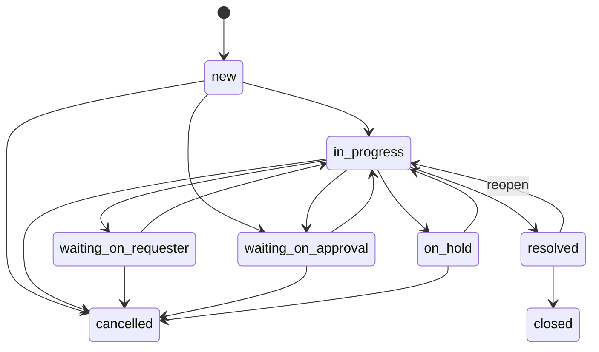
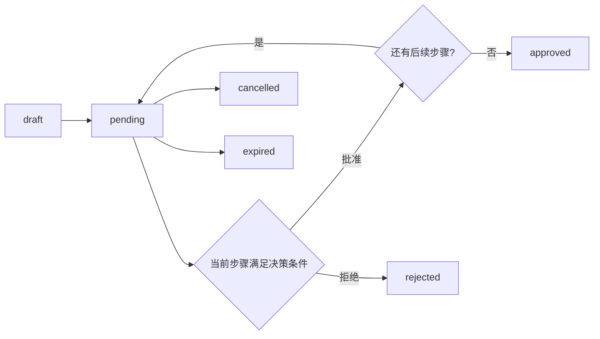

# QueueDesk REST API 设计规范报告

## 执行摘要

本文给出的 QueueDesk REST API 规范，以“**租户上下文只能从已验证身份凭证中推导**”“**workspace 是主要业务边界**”“**AI 只能生成建议，不得绕过人工确认直接落库**”为三条总原则。结合已知背景，推荐采用 `/api/v1/` 的路径版本化、以 `workspaces/{workspace_id}` 作为大多数业务资源的顶层容器、以短时效 JWT Session Token 承载交互式会话、以**不透明**的 Scoped Integration Token 承载机器集成、以 PostgreSQL RLS 作为最终数据面隔离、以 `If-Match` + `Idempotency-Key` 作为并发与重试安全网、以 cursor pagination 作为默认分页模式、以 HMAC-SHA256 签名与至少一次投递语义管理 Webhook。JWT 的 `exp`、`iat`、`jti` 等声明与算法白名单、`iss`/`aud` 校验应遵循 RFC 7519 与 RFC 8725；Bearer token 仅应在 TLS 上传输；RLS 需要显式启用，并避免使用会绕过策略的数据库角色；NestJS 的 middleware → guards → interceptors → exception filters 执行链，正好适合承载 tenant 注入、scope/RBAC 判定、审计和统一错误输出。QueueDesk 的 AI 模块上传资料同样强调：所有 AI 请求都经统一 AI Gateway，输出是 suggestion object，最终写回必须由人工确认。fileciteturn0file3 citeturn12view0turn12view1turn12view2turn13view0turn0search3turn16view0turn6search1turn5search1

下表给出本规范最重要的落地结论，便于工程评审时快速对齐。

| 设计面 | 规范结论 |
|---|---|
| 租户隔离 | `tenant_id` 只来自已验证 JWT / Integration Token；不接受客户端显式覆盖的 `X-Tenant-Id` |
| URL 边界 | `/api/v1/` + `workspaces/{workspace_id}` + 资源名复数 + `kebab-case` |
| 会话认证 | Access JWT 短时效；Refresh Token 轮换；显式算法白名单与 `iss`/`aud` 校验 |
| 集成认证 | Opaque scoped token，服务端查表/缓存解析 scope，支持即时撤销 |
| 写操作安全 | POST/动作端点要求 `Idempotency-Key`；PATCH/DELETE/状态流转要求 `If-Match` |
| 分页 | 默认 cursor-based；仅在稳定、低变化列表或需要页码跳转时使用 offset |
| 错误格式 | 统一 `{ error: { code, message, details, request_id } }` |
| 审计 | 所有写操作、角色变更、审批流转、Webhook 管理与 AI 接纳动作写入审计日志 |
| AI 约束 | 不提供“AI 直接应用到工单”的无确认端点；仅允许人工提交最终变更 |

## 背景与设计假设

以下内容把**已知背景**与**本文必须做出的工程假设**放在同一张表里。凡是用户输入没有给出、且上传资料片段也未明确的项，均明确标注为“未指定”，并给出推荐值，便于后续产品/安全/平台三方共同确认。

| 维度 | 已知信息 | 对 API 设计的影响 |
|---|---|---|
| 服务形态 | QueueDesk 是 AI-first 内部服务台 SaaS 平台 | API 默认按 B2B SaaS 多租户方式设计，所有受保护请求都要具备租户上下文 |
| 后端技术栈 | TypeScript 模块化单体，NestJS 风格 | 适合使用 NestJS middleware/guards/interceptors/filters 承担认证、授权、审计、统一错误封装 |
| 存储 | PostgreSQL + RLS，Redis | PostgreSQL 负责最终授权边界；Redis 适合承载 jti 黑名单、速率限制、幂等缓存、短期 cursor |
| 认证 | JWT + Scoped API Token | 交互会话与机器集成应使用两类不同的 token 体系 |
| 多租户隔离 | JWT 中 `tenant_id` + PostgreSQL RLS | URL 不再显式暴露 `tenant_id` 作为可篡改参数；应用层必须把 verified `tenant_id` 注入 DB session context |
| 核心实体 | Tenant, Workspace, Team, Queue, Ticket, TicketComment, Attachment, Label, SLAPolicy, ApprovalWorkflow, ApprovalStep, AuditLog, KnowledgeArticle, AIAction, Contact, AppUser | 本文重点展开用户明确要求的资源：tickets, queues, teams, sla-policies, approvals, comments, attachments, audit-logs, contacts, users, webhooks |
| AI 模块 | 所有 AI 调用走统一 AI Gateway；AI 建议不自动写入，需要人工确认 | v1 不定义“无确认自动应用”的 AI 变更端点；若记录 AI 来源，只能作为 provenance 元数据写入审计和最终对象 |
| API 版本策略 | 未指定 | 推荐：URI only major version，路径 `/api/v1/`；大版本支持窗口建议不少于 24 个月 |
| Session Access Token TTL | 未指定 | 推荐：15 分钟 |
| Refresh Token TTL | 未指定 | 推荐：30 天滑动有效 + 90 天绝对上限 |
| Integration Token 默认有效期 | 未指定 | 推荐：180 天；允许更短，不建议无过期 |
|上传 URL 有效期| 未指定 | 推荐：15 分钟 |
|下载 URL 有效期| 未指定 | 推荐：5 分钟 |
| 幂等记录保留时长 | 未指定 | 推荐：24 小时 |
| 数据保留策略 | 未指定 | 需要单独的合规决策；本文在“安全与合规”部分给出建议值，但仍标注为未指定 |

从安全模型看，PostgreSQL RLS 的默认行为对本设计非常关键：启用 RLS 后，如果表上没有策略，系统会采取默认拒绝；但**表 owner** 与拥有 `BYPASSRLS` 属性的角色会绕过 RLS，因此 QueueDesk 生产环境必须使用受限数据库角色，并对关键多租户表启用 `FORCE ROW LEVEL SECURITY`。与此同时，OWASP 对多租户隔离和对象级授权的长期结论也很明确：不要让客户端可控的对象 ID、tenant 标识或 header 成为授权真相来源，否则极易出现 Broken Tenant Isolation / BOLA。citeturn16view0turn7search10turn7search13turn7search1

在 AI 侧，上传的 QueueDesk AI 架构资料已经把“AI 只建议，人工最终决定”“统一 AI Gateway”“脱敏优先”“审计优先”作为体系边界，而不是 UI 提示语；因此本文在 tickets/comments/transitions 等端点里只允许携带 `ai_action_id` 作为**来源标记**，不允许让 AI 结果绕过人工形成副作用。fileciteturn0file3

## URL 结构与资源建模

本文建议把 URL 设计成**版本明确、边界清晰、层级不过深、动词尽量外移到动作子资源**的形式。HTTP 本质上是与资源交互的统一接口，因此我们优先让 URL 表达“资源”和“包含关系”，而不是 RPC 式动词。对于 QueueDesk，这意味着：tenant 从 token 解析，workspace 放进路径，ticket/comment/attachment/approval 等强包含资源允许嵌套；跨容器列表优先使用过滤参数，而不是继续加深路径层级。HTTP 的统一资源接口语义、现代 SaaS API 的分页/版本/速率限制实践，以及 RLS 与多租户安全边界，共同支持这种设计取向。citeturn18view0turn22view0turn23view0turn16view0turn7search13

| 规则 | 规范 |
|---|---|
| 基础前缀 | `/api/v1/` |
| 资源名 | 一律使用**复数名词**，例如 `tickets`、`queues`、`sla-policies` |
| 路径风格 | `kebab-case` |
| JSON 字段 | `snake_case`，与已知领域字段（如 `tenant_id`、`workspace_id`）保持一致 |
| 租户路径 | **不**在路径中暴露 `/tenants/{tenant_id}` 作为客户端可控授权输入；tenant 由 token 决定 |
| 顶层边界 | 绝大多数业务资源挂在 `/workspaces/{workspace_id}` 下 |
| 嵌套深度 | 推荐不超过 3 级业务资源，例如 `workspaces/{workspace_id}/tickets/{ticket_id}/comments` |
| 动作端点 | 用动作子资源表达，例如 `/tickets/{ticket_id}/transitions`、`/comments/{comment_id}/redactions` |
| 删除语义 | DELETE 优先用于“解除关联/停用/归档”；真的物理删除一般不暴露给公开 API |
| 过滤而非深嵌套 | 例如用 `/workspaces/{workspace_id}/tickets?queue_id=...`，而不是 `/queues/{queue_id}/tickets` |

推荐的 URL 组织方式如下：

```text
/api/v1
  /users
  /users/{user_id}/roles
  /contacts
  /contacts/{contact_id}
  /workspaces/{workspace_id}
    /tickets
    /tickets/{ticket_id}
    /tickets/{ticket_id}/transitions
    /tickets/{ticket_id}/comments
    /tickets/{ticket_id}/approvals
    /queues
    /queues/{queue_id}
    /queues/{queue_id}/members
    /teams
    /teams/{team_id}
    /teams/{team_id}/members
    /sla-policies
    /sla-policies/{sla_policy_id}
    /sla-policies/{sla_policy_id}/bindings
    /approvals
    /approvals/{approval_id}
    /approvals/{approval_id}/steps/{step_id}/decisions
    /attachments/upload-urls
    /attachments/{attachment_id}/complete
    /attachments/{attachment_id}/download-url
    /audit-logs
    /audit-logs/exports
    /webhooks
    /webhooks/{webhook_id}
```

下表是核心端点摘要，可直接作为 OpenAPI tags 与 operationId 规划的基础。

| Method | Path | Purpose |
|---|---|---|
| POST | `/api/v1/workspaces/{workspace_id}/tickets` | 创建工单 |
| GET | `/api/v1/workspaces/{workspace_id}/tickets` | 列表查询工单 |
| GET | `/api/v1/workspaces/{workspace_id}/tickets/{ticket_id}` | 查询工单详情 |
| PATCH | `/api/v1/workspaces/{workspace_id}/tickets/{ticket_id}` | 更新工单 |
| POST | `/api/v1/workspaces/{workspace_id}/tickets/{ticket_id}/transitions` | 工单状态流转 |
| POST | `/api/v1/workspaces/{workspace_id}/queues` | 创建队列 |
| GET | `/api/v1/workspaces/{workspace_id}/queues` | 队列列表 |
| GET | `/api/v1/workspaces/{workspace_id}/queues/{queue_id}` | 队列详情 |
| PATCH | `/api/v1/workspaces/{workspace_id}/queues/{queue_id}` | 更新队列 |
| DELETE | `/api/v1/workspaces/{workspace_id}/queues/{queue_id}` | 归档/删除队列 |
| POST | `/api/v1/workspaces/{workspace_id}/queues/{queue_id}/members` | 添加队列成员 |
| DELETE | `/api/v1/workspaces/{workspace_id}/queues/{queue_id}/members/{user_id}` | 移除队列成员 |
| POST | `/api/v1/workspaces/{workspace_id}/teams` | 创建团队 |
| GET | `/api/v1/workspaces/{workspace_id}/teams` | 团队列表 |
| GET | `/api/v1/workspaces/{workspace_id}/teams/{team_id}` | 团队详情 |
| PATCH | `/api/v1/workspaces/{workspace_id}/teams/{team_id}` | 更新团队 |
| DELETE | `/api/v1/workspaces/{workspace_id}/teams/{team_id}` | 归档/删除团队 |
| POST | `/api/v1/workspaces/{workspace_id}/teams/{team_id}/members` | 添加团队成员 |
| DELETE | `/api/v1/workspaces/{workspace_id}/teams/{team_id}/members/{user_id}` | 移除团队成员 |
| POST | `/api/v1/workspaces/{workspace_id}/sla-policies` | 创建 SLA 策略 |
| GET | `/api/v1/workspaces/{workspace_id}/sla-policies` | SLA 列表 |
| GET | `/api/v1/workspaces/{workspace_id}/sla-policies/{sla_policy_id}` | SLA 详情 |
| PATCH | `/api/v1/workspaces/{workspace_id}/sla-policies/{sla_policy_id}` | 更新 SLA |
| DELETE | `/api/v1/workspaces/{workspace_id}/sla-policies/{sla_policy_id}` | 停用/删除 SLA |
| POST | `/api/v1/workspaces/{workspace_id}/sla-policies/{sla_policy_id}/bindings` | 绑定 SLA |
| DELETE | `/api/v1/workspaces/{workspace_id}/sla-policies/{sla_policy_id}/bindings/{binding_id}` | 解绑 SLA |
| POST | `/api/v1/workspaces/{workspace_id}/tickets/{ticket_id}/approvals` | 创建审批实例 |
| GET | `/api/v1/workspaces/{workspace_id}/approvals` | 审批列表 |
| GET | `/api/v1/workspaces/{workspace_id}/approvals/{approval_id}` | 审批详情 |
| POST | `/api/v1/workspaces/{workspace_id}/approvals/{approval_id}/steps/{step_id}/decisions` | 审批步骤流转 |
| GET | `/api/v1/workspaces/{workspace_id}/tickets/{ticket_id}/comments` | 评论列表 |
| POST | `/api/v1/workspaces/{workspace_id}/tickets/{ticket_id}/comments` | 创建评论 |
| PATCH | `/api/v1/workspaces/{workspace_id}/comments/{comment_id}` | 编辑评论 |
| POST | `/api/v1/workspaces/{workspace_id}/comments/{comment_id}/redactions` | 评论脱敏 |
| POST | `/api/v1/workspaces/{workspace_id}/attachments/upload-urls` | 申请上传 URL |
| POST | `/api/v1/workspaces/{workspace_id}/attachments/{attachment_id}/complete` | 确认上传完成 |
| GET | `/api/v1/workspaces/{workspace_id}/attachments/{attachment_id}/download-url` | 获取下载 URL |
| GET | `/api/v1/workspaces/{workspace_id}/audit-logs` | 审计日志查询 |
| POST | `/api/v1/workspaces/{workspace_id}/audit-logs/exports` | 审计日志导出 |
| POST | `/api/v1/contacts` | 创建联系人 |
| GET | `/api/v1/contacts` | 联系人查询 |
| GET | `/api/v1/contacts/{contact_id}` | 联系人详情 |
| GET | `/api/v1/users` | 用户列表 |
| PUT | `/api/v1/users/{user_id}/roles` | 角色分配/替换 |
| POST | `/api/v1/workspaces/{workspace_id}/webhooks` | 订阅 webhook |
| GET | `/api/v1/workspaces/{workspace_id}/webhooks` | webhook 列表 |
| GET | `/api/v1/workspaces/{workspace_id}/webhooks/{webhook_id}` | webhook 详情 |
| PATCH | `/api/v1/workspaces/{workspace_id}/webhooks/{webhook_id}` | 更新 webhook |
| DELETE | `/api/v1/workspaces/{workspace_id}/webhooks/{webhook_id}` | 退订 webhook |

## 认证授权与执行链路

QueueDesk 应把“谁发起请求”和“这个请求能对哪个 workspace / queue / action 生效”拆成两层：交互式用户会话使用 JWT Session Token；机器集成使用不透明的 Scoped Integration Token。OAuth 2.0 本身把 access token 视为携带 scope 与生命周期的授权凭证，scope 是**空格分隔、大小写敏感**的字符串集合；Bearer token 的传输依赖 TLS；JWT 的 `exp`/`iat`/`jti` 有明确的注册语义；JWT BCP 则要求调用方显式收紧允许的算法集合、校验 `iss`/`aud`，并避免同一 JWT 在多上下文混用。citeturn15view0turn15view2turn0search3turn12view0turn12view1turn12view2turn13view0

下表对三类安全凭证做并列说明。

| 凭证类型 | 载体格式 | 推荐有效期 | 绑定对象 | 权限模型 | 典型用途 |
|---|---|---:|---|---|---|
| JWT Session Access Token | JWT Bearer | 15 分钟，未指定，本文建议值 | `tenant_id` + `user_id` | RBAC + membership + object policy | Web/App 前端会话调用 API |
| Refresh Token | 建议 opaque random token | 30 天滑动 + 90 天绝对上限，未指定，本文建议值 | session family | 仅用于换发 access token | 会话续期 |
| Scoped Integration Token | **Opaque** token，建议带环境前缀 | 默认 180 天，未指定，本文建议值 | `tenant_id` + scope set | scope allowlist + shadow RBAC | 工单导入、外部系统同步、Webhook 管理等 |

JWT Session Token 推荐结构如下。这里把 `tenant_id`、`user_id`、`roles`、`exp`、`iat`、`jti` 视为**必需字段**；`iss`、`aud`、`sub`、`token_type`、`session_id` 则强烈推荐加入，以便做显式类型区分、受众校验、吊销链追踪和跨系统联调。因为 RFC 8725 明确要求算法白名单、加密敏捷性以及 `iss`/`aud` 验证，本文推荐 QueueDesk 使用**非对称**签名并通过 `kid` 支持轮换；具体选 `ES256` 还是 `EdDSA` 属于实现决策，用户输入未指定。citeturn13view0turn12view3turn10search9

```json
{
  "header": {
    "typ": "qd-session+jwt",
    "alg": "ES256",
    "kid": "2026-05-key-01"
  },
  "payload": {
    "iss": "https://auth.queuedesk.example",
    "aud": "queuedesk-api",
    "sub": "d3b5069a-14da-47ab-991a-4fd1c609d39d",
    "tenant_id": "1f5fe7fa-e654-4682-b2ef-b8aa9800d8a8",
    "user_id": "d3b5069a-14da-47ab-991a-4fd1c609d39d",
    "roles": ["workspace_admin", "agent"],
    "token_type": "session_access",
    "session_id": "5b61979d-3496-45a4-a4fb-ae41ce4dc8ad",
    "iat": 1778052000,
    "exp": 1778052900,
    "jti": "d0ca1b79-5c77-457b-b432-c9f5d9a4e10b"
  }
}
```

Refresh 机制建议采用**轮换刷新**：每次 `POST /api/v1/auth/sessions/refresh` 成功，都返回新的 access token 和新的 refresh token，并让旧 refresh token 立即失效。OAuth 安全 BCP 把 refresh token rotation 作为重要的泄露缓解手段；OAuth token revocation 也已经标准化，因此 QueueDesk 完全可以把这些成熟做法内化到自有会话系统中。推荐认证端点如下：`POST /api/v1/auth/sessions`、`POST /api/v1/auth/sessions/refresh`、`POST /api/v1/auth/sessions/revoke`。检测到 refresh token reuse、用户主动登出、密码重置、角色版本升级、tenant 被禁用时，应吊销整个 session family，并把 access token 的 `jti` 放入 Redis denylist 直到 `exp` 到期。citeturn15view1turn9search1turn9search2

Scoped Integration Token 不建议做成 JWT，而建议做成**只展示一次的不透明随机串**，原因很实际：机器 token 最需要的是**即时撤销、最小权限、可追踪 last_used_at、低泄露面**。scope 语义仍可借鉴 OAuth 2.0 的字符串式设计，但鉴权真相应来自服务端数据库/缓存而不是 token 自身。推荐的 scope 语法如下：

```text
workspace:{workspace_id}:read
workspace:{workspace_id}:write
queue:{queue_id}:tickets:read
queue:{queue_id}:tickets:create
queue:{queue_id}:tickets:update
queue:{queue_id}:comments:create
queue:{queue_id}:attachments:create
action:webhooks:manage
action:audit_logs:read
action:contacts:read
```

创建/撤销流程建议如下：由 tenant admin 或 workspace admin 通过控制台/管理 API 创建 token；系统只返回一次明文 token，同时在数据库中仅保存 token hash、scope 集、创建者、到期时间、最近使用时间、可选 IP allowlist；请求到达 API Gateway 后，先按 token prefix 识别 token 类型，再查缓存/数据库解析 scopes；撤销就是标记失效并清理缓存，不依赖等 JWT 过期。这样可以天然符合最小权限原则，也避免“集成 token 拿到了 tenant 全读写”的过宽授权。OAuth 2.0 对 scope 的语义定义、大小写敏感和授权服务器裁剪 scope 的做法，正好为这种设计提供了通用约束。citeturn15view2turn15view3

RBAC 在 API 层的执行点，推荐严格贴合 NestJS 的请求生命周期。NestJS 文档说明 middleware 先于 guards、guards 按 global → controller → route 顺序执行，而 exception filters 位于尾部统一接管错误；自定义 decorator 可以把 `request.user`、`request.tenant`、`request.scopes` 等上下文安全地注入到控制器参数里。对 QueueDesk 来说，这意味着最清晰的执行链是：**middleware 做凭证解析与 request_id 注入，global guard 做 token 有效性校验，tenant/workspace/scope/RBAC guard 逐层收缩授权范围，interceptor 负责审计与指标，exception filter 输出统一错误 JSON**。citeturn6search1turn6search2turn5search1turn5search2

| 执行层 | 推荐实现 | 职责 |
|---|---|---|
| Middleware | `AuthContextMiddleware` | 解析 `Authorization`、生成 `request_id`、区分 JWT 与 integration token、把 principal 放到 `request.auth` |
| Global Guard | `AuthenticatedGuard` | 验证签名、时效、吊销状态、tenant 一致性 |
| Controller/Route Guard | `WorkspaceGuard` | 校验路径中的 `workspace_id` 属于当前 token 的 `tenant_id` |
| Route Guard | `ScopeGuard` | 校验 integration token scopes 或用户角色映射出的权限 |
| Route Guard | `RbacGuard` / `PolicyGuard` | 对 action 级权限做最终放行，例如 `ticket.transition`、`sla.bind` |
| Interceptor | `AuditInterceptor` | 记录 before/after、actor、request_id、AI provenance |
| Exception Filter | `ApiExceptionFilter` | 输出统一 `{ error: { code, message, details, request_id } }` |

建议的授权判定公式可写成：

```text
authorize =
  valid_token
  AND tenant_match
  AND workspace_visible
  AND scope_allow
  AND rbac_allow
  AND object_policy_allow
  AND rls_allow
```

其中最后一层 `rls_allow` 不是可选项，而是数据库最终裁决。

## 核心资源与 Webhook 规范

本节是可直接转成 OpenAPI 3.1 的主体。为了避免重复，先定义全局约束，再逐资源给出接口矩阵、schema 摘要与 JSON 示例。创建/更新/动作类接口返回 `201`、`200`、`202` 的选择遵循 HTTP 语义；删除、解绑、移除成员等无返回体成功场景用 `204`；异步导出用 `202`；语义正确但业务指令不能执行时用 `422`；并发前置条件缺失或失败时用 `428/412`；限流用 `429 + Retry-After`。这些状态码语义来自 RFC 9110 与 RFC 6585。citeturn19view0turn19view1turn19view2turn19view3turn19view4turn20view1turn20view2

以下矩阵使用的请求头缩写说明如下。

| 记号 | 含义 |
|---|---|
| Auth | `Authorization: Bearer <JWT 或 integration token>` |
| JSON | `Content-Type: application/json` |
| Idem | `Idempotency-Key: <uuid/random>` |
| Precond | `If-Match: "<strong-etag>"` |

所有成功响应统一采用如下 envelope；列表响应多一个 `page_info`。

```json
{
  "data": {},
  "meta": {
    "request_id": "req_01JTG4T8D9M6N2T1GQF4M3GQ9M",
    "api_version": "v1"
  }
}
```

```json
{
  "data": [],
  "page_info": {
    "next_cursor": "eyJ1cGRhdGVkX2F0IjoiMjAyNi0wNS0wNlQxMzozMDowMFoiLCJpZCI6IjQ0Y2E2ZGJmLTIxODEtNDhjNS04NWU5LTgzYzUzYjc0NWI3NyJ9",
    "has_more": true,
    "limit": 50
  },
  "meta": {
    "request_id": "req_01JTG4T8D9M6N2T1GQF4M3GQ9M",
    "api_version": "v1"
  }
}
```

### 工单与审批状态流转图

下图是本文建议的 v1 工单状态机。它是 API 规范中的**行为约束**，不是数据库实现细节。关闭后的工单默认不可 reopen；若需要由外部新消息重启处理，建议创建 follow-up ticket，而不是直接把 `closed` 改回处理中。



审批流建议建成“实例 + 步骤”的双层模型。最终状态一旦到达 `approved` / `rejected` / `cancelled` / `expired`，实例应视为不可变，只允许查询，不允许继续写操作。



### 核心资源接口

**Tickets**

| Method | Path | Headers | Query 参数 | Body Schema | 成功 | 常见错误 |
|---|---|---|---|---|---|---|
| POST | `/api/v1/workspaces/{workspace_id}/tickets` | Auth + JSON + Idem | 无 | `TicketCreateRequest` | `201` | `400/401/403/404/409/422` |
| GET | `/api/v1/workspaces/{workspace_id}/tickets` | Auth | `cursor, limit, sort, status, priority, queue_id, assignee_user_id, requester_contact_id, label_id, updated_at_gte, updated_at_lte, q` | 无 | `200` | `400/401/403` |
| GET | `/api/v1/workspaces/{workspace_id}/tickets/{ticket_id}` | Auth | 无 | 无 | `200` | `401/403/404` |
| PATCH | `/api/v1/workspaces/{workspace_id}/tickets/{ticket_id}` | Auth + JSON + Precond | 无 | `TicketPatchRequest` | `200` | `400/401/403/404/412/428/422` |
| POST | `/api/v1/workspaces/{workspace_id}/tickets/{ticket_id}/transitions` | Auth + JSON + Idem + Precond | 无 | `TicketTransitionRequest` | `200` | `400/401/403/404/409/412/422` |

| Schema | 摘要 |
|---|---|
| `TicketCreateRequest` | `queue_id(uuid, required)`；`requester_contact_id(uuid, required)`；`subject(string, required, <=200)`；`description(string, required)`；`priority(enum: p1/p2/p3/p4)`；`label_ids(uuid[])`；`source_channel(enum: email/form/api/chat)`；`custom_fields(object)`；`attachment_ids(uuid[])` |
| `TicketPatchRequest` | 可更新字段：`subject`、`description`、`priority`、`queue_id`、`assignee_user_id`、`label_ids`、`custom_fields` |
| `TicketTransitionRequest` | `to_status(enum, required)`；`reason(string, required)`；`resolution_code(string, optional)`；`comment({visibility, body}, optional)`；`accepted_from_ai_action_id(uuid, optional)` |
| `Ticket` | `id`；`ticket_no`；`workspace_id`；`queue_id`；`team_id`；`requester_contact_id`；`subject`；`description`；`status`；`priority`；`label_ids`；`assignee_user_id`；`source_channel`；`sla{policy_id,first_response_due_at,resolution_due_at,state,breached}`；`approval{required,current_approval_id,status}`；`custom_fields`；`created_at`；`updated_at`；`resolved_at`；`closed_at`；`lock_version` |

创建请求示例：

```json
{
  "queue_id": "4b9ba86a-bd2c-49d3-9fd5-dabcfcb0cb8d",
  "requester_contact_id": "15eb98de-676b-4fb1-8ab8-1a4a01733a1b",
  "subject": "VPN 无法连接",
  "description": "今天 09:10 开始无法登录公司 VPN，错误码 691，影响多个同事。",
  "priority": "p2",
  "label_ids": [
    "98e2d7a2-1b6a-4c2b-b07b-a3a9c399bd75"
  ],
  "source_channel": "api",
  "custom_fields": {
    "device_os": "macOS 15.4",
    "office": "Shanghai"
  }
}
```

创建响应示例：

```json
{
  "data": {
    "id": "44ca6dbf-2181-48c5-85e9-83c53b745b77",
    "ticket_no": "QD-000123",
    "workspace_id": "8ced0a5c-cc6d-4fc2-9ecf-0bd8853d5d4a",
    "queue_id": "4b9ba86a-bd2c-49d3-9fd5-dabcfcb0cb8d",
    "team_id": "92c54b39-51e7-4baa-93ec-0a5e958a4c66",
    "requester_contact_id": "15eb98de-676b-4fb1-8ab8-1a4a01733a1b",
    "subject": "VPN 无法连接",
    "description": "今天 09:10 开始无法登录公司 VPN，错误码 691，影响多个同事。",
    "status": "new",
    "priority": "p2",
    "label_ids": [
      "98e2d7a2-1b6a-4c2b-b07b-a3a9c399bd75"
    ],
    "assignee_user_id": null,
    "source_channel": "api",
    "sla": {
      "policy_id": "28f67d76-40b5-47d5-b7cc-7c0ba42babb5",
      "first_response_due_at": "2026-05-06T10:00:00Z",
      "resolution_due_at": "2026-05-06T17:00:00Z",
      "state": "on_track",
      "breached": false
    },
    "approval": {
      "required": false,
      "current_approval_id": null,
      "status": null
    },
    "custom_fields": {
      "device_os": "macOS 15.4",
      "office": "Shanghai"
    },
    "created_at": "2026-05-06T09:12:00Z",
    "updated_at": "2026-05-06T09:12:00Z",
    "resolved_at": null,
    "closed_at": null,
    "lock_version": 1
  },
  "meta": {
    "request_id": "req_01JTG4T8D9M6N2T1GQF4M3GQ9M",
    "api_version": "v1"
  }
}
```

列表响应示例：

```json
{
  "data": [
    {
      "id": "44ca6dbf-2181-48c5-85e9-83c53b745b77",
      "ticket_no": "QD-000123",
      "queue_id": "4b9ba86a-bd2c-49d3-9fd5-dabcfcb0cb8d",
      "subject": "VPN 无法连接",
      "status": "new",
      "priority": "p2",
      "assignee_user_id": null,
      "updated_at": "2026-05-06T09:12:00Z"
    }
  ],
  "page_info": {
    "next_cursor": "eyJ1cGRhdGVkX2F0IjoiMjAyNi0wNS0wNlQwOToxMjowMFoiLCJpZCI6IjQ0Y2E2ZGJmLTIxODEtNDhjNS04NWU5LTgzYzUzYjc0NWI3NyJ9",
    "has_more": true,
    "limit": 50
  },
  "meta": {
    "request_id": "req_01JTG4T9J1D8F3M2Y4M5M6M7M8",
    "api_version": "v1"
  }
}
```

详情响应示例：

```json
{
  "data": {
    "id": "44ca6dbf-2181-48c5-85e9-83c53b745b77",
    "ticket_no": "QD-000123",
    "workspace_id": "8ced0a5c-cc6d-4fc2-9ecf-0bd8853d5d4a",
    "queue_id": "4b9ba86a-bd2c-49d3-9fd5-dabcfcb0cb8d",
    "team_id": "92c54b39-51e7-4baa-93ec-0a5e958a4c66",
    "requester_contact_id": "15eb98de-676b-4fb1-8ab8-1a4a01733a1b",
    "subject": "VPN 无法连接",
    "description": "今天 09:10 开始无法登录公司 VPN，错误码 691，影响多个同事。",
    "status": "in_progress",
    "priority": "p2",
    "label_ids": [
      "98e2d7a2-1b6a-4c2b-b07b-a3a9c399bd75"
    ],
    "assignee_user_id": "d3b5069a-14da-47ab-991a-4fd1c609d39d",
    "source_channel": "api",
    "sla": {
      "policy_id": "28f67d76-40b5-47d5-b7cc-7c0ba42babb5",
      "first_response_due_at": "2026-05-06T10:00:00Z",
      "resolution_due_at": "2026-05-06T17:00:00Z",
      "state": "on_track",
      "breached": false
    },
    "approval": {
      "required": true,
      "current_approval_id": "b08663c8-d0fa-4fc5-8d83-91de0764cb2f",
      "status": "pending"
    },
    "custom_fields": {
      "device_os": "macOS 15.4",
      "office": "Shanghai"
    },
    "created_at": "2026-05-06T09:12:00Z",
    "updated_at": "2026-05-06T09:20:00Z",
    "resolved_at": null,
    "closed_at": null,
    "lock_version": 2
  },
  "meta": {
    "request_id": "req_01JTG4TA4MTA2N7NXRNTC67KV1",
    "api_version": "v1"
  }
}
```

更新请求示例：

```json
{
  "assignee_user_id": "d3b5069a-14da-47ab-991a-4fd1c609d39d",
  "priority": "p1",
  "label_ids": [
    "98e2d7a2-1b6a-4c2b-b07b-a3a9c399bd75",
    "7eb0a98d-88f6-4bc1-9d3d-0b109af90663"
  ]
}
```

更新响应示例：

```json
{
  "data": {
    "id": "44ca6dbf-2181-48c5-85e9-83c53b745b77",
    "status": "in_progress",
    "priority": "p1",
    "assignee_user_id": "d3b5069a-14da-47ab-991a-4fd1c609d39d",
    "label_ids": [
      "98e2d7a2-1b6a-4c2b-b07b-a3a9c399bd75",
      "7eb0a98d-88f6-4bc1-9d3d-0b109af90663"
    ],
    "updated_at": "2026-05-06T09:20:00Z",
    "lock_version": 3
  },
  "meta": {
    "request_id": "req_01JTG4TBPHKWS98C2G0GSKW2F5",
    "api_version": "v1"
  }
}
```

状态流转请求示例：

```json
{
  "to_status": "waiting_on_approval",
  "reason": "需要网络权限审批后才能继续变更 VPN 访问策略",
  "comment": {
    "visibility": "internal",
    "body": "已提交权限审批，等待批准。"
  },
  "accepted_from_ai_action_id": "d9f7b1f9-9a20-420f-8f6a-1ce9a9b6d2d3"
}
```

状态流转响应示例：

```json
{
  "data": {
    "ticket": {
      "id": "44ca6dbf-2181-48c5-85e9-83c53b745b77",
      "status": "waiting_on_approval",
      "updated_at": "2026-05-06T09:25:00Z",
      "lock_version": 4
    },
    "transition": {
      "id": "8f10491f-3762-48c4-8cf3-20d3bb6517c0",
      "from_status": "in_progress",
      "to_status": "waiting_on_approval",
      "reason": "需要网络权限审批后才能继续变更 VPN 访问策略",
      "occurred_at": "2026-05-06T09:25:00Z"
    }
  },
  "meta": {
    "request_id": "req_01JTG4TC7DM7YAB6HR2D5H2B4K",
    "api_version": "v1"
  }
}
```

**Queues**

| Method | Path | Headers | Query 参数 | Body Schema | 成功 | 常见错误 |
|---|---|---|---|---|---|---|
| POST | `/api/v1/workspaces/{workspace_id}/queues` | Auth + JSON + Idem | 无 | `QueueCreateRequest` | `201` | `400/401/403/409/422` |
| GET | `/api/v1/workspaces/{workspace_id}/queues` | Auth | `cursor, limit, sort, team_id, status, visibility, q` | 无 | `200` | `400/401/403` |
| GET | `/api/v1/workspaces/{workspace_id}/queues/{queue_id}` | Auth | 无 | 无 | `200` | `401/403/404` |
| PATCH | `/api/v1/workspaces/{workspace_id}/queues/{queue_id}` | Auth + JSON + Precond | 无 | `QueuePatchRequest` | `200` | `400/401/403/404/412/422` |
| DELETE | `/api/v1/workspaces/{workspace_id}/queues/{queue_id}` | Auth + Precond | 无 | 无 | `204` | `401/403/404/409/412` |
| POST | `/api/v1/workspaces/{workspace_id}/queues/{queue_id}/members` | Auth + JSON + Idem | 无 | `QueueMemberAddRequest` | `201` | `400/401/403/404/409/422` |
| DELETE | `/api/v1/workspaces/{workspace_id}/queues/{queue_id}/members/{user_id}` | Auth + Precond | 无 | 无 | `204` | `401/403/404/412` |

| Schema | 摘要 |
|---|---|
| `QueueCreateRequest` | `team_id(uuid, required)`；`name(string, required)`；`slug(string, required)`；`description(string)`；`intake_sources(string[])`；`default_priority(enum)`；`default_sla_policy_id(uuid)`；`routing_mode(enum: manual/round_robin/skill_based)`；`visibility(enum: internal/restricted)` |
| `QueuePatchRequest` | `name`、`description`、`default_priority`、`default_sla_policy_id`、`routing_mode`、`visibility`、`status(enum: active/paused/archived)` |
| `QueueMemberAddRequest` | `user_id(uuid, required)`；`role(enum: primary/backup/observer, required)` |
| `Queue` | `id`；`workspace_id`；`team_id`；`name`；`slug`；`description`；`intake_sources`；`default_priority`；`default_sla_policy_id`；`routing_mode`；`visibility`；`status`；`created_at`；`updated_at`；`lock_version` |

创建请求示例：

```json
{
  "team_id": "92c54b39-51e7-4baa-93ec-0a5e958a4c66",
  "name": "网络支持",
  "slug": "network-support",
  "description": "负责 VPN、DNS、代理、内外网访问问题",
  "intake_sources": ["email", "form", "api"],
  "default_priority": "p3",
  "default_sla_policy_id": "28f67d76-40b5-47d5-b7cc-7c0ba42babb5",
  "routing_mode": "round_robin",
  "visibility": "internal"
}
```

创建响应示例：

```json
{
  "data": {
    "id": "4b9ba86a-bd2c-49d3-9fd5-dabcfcb0cb8d",
    "workspace_id": "8ced0a5c-cc6d-4fc2-9ecf-0bd8853d5d4a",
    "team_id": "92c54b39-51e7-4baa-93ec-0a5e958a4c66",
    "name": "网络支持",
    "slug": "network-support",
    "description": "负责 VPN、DNS、代理、内外网访问问题",
    "intake_sources": ["email", "form", "api"],
    "default_priority": "p3",
    "default_sla_policy_id": "28f67d76-40b5-47d5-b7cc-7c0ba42babb5",
    "routing_mode": "round_robin",
    "visibility": "internal",
    "status": "active",
    "created_at": "2026-05-06T08:00:00Z",
    "updated_at": "2026-05-06T08:00:00Z",
    "lock_version": 1
  },
  "meta": {
    "request_id": "req_01JTG4TDQ7T0NQEA2G7YCA1S0V",
    "api_version": "v1"
  }
}
```

列表响应示例：

```json
{
  "data": [
    {
      "id": "4b9ba86a-bd2c-49d3-9fd5-dabcfcb0cb8d",
      "name": "网络支持",
      "slug": "network-support",
      "routing_mode": "round_robin",
      "status": "active"
    }
  ],
  "page_info": {
    "next_cursor": null,
    "has_more": false,
    "limit": 50
  },
  "meta": {
    "request_id": "req_01JTG4TE4YJ2K66H2BE3QJQ3RQ",
    "api_version": "v1"
  }
}
```

详情响应示例：

```json
{
  "data": {
    "id": "4b9ba86a-bd2c-49d3-9fd5-dabcfcb0cb8d",
    "workspace_id": "8ced0a5c-cc6d-4fc2-9ecf-0bd8853d5d4a",
    "team_id": "92c54b39-51e7-4baa-93ec-0a5e958a4c66",
    "name": "网络支持",
    "slug": "network-support",
    "description": "负责 VPN、DNS、代理、内外网访问问题",
    "intake_sources": ["email", "form", "api"],
    "default_priority": "p3",
    "default_sla_policy_id": "28f67d76-40b5-47d5-b7cc-7c0ba42babb5",
    "routing_mode": "round_robin",
    "visibility": "internal",
    "status": "active",
    "lock_version": 1
  },
  "meta": {
    "request_id": "req_01JTG4TENM75TZJ5ZCX1G0WV2S",
    "api_version": "v1"
  }
}
```

更新请求示例：

```json
{
  "routing_mode": "skill_based",
  "status": "paused",
  "description": "临时暂停接新单，已切换到备用队列"
}
```

更新响应示例：

```json
{
  "data": {
    "id": "4b9ba86a-bd2c-49d3-9fd5-dabcfcb0cb8d",
    "routing_mode": "skill_based",
    "status": "paused",
    "description": "临时暂停接新单，已切换到备用队列",
    "updated_at": "2026-05-06T12:00:00Z",
    "lock_version": 2
  },
  "meta": {
    "request_id": "req_01JTG4TFVN3B35V9V208F5EZ5B",
    "api_version": "v1"
  }
}
```

添加成员请求示例：

```json
{
  "user_id": "d3b5069a-14da-47ab-991a-4fd1c609d39d",
  "role": "primary"
}
```

添加成员响应示例：

```json
{
  "data": {
    "queue_id": "4b9ba86a-bd2c-49d3-9fd5-dabcfcb0cb8d",
    "user_id": "d3b5069a-14da-47ab-991a-4fd1c609d39d",
    "role": "primary",
    "added_at": "2026-05-06T12:05:00Z"
  },
  "meta": {
    "request_id": "req_01JTG4TG4T7MH0XNDAK9NRE1V5",
    "api_version": "v1"
  }
}
```

**Teams**

| Method | Path | Headers | Query 参数 | Body Schema | 成功 | 常见错误 |
|---|---|---|---|---|---|---|
| POST | `/api/v1/workspaces/{workspace_id}/teams` | Auth + JSON + Idem | 无 | `TeamCreateRequest` | `201` | `400/401/403/409/422` |
| GET | `/api/v1/workspaces/{workspace_id}/teams` | Auth | `cursor, limit, sort, status, q` | 无 | `200` | `400/401/403` |
| GET | `/api/v1/workspaces/{workspace_id}/teams/{team_id}` | Auth | 无 | 无 | `200` | `401/403/404` |
| PATCH | `/api/v1/workspaces/{workspace_id}/teams/{team_id}` | Auth + JSON + Precond | 无 | `TeamPatchRequest` | `200` | `400/401/403/404/412/422` |
| DELETE | `/api/v1/workspaces/{workspace_id}/teams/{team_id}` | Auth + Precond | 无 | 无 | `204` | `401/403/404/409/412` |
| POST | `/api/v1/workspaces/{workspace_id}/teams/{team_id}/members` | Auth + JSON + Idem | 无 | `TeamMemberAddRequest` | `201` | `400/401/403/404/409/422` |
| DELETE | `/api/v1/workspaces/{workspace_id}/teams/{team_id}/members/{user_id}` | Auth + Precond | 无 | 无 | `204` | `401/403/404/412` |

| Schema | 摘要 |
|---|---|
| `TeamCreateRequest` | `name(required)`；`slug(required)`；`description`；`lead_user_id(uuid)`；`status(enum: active/paused/archived)` |
| `TeamPatchRequest` | `name`、`description`、`lead_user_id`、`status` |
| `TeamMemberAddRequest` | `user_id(uuid, required)`；`role(enum: lead/member/observer, required)` |
| `Team` | `id`；`workspace_id`；`name`；`slug`；`description`；`lead_user_id`；`status`；`created_at`；`updated_at`；`lock_version` |

创建请求示例：

```json
{
  "name": "企业基础设施组",
  "slug": "infra",
  "description": "负责网络、终端、账号基础设施支持",
  "lead_user_id": "d3b5069a-14da-47ab-991a-4fd1c609d39d",
  "status": "active"
}
```

创建响应示例：

```json
{
  "data": {
    "id": "92c54b39-51e7-4baa-93ec-0a5e958a4c66",
    "workspace_id": "8ced0a5c-cc6d-4fc2-9ecf-0bd8853d5d4a",
    "name": "企业基础设施组",
    "slug": "infra",
    "description": "负责网络、终端、账号基础设施支持",
    "lead_user_id": "d3b5069a-14da-47ab-991a-4fd1c609d39d",
    "status": "active",
    "created_at": "2026-05-06T08:00:00Z",
    "updated_at": "2026-05-06T08:00:00Z",
    "lock_version": 1
  },
  "meta": {
    "request_id": "req_01JTG4THVHTJ5QYZ4S67FJ31SN",
    "api_version": "v1"
  }
}
```

列表响应示例：

```json
{
  "data": [
    {
      "id": "92c54b39-51e7-4baa-93ec-0a5e958a4c66",
      "name": "企业基础设施组",
      "slug": "infra",
      "status": "active"
    }
  ],
  "page_info": {
    "next_cursor": null,
    "has_more": false,
    "limit": 50
  },
  "meta": {
    "request_id": "req_01JTG4TJ4W5SJPJQDKB6T0QX8Q",
    "api_version": "v1"
  }
}
```

详情响应示例：

```json
{
  "data": {
    "id": "92c54b39-51e7-4baa-93ec-0a5e958a4c66",
    "workspace_id": "8ced0a5c-cc6d-4fc2-9ecf-0bd8853d5d4a",
    "name": "企业基础设施组",
    "slug": "infra",
    "description": "负责网络、终端、账号基础设施支持",
    "lead_user_id": "d3b5069a-14da-47ab-991a-4fd1c609d39d",
    "status": "active",
    "lock_version": 1
  },
  "meta": {
    "request_id": "req_01JTG4TJYQJ9M6EX4K9CP3XE7S",
    "api_version": "v1"
  }
}
```

更新请求示例：

```json
{
  "description": "负责网络、终端、账号与办公网络接入支持",
  "status": "active"
}
```

更新响应示例：

```json
{
  "data": {
    "id": "92c54b39-51e7-4baa-93ec-0a5e958a4c66",
    "description": "负责网络、终端、账号与办公网络接入支持",
    "status": "active",
    "updated_at": "2026-05-06T12:10:00Z",
    "lock_version": 2
  },
  "meta": {
    "request_id": "req_01JTG4TKKQKJ7W7D4J14MQ1ZQ2",
    "api_version": "v1"
  }
}
```

添加成员请求示例：

```json
{
  "user_id": "c225d34a-d6fd-4d62-a0bf-9716c5c1d8ea",
  "role": "member"
}
```

添加成员响应示例：

```json
{
  "data": {
    "team_id": "92c54b39-51e7-4baa-93ec-0a5e958a4c66",
    "user_id": "c225d34a-d6fd-4d62-a0bf-9716c5c1d8ea",
    "role": "member",
    "added_at": "2026-05-06T12:12:00Z"
  },
  "meta": {
    "request_id": "req_01JTG4TM3Q4MWH0HT5FQH5R2R0",
    "api_version": "v1"
  }
}
```

**SLA Policies**

| Method | Path | Headers | Query 参数 | Body Schema | 成功 | 常见错误 |
|---|---|---|---|---|---|---|
| POST | `/api/v1/workspaces/{workspace_id}/sla-policies` | Auth + JSON + Idem | 无 | `SlaPolicyCreateRequest` | `201` | `400/401/403/409/422` |
| GET | `/api/v1/workspaces/{workspace_id}/sla-policies` | Auth | `cursor, limit, sort, status, q` | 无 | `200` | `400/401/403` |
| GET | `/api/v1/workspaces/{workspace_id}/sla-policies/{sla_policy_id}` | Auth | 无 | 无 | `200` | `401/403/404` |
| PATCH | `/api/v1/workspaces/{workspace_id}/sla-policies/{sla_policy_id}` | Auth + JSON + Precond | 无 | `SlaPolicyPatchRequest` | `200` | `400/401/403/404/412/422` |
| DELETE | `/api/v1/workspaces/{workspace_id}/sla-policies/{sla_policy_id}` | Auth + Precond | 无 | 无 | `204` | `401/403/404/409/412` |
| POST | `/api/v1/workspaces/{workspace_id}/sla-policies/{sla_policy_id}/bindings` | Auth + JSON + Idem | 无 | `SlaBindingCreateRequest` | `201` | `400/401/403/404/409/422` |
| DELETE | `/api/v1/workspaces/{workspace_id}/sla-policies/{sla_policy_id}/bindings/{binding_id}` | Auth + Precond | 无 | 无 | `204` | `401/403/404/412` |

| Schema | 摘要 |
|---|---|
| `SlaPolicyCreateRequest` | `name(required)`；`description`；`business_hours(object, required)`；`first_response_target_minutes(int, required)`；`resolution_target_minutes(int, required)`；`pause_on_statuses(string[])`；`status(enum: active/archived)` |
| `SlaPolicyPatchRequest` | `description`、`business_hours`、`first_response_target_minutes`、`resolution_target_minutes`、`pause_on_statuses`、`status` |
| `SlaBindingCreateRequest` | `target_type(enum: queue/ticket, required)`；`target_id(uuid, required)`；`priority_filter(enum array, optional)` |
| `SlaPolicy` | `id`；`workspace_id`；`name`；`description`；`business_hours`；`first_response_target_minutes`；`resolution_target_minutes`；`pause_on_statuses`；`status`；`created_at`；`updated_at`；`lock_version` |

创建请求示例：

```json
{
  "name": "网络故障标准 SLA",
  "description": "工作日 09:00-18:00 生效",
  "business_hours": {
    "timezone": "Asia/Shanghai",
    "windows": [
      {
        "weekday": 1,
        "start": "09:00",
        "end": "18:00"
      },
      {
        "weekday": 2,
        "start": "09:00",
        "end": "18:00"
      },
      {
        "weekday": 3,
        "start": "09:00",
        "end": "18:00"
      },
      {
        "weekday": 4,
        "start": "09:00",
        "end": "18:00"
      },
      {
        "weekday": 5,
        "start": "09:00",
        "end": "18:00"
      }
    ]
  },
  "first_response_target_minutes": 30,
  "resolution_target_minutes": 480,
  "pause_on_statuses": ["waiting_on_requester", "waiting_on_approval", "on_hold"],
  "status": "active"
}
```

创建响应示例：

```json
{
  "data": {
    "id": "28f67d76-40b5-47d5-b7cc-7c0ba42babb5",
    "workspace_id": "8ced0a5c-cc6d-4fc2-9ecf-0bd8853d5d4a",
    "name": "网络故障标准 SLA",
    "description": "工作日 09:00-18:00 生效",
    "business_hours": {
      "timezone": "Asia/Shanghai",
      "windows": [
        {
          "weekday": 1,
          "start": "09:00",
          "end": "18:00"
        }
      ]
    },
    "first_response_target_minutes": 30,
    "resolution_target_minutes": 480,
    "pause_on_statuses": ["waiting_on_requester", "waiting_on_approval", "on_hold"],
    "status": "active",
    "created_at": "2026-05-06T08:10:00Z",
    "updated_at": "2026-05-06T08:10:00Z",
    "lock_version": 1
  },
  "meta": {
    "request_id": "req_01JTG4TN6GQ69PNM0RQ4Z0WJ9N",
    "api_version": "v1"
  }
}
```

列表响应示例：

```json
{
  "data": [
    {
      "id": "28f67d76-40b5-47d5-b7cc-7c0ba42babb5",
      "name": "网络故障标准 SLA",
      "status": "active"
    }
  ],
  "page_info": {
    "next_cursor": null,
    "has_more": false,
    "limit": 50
  },
  "meta": {
    "request_id": "req_01JTG4TNW1T1HM5FH52PCK4FPA",
    "api_version": "v1"
  }
}
```

详情响应示例：

```json
{
  "data": {
    "id": "28f67d76-40b5-47d5-b7cc-7c0ba42babb5",
    "workspace_id": "8ced0a5c-cc6d-4fc2-9ecf-0bd8853d5d4a",
    "name": "网络故障标准 SLA",
    "description": "工作日 09:00-18:00 生效",
    "business_hours": {
      "timezone": "Asia/Shanghai",
      "windows": [
        {
          "weekday": 1,
          "start": "09:00",
          "end": "18:00"
        }
      ]
    },
    "first_response_target_minutes": 30,
    "resolution_target_minutes": 480,
    "pause_on_statuses": ["waiting_on_requester", "waiting_on_approval", "on_hold"],
    "status": "active",
    "lock_version": 1
  },
  "meta": {
    "request_id": "req_01JTG4TPF09XKZ1V5H67DXFXHX",
    "api_version": "v1"
  }
}
```

更新请求示例：

```json
{
  "resolution_target_minutes": 360,
  "pause_on_statuses": ["waiting_on_requester", "waiting_on_approval"]
}
```

更新响应示例：

```json
{
  "data": {
    "id": "28f67d76-40b5-47d5-b7cc-7c0ba42babb5",
    "resolution_target_minutes": 360,
    "pause_on_statuses": ["waiting_on_requester", "waiting_on_approval"],
    "updated_at": "2026-05-06T12:15:00Z",
    "lock_version": 2
  },
  "meta": {
    "request_id": "req_01JTG4TQ7A4S8BEJ0Q5CQJ0QW1",
    "api_version": "v1"
  }
}
```

绑定请求示例：

```json
{
  "target_type": "queue",
  "target_id": "4b9ba86a-bd2c-49d3-9fd5-dabcfcb0cb8d",
  "priority_filter": ["p1", "p2", "p3", "p4"]
}
```

绑定响应示例：

```json
{
  "data": {
    "binding_id": "207e9f81-8d45-4d84-9bfe-844fa83fc3be",
    "sla_policy_id": "28f67d76-40b5-47d5-b7cc-7c0ba42babb5",
    "target_type": "queue",
    "target_id": "4b9ba86a-bd2c-49d3-9fd5-dabcfcb0cb8d",
    "priority_filter": ["p1", "p2", "p3", "p4"],
    "created_at": "2026-05-06T12:16:00Z"
  },
  "meta": {
    "request_id": "req_01JTG4TR0RNTSRP62M01YJY9EG",
    "api_version": "v1"
  }
}
```

**Approvals**

| Method | Path | Headers | Query 参数 | Body Schema | 成功 | 常见错误 |
|---|---|---|---|---|---|---|
| POST | `/api/v1/workspaces/{workspace_id}/tickets/{ticket_id}/approvals` | Auth + JSON + Idem | 无 | `ApprovalCreateRequest` | `201` | `400/401/403/404/409/422` |
| GET | `/api/v1/workspaces/{workspace_id}/approvals` | Auth | `cursor, limit, sort, status, ticket_id, approver_user_id, due_before` | 无 | `200` | `400/401/403` |
| GET | `/api/v1/workspaces/{workspace_id}/approvals/{approval_id}` | Auth | 无 | 无 | `200` | `401/403/404` |
| POST | `/api/v1/workspaces/{workspace_id}/approvals/{approval_id}/steps/{step_id}/decisions` | Auth + JSON + Idem + Precond | 无 | `ApprovalDecisionRequest` | `200` | `400/401/403/404/409/412/422` |

| Schema | 摘要 |
|---|---|
| `ApprovalCreateRequest` | `template_type(required)`；`justification(required)`；`requested_for_contact_id(uuid, optional)`；`due_at(datetime, optional)`；`steps(step[], required if ad-hoc)`；`payload(object)` |
| `ApprovalDecisionRequest` | `decision(enum: approved/rejected/skipped, required)`；`comment(string)` |
| `Approval` | `id`；`ticket_id`；`template_type`；`justification`；`status(enum: pending/approved/rejected/cancelled/expired)`；`current_step_index`；`due_at`；`steps[]`；`payload`；`created_at`；`updated_at`；`lock_version` |

创建请求示例：

```json
{
  "template_type": "network_access_change",
  "justification": "需要修改 VPN 访问策略以恢复受影响员工连接",
  "requested_for_contact_id": "15eb98de-676b-4fb1-8ab8-1a4a01733a1b",
  "due_at": "2026-05-06T16:00:00Z",
  "steps": [
    {
      "name": "直属主管审批",
      "approver_user_ids": ["c225d34a-d6fd-4d62-a0bf-9716c5c1d8ea"],
      "decision_mode": "all_of"
    },
    {
      "name": "网络管理员审批",
      "approver_user_ids": ["d3b5069a-14da-47ab-991a-4fd1c609d39d"],
      "decision_mode": "any_of"
    }
  ],
  "payload": {
    "change_type": "vpn_policy_update",
    "risk_level": "medium"
  }
}
```

创建响应示例：

```json
{
  "data": {
    "id": "b08663c8-d0fa-4fc5-8d83-91de0764cb2f",
    "ticket_id": "44ca6dbf-2181-48c5-85e9-83c53b745b77",
    "template_type": "network_access_change",
    "justification": "需要修改 VPN 访问策略以恢复受影响员工连接",
    "status": "pending",
    "current_step_index": 0,
    "due_at": "2026-05-06T16:00:00Z",
    "steps": [
      {
        "id": "2df4f879-e055-4e4f-97dc-fdf962d2cea8",
        "name": "直属主管审批",
        "status": "pending"
      },
      {
        "id": "45db237c-fe06-43dc-a897-c8747bdcbf9d",
        "name": "网络管理员审批",
        "status": "not_started"
      }
    ],
    "payload": {
      "change_type": "vpn_policy_update",
      "risk_level": "medium"
    },
    "created_at": "2026-05-06T09:26:00Z",
    "updated_at": "2026-05-06T09:26:00Z",
    "lock_version": 1
  },
  "meta": {
    "request_id": "req_01JTG4TRW0GG2A6ACSWGQ6SEAA",
    "api_version": "v1"
  }
}
```

列表响应示例：

```json
{
  "data": [
    {
      "id": "b08663c8-d0fa-4fc5-8d83-91de0764cb2f",
      "ticket_id": "44ca6dbf-2181-48c5-85e9-83c53b745b77",
      "template_type": "network_access_change",
      "status": "pending",
      "due_at": "2026-05-06T16:00:00Z"
    }
  ],
  "page_info": {
    "next_cursor": null,
    "has_more": false,
    "limit": 50
  },
  "meta": {
    "request_id": "req_01JTG4TSHTX5T18Y0P7A1D45D7",
    "api_version": "v1"
  }
}
```

详情响应示例：

```json
{
  "data": {
    "id": "b08663c8-d0fa-4fc5-8d83-91de0764cb2f",
    "ticket_id": "44ca6dbf-2181-48c5-85e9-83c53b745b77",
    "template_type": "network_access_change",
    "justification": "需要修改 VPN 访问策略以恢复受影响员工连接",
    "status": "pending",
    "current_step_index": 0,
    "due_at": "2026-05-06T16:00:00Z",
    "steps": [
      {
        "id": "2df4f879-e055-4e4f-97dc-fdf962d2cea8",
        "name": "直属主管审批",
        "status": "pending"
      },
      {
        "id": "45db237c-fe06-43dc-a897-c8747bdcbf9d",
        "name": "网络管理员审批",
        "status": "not_started"
      }
    ],
    "payload": {
      "change_type": "vpn_policy_update",
      "risk_level": "medium"
    },
    "lock_version": 1
  },
  "meta": {
    "request_id": "req_01JTG4TTA66GFXKTRQHVGXKQTS",
    "api_version": "v1"
  }
}
```

步骤决策请求示例：

```json
{
  "decision": "approved",
  "comment": "同意执行网络访问策略调整"
}
```

步骤决策响应示例：

```json
{
  "data": {
    "approval": {
      "id": "b08663c8-d0fa-4fc5-8d83-91de0764cb2f",
      "status": "pending",
      "current_step_index": 1,
      "updated_at": "2026-05-06T10:00:00Z",
      "lock_version": 2
    },
    "step": {
      "id": "2df4f879-e055-4e4f-97dc-fdf962d2cea8",
      "status": "approved",
      "decision_at": "2026-05-06T10:00:00Z"
    }
  },
  "meta": {
    "request_id": "req_01JTG4TTVFW0PKKJ3NG2SKR6FQ",
    "api_version": "v1"
  }
}
```

**Comments**

| Method | Path | Headers | Query 参数 | Body Schema | 成功 | 常见错误 |
|---|---|---|---|---|---|---|
| GET | `/api/v1/workspaces/{workspace_id}/tickets/{ticket_id}/comments` | Auth | `cursor, limit, sort, visibility` | 无 | `200` | `400/401/403/404` |
| POST | `/api/v1/workspaces/{workspace_id}/tickets/{ticket_id}/comments` | Auth + JSON + Idem | 无 | `CommentCreateRequest` | `201` | `400/401/403/404/422` |
| PATCH | `/api/v1/workspaces/{workspace_id}/comments/{comment_id}` | Auth + JSON + Precond | 无 | `CommentPatchRequest` | `200` | `400/401/403/404/409/412/422` |
| POST | `/api/v1/workspaces/{workspace_id}/comments/{comment_id}/redactions` | Auth + JSON + Idem + Precond | 无 | `CommentRedactRequest` | `200` | `400/401/403/404/409/412/422` |

| Schema | 摘要 |
|---|---|
| `CommentCreateRequest` | `visibility(enum: public/internal, required)`；`body(string, required)`；`mentions(uuid[])`；`attachment_ids(uuid[])`；`accepted_from_ai_action_id(uuid, optional)` |
| `CommentPatchRequest` | `body(required)` |
| `CommentRedactRequest` | `reason(enum: contains_pii/legal_hold/manual_policy, required)`；`replacement_text(string, optional)` |
| `Comment` | `id`；`ticket_id`；`author_type`；`author_id`；`visibility`；`body`；`status(enum: published/edited/redacted)`；`mentions`；`attachment_ids`；`edited_at`；`redacted_at` |

列表响应示例：

```json
{
  "data": [
    {
      "id": "7371a436-ff01-4534-958e-9f803c1370dc",
      "ticket_id": "44ca6dbf-2181-48c5-85e9-83c53b745b77",
      "author_type": "user",
      "author_id": "d3b5069a-14da-47ab-991a-4fd1c609d39d",
      "visibility": "internal",
      "body": "已初步确认 VPN 认证服务异常，正在排查。",
      "status": "published",
      "attachment_ids": [],
      "edited_at": null,
      "redacted_at": null
    }
  ],
  "page_info": {
    "next_cursor": null,
    "has_more": false,
    "limit": 50
  },
  "meta": {
    "request_id": "req_01JTG4TVSPWJ5D36F2C35S0Y4H",
    "api_version": "v1"
  }
}
```

创建请求示例：

```json
{
  "visibility": "internal",
  "body": "已提交审批，待主管确认后继续处理。",
  "mentions": ["c225d34a-d6fd-4d62-a0bf-9716c5c1d8ea"],
  "attachment_ids": [],
  "accepted_from_ai_action_id": "d9f7b1f9-9a20-420f-8f6a-1ce9a9b6d2d3"
}
```

创建响应示例：

```json
{
  "data": {
    "id": "7371a436-ff01-4534-958e-9f803c1370dc",
    "ticket_id": "44ca6dbf-2181-48c5-85e9-83c53b745b77",
    "author_type": "user",
    "author_id": "d3b5069a-14da-47ab-991a-4fd1c609d39d",
    "visibility": "internal",
    "body": "已提交审批，待主管确认后继续处理。",
    "status": "published",
    "mentions": ["c225d34a-d6fd-4d62-a0bf-9716c5c1d8ea"],
    "attachment_ids": [],
    "edited_at": null,
    "redacted_at": null
  },
  "meta": {
    "request_id": "req_01JTG4TWJQKZH7VY5T7EB0BWSE",
    "api_version": "v1"
  }
}
```

编辑请求示例：

```json
{
  "body": "已提交审批，待主管确认后继续处理；同时已通知网络管理员关注。"
}
```

编辑响应示例：

```json
{
  "data": {
    "id": "7371a436-ff01-4534-958e-9f803c1370dc",
    "body": "已提交审批，待主管确认后继续处理；同时已通知网络管理员关注。",
    "status": "edited",
    "edited_at": "2026-05-06T10:05:00Z"
  },
  "meta": {
    "request_id": "req_01JTG4TX3SY66VJZQWFKR6HM0A",
    "api_version": "v1"
  }
}
```

脱敏请求示例：

```json
{
  "reason": "contains_pii",
  "replacement_text": "[REDACTED: 包含敏感个人信息]"
}
```

脱敏响应示例：

```json
{
  "data": {
    "id": "7371a436-ff01-4534-958e-9f803c1370dc",
    "body": "[REDACTED: 包含敏感个人信息]",
    "status": "redacted",
    "redacted_at": "2026-05-06T10:06:00Z"
  },
  "meta": {
    "request_id": "req_01JTG4TXWY40BNAQ5D8W3PW7Q5",
    "api_version": "v1"
  }
}
```

**Attachments**

| Method | Path | Headers | Query 参数 | Body Schema | 成功 | 常见错误 |
|---|---|---|---|---|---|---|
| POST | `/api/v1/workspaces/{workspace_id}/attachments/upload-urls` | Auth + JSON + Idem | 无 | `AttachmentUploadIntentRequest` | `201` | `400/401/403/413/415/422` |
| POST | `/api/v1/workspaces/{workspace_id}/attachments/{attachment_id}/complete` | Auth + JSON + Idem | 无 | `AttachmentCompleteRequest` | `200` | `400/401/403/404/409/422` |
| GET | `/api/v1/workspaces/{workspace_id}/attachments/{attachment_id}/download-url` | Auth | 无 | 无 | `200` | `401/403/404/409` |

| Schema | 摘要 |
|---|---|
| `AttachmentUploadIntentRequest` | `parent_type(enum: ticket/comment, required)`；`parent_id(uuid, required)`；`file_name(required)`；`content_type(required)`；`size_bytes(required)`；`checksum_sha256(required)` |
| `AttachmentCompleteRequest` | `storage_etag(required)`；`uploaded_at(datetime, required)` |
| `Attachment` | `id`；`parent_type`；`parent_id`；`file_name`；`content_type`；`size_bytes`；`checksum_sha256`；`status(enum: pending_upload/scanning/available/quarantined)`；`created_at` |

申请上传 URL 请求示例：

```json
{
  "parent_type": "ticket",
  "parent_id": "44ca6dbf-2181-48c5-85e9-83c53b745b77",
  "file_name": "vpn-error.png",
  "content_type": "image/png",
  "size_bytes": 245123,
  "checksum_sha256": "a99f3ad58d66f12e5f3d43b3578b201900c98f5f7d6216e5bc91d7f0a49390c9"
}
```

申请上传 URL 响应示例：

```json
{
  "data": {
    "attachment": {
      "id": "b2241f4a-c0b3-4029-a829-a3bd165b4ea6",
      "parent_type": "ticket",
      "parent_id": "44ca6dbf-2181-48c5-85e9-83c53b745b77",
      "file_name": "vpn-error.png",
      "content_type": "image/png",
      "size_bytes": 245123,
      "checksum_sha256": "a99f3ad58d66f12e5f3d43b3578b201900c98f5f7d6216e5bc91d7f0a49390c9",
      "status": "pending_upload",
      "created_at": "2026-05-06T09:30:00Z"
    },
    "upload": {
      "method": "PUT",
      "url": "https://storage.example/upload/abc123",
      "headers": {
        "content-type": "image/png"
      },
      "expires_at": "2026-05-06T09:45:00Z"
    }
  },
  "meta": {
    "request_id": "req_01JTG4TYPHQK3ORG0VTW5YQSJH",
    "api_version": "v1"
  }
}
```

确认上传完成请求示例：

```json
{
  "storage_etag": "\"6e1f8c1fdaf7f3379f6f5b3e0a8f1d97\"",
  "uploaded_at": "2026-05-06T09:32:10Z"
}
```

确认上传完成响应示例：

```json
{
  "data": {
    "id": "b2241f4a-c0b3-4029-a829-a3bd165b4ea6",
    "status": "scanning",
    "created_at": "2026-05-06T09:30:00Z"
  },
  "meta": {
    "request_id": "req_01JTG4TZDD1TJ1KJYB55CNJ7Y9",
    "api_version": "v1"
  }
}
```

获取下载 URL 响应示例：

```json
{
  "data": {
    "attachment_id": "b2241f4a-c0b3-4029-a829-a3bd165b4ea6",
    "download_url": "https://storage.example/download/xyz789",
    "expires_at": "2026-05-06T09:40:00Z"
  },
  "meta": {
    "request_id": "req_01JTG4V02G4R45M40YBWWBB21D",
    "api_version": "v1"
  }
}
```

**Audit Logs**

| Method | Path | Headers | Query 参数 | Body Schema | 成功 | 常见错误 |
|---|---|---|---|---|---|---|
| GET | `/api/v1/workspaces/{workspace_id}/audit-logs` | Auth | `cursor, limit, sort, actor_id, object_type, object_id, action, occurred_at_gte, occurred_at_lte, request_id` | 无 | `200` | `400/401/403` |
| POST | `/api/v1/workspaces/{workspace_id}/audit-logs/exports` | Auth + JSON + Idem | 无 | `AuditExportRequest` | `202` | `400/401/403/422` |

| Schema | 摘要 |
|---|---|
| `AuditExportRequest` | `format(enum: csv/jsonl, required)`；`filters(object, required)`；`columns(string[])` |
| `AuditLog` | `id`；`occurred_at`；`actor{type,id,display_name}`；`action`；`object_type`；`object_id`；`before`；`after`；`request_id`；`ip_address`；`user_agent` |
| `AuditExportJob` | `export_id`；`status(enum: pending/running/ready/failed)`；`download_url`；`expires_at` |

查询响应示例：

```json
{
  "data": [
    {
      "id": "ccf758e8-f083-495a-9102-5718974c6005",
      "occurred_at": "2026-05-06T09:25:00Z",
      "actor": {
        "type": "user",
        "id": "d3b5069a-14da-47ab-991a-4fd1c609d39d",
        "display_name": "Sam Lee"
      },
      "action": "ticket.transitioned",
      "object_type": "ticket",
      "object_id": "44ca6dbf-2181-48c5-85e9-83c53b745b77",
      "before": {
        "status": "in_progress"
      },
      "after": {
        "status": "waiting_on_approval"
      },
      "request_id": "req_01JTG4TC7DM7YAB6HR2D5H2B4K",
      "ip_address": "203.0.113.20",
      "user_agent": "QueueDesk Web/1.0"
    }
  ],
  "page_info": {
    "next_cursor": null,
    "has_more": false,
    "limit": 50
  },
  "meta": {
    "request_id": "req_01JTG4V0VT8C31BKMS0PXG3MFG",
    "api_version": "v1"
  }
}
```

导出请求示例：

```json
{
  "format": "csv",
  "filters": {
    "action": ["ticket.transitioned", "approval.approved"],
    "occurred_at_gte": "2026-05-01T00:00:00Z",
    "occurred_at_lte": "2026-05-06T23:59:59Z"
  },
  "columns": ["occurred_at", "actor", "action", "object_type", "object_id", "request_id"]
}
```

导出响应示例：

```json
{
  "data": {
    "export_id": "a41d2dc1-6710-4720-811a-bec2f217ade1",
    "status": "pending",
    "download_url": null,
    "expires_at": null
  },
  "meta": {
    "request_id": "req_01JTG4V1J0GQ22E7B9M1V7X76K",
    "api_version": "v1"
  }
}
```

**Contacts**

| Method | Path | Headers | Query 参数 | Body Schema | 成功 | 常见错误 |
|---|---|---|---|---|---|---|
| POST | `/api/v1/contacts` | Auth + JSON + Idem | 无 | `ContactCreateRequest` | `201` | `400/401/403/409/422` |
| GET | `/api/v1/contacts` | Auth | `cursor, limit, sort, q, email, external_ref, status, department` | 无 | `200` | `400/401/403` |
| GET | `/api/v1/contacts/{contact_id}` | Auth | 无 | 无 | `200` | `401/403/404` |

| Schema | 摘要 |
|---|---|
| `ContactCreateRequest` | `external_ref(string)`；`full_name(required)`；`primary_email(required)`；`contact_type(enum: employee/contractor/system)`；`department`；`location`；`manager_contact_id(uuid)`；`locale`；`timezone` |
| `Contact` | `id`；`external_ref`；`full_name`；`primary_email`；`contact_type`；`department`；`location`；`manager_contact_id`；`locale`；`timezone`；`status(enum: active/inactive)`；`created_at` |

创建请求示例：

```json
{
  "external_ref": "emp-100893",
  "full_name": "Alex Chen",
  "primary_email": "alex.chen@example.com",
  "contact_type": "employee",
  "department": "Finance",
  "location": "Shanghai",
  "locale": "zh-CN",
  "timezone": "Asia/Shanghai"
}
```

创建响应示例：

```json
{
  "data": {
    "id": "15eb98de-676b-4fb1-8ab8-1a4a01733a1b",
    "external_ref": "emp-100893",
    "full_name": "Alex Chen",
    "primary_email": "alex.chen@example.com",
    "contact_type": "employee",
    "department": "Finance",
    "location": "Shanghai",
    "manager_contact_id": null,
    "locale": "zh-CN",
    "timezone": "Asia/Shanghai",
    "status": "active",
    "created_at": "2026-05-06T08:30:00Z"
  },
  "meta": {
    "request_id": "req_01JTG4V268F7F6RYJFNKJDRVSN",
    "api_version": "v1"
  }
}
```

查询响应示例：

```json
{
  "data": [
    {
      "id": "15eb98de-676b-4fb1-8ab8-1a4a01733a1b",
      "full_name": "Alex Chen",
      "primary_email": "alex.chen@example.com",
      "contact_type": "employee",
      "status": "active"
    }
  ],
  "page_info": {
    "next_cursor": null,
    "has_more": false,
    "limit": 50
  },
  "meta": {
    "request_id": "req_01JTG4V2SZ5K1574QBCRW0M5P8",
    "api_version": "v1"
  }
}
```

详情响应示例：

```json
{
  "data": {
    "id": "15eb98de-676b-4fb1-8ab8-1a4a01733a1b",
    "external_ref": "emp-100893",
    "full_name": "Alex Chen",
    "primary_email": "alex.chen@example.com",
    "contact_type": "employee",
    "department": "Finance",
    "location": "Shanghai",
    "manager_contact_id": null,
    "locale": "zh-CN",
    "timezone": "Asia/Shanghai",
    "status": "active",
    "created_at": "2026-05-06T08:30:00Z"
  },
  "meta": {
    "request_id": "req_01JTG4V3DB1G1KNXS8RFYQDCMJ",
    "api_version": "v1"
  }
}
```

**Users**

| Method | Path | Headers | Query 参数 | Body Schema | 成功 | 常见错误 |
|---|---|---|---|---|---|---|
| GET | `/api/v1/users` | Auth | `cursor, limit, sort, q, role, status` | 无 | `200` | `400/401/403` |
| PUT | `/api/v1/users/{user_id}/roles` | Auth + JSON + Idem + Precond | 无 | `UserRolesReplaceRequest` | `200` | `400/401/403/404/409/412/422` |

| Schema | 摘要 |
|---|---|
| `UserRolesReplaceRequest` | `role_bindings(role_binding[], required)`；其中 `role_binding = { role, scope }`，`scope` 可以是 `{workspace_id}`、`{team_id}`、`{queue_id}` 或 `null` |
| `User` | `id`；`email`；`display_name`；`status(enum: active/invited/suspended)`；`role_bindings[]`；`created_at`；`updated_at`；`lock_version` |

列表响应示例：

```json
{
  "data": [
    {
      "id": "d3b5069a-14da-47ab-991a-4fd1c609d39d",
      "email": "sam.lee@example.com",
      "display_name": "Sam Lee",
      "status": "active",
      "role_bindings": [
        {
          "role": "workspace_admin",
          "scope": {
            "workspace_id": "8ced0a5c-cc6d-4fc2-9ecf-0bd8853d5d4a"
          }
        }
      ]
    }
  ],
  "page_info": {
    "next_cursor": null,
    "has_more": false,
    "limit": 50
  },
  "meta": {
    "request_id": "req_01JTG4V42BT3AFY0ZWE4FRZ2M3",
    "api_version": "v1"
  }
}
```

角色分配请求示例：

```json
{
  "role_bindings": [
    {
      "role": "workspace_admin",
      "scope": {
        "workspace_id": "8ced0a5c-cc6d-4fc2-9ecf-0bd8853d5d4a"
      }
    },
    {
      "role": "agent",
      "scope": {
        "queue_id": "4b9ba86a-bd2c-49d3-9fd5-dabcfcb0cb8d"
      }
    }
  ]
}
```

角色分配响应示例：

```json
{
  "data": {
    "id": "d3b5069a-14da-47ab-991a-4fd1c609d39d",
    "role_bindings": [
      {
        "role": "workspace_admin",
        "scope": {
          "workspace_id": "8ced0a5c-cc6d-4fc2-9ecf-0bd8853d5d4a"
        }
      },
      {
        "role": "agent",
        "scope": {
          "queue_id": "4b9ba86a-bd2c-49d3-9fd5-dabcfcb0cb8d"
        }
      }
    ],
    "updated_at": "2026-05-06T12:20:00Z",
    "lock_version": 3
  },
  "meta": {
    "request_id": "req_01JTG4V4V4EA0QTVM9X4A0D3BX",
    "api_version": "v1"
  }
}
```

**Webhooks**

| Method | Path | Headers | Query 参数 | Body Schema | 成功 | 常见错误 |
|---|---|---|---|---|---|---|
| POST | `/api/v1/workspaces/{workspace_id}/webhooks` | Auth + JSON + Idem | 无 | `WebhookCreateRequest` | `201` | `400/401/403/409/422` |
| GET | `/api/v1/workspaces/{workspace_id}/webhooks` | Auth | `cursor, limit, sort, status, event` | 无 | `200` | `400/401/403` |
| GET | `/api/v1/workspaces/{workspace_id}/webhooks/{webhook_id}` | Auth | 无 | 无 | `200` | `401/403/404` |
| PATCH | `/api/v1/workspaces/{workspace_id}/webhooks/{webhook_id}` | Auth + JSON + Precond | 无 | `WebhookPatchRequest` | `200` | `400/401/403/404/412/422` |
| DELETE | `/api/v1/workspaces/{workspace_id}/webhooks/{webhook_id}` | Auth + Precond | 无 | 无 | `204` | `401/403/404/412` |

| Schema | 摘要 |
|---|---|
| `WebhookCreateRequest` | `url(https, required)`；`events(string[], required)`；`description(string)`；`status(enum: active/paused, optional)`；`secret(string, optional, omitted 时由系统生成)` |
| `WebhookPatchRequest` | `url`、`events`、`description`、`status` |
| `Webhook` | `id`；`workspace_id`；`url`；`events[]`；`description`；`status`；`secret_last4`；`signing_algorithm`；`created_at`；`updated_at`；`last_success_at`；`last_failure_at`；`lock_version` |

创建请求示例：

```json
{
  "url": "https://ops.example.com/queuedesk/webhook",
  "events": [
    "ticket.created",
    "ticket.updated",
    "approval.approved",
    "sla.breached"
  ],
  "description": "Ops 同步端点",
  "status": "active"
}
```

创建响应示例：

```json
{
  "data": {
    "webhook": {
      "id": "f3f59680-f244-40bf-adf0-c2baf6942c2c",
      "workspace_id": "8ced0a5c-cc6d-4fc2-9ecf-0bd8853d5d4a",
      "url": "https://ops.example.com/queuedesk/webhook",
      "events": [
        "ticket.created",
        "ticket.updated",
        "approval.approved",
        "sla.breached"
      ],
      "description": "Ops 同步端点",
      "status": "active",
      "secret_last4": "7c2f",
      "signing_algorithm": "hmac-sha256",
      "created_at": "2026-05-06T12:25:00Z",
      "updated_at": "2026-05-06T12:25:00Z",
      "last_success_at": null,
      "last_failure_at": null,
      "lock_version": 1
    },
    "secret_plaintext": "whsec_8cUxYJrHn3VY2v2L1gS1V4i7Q7c2f"
  },
  "meta": {
    "request_id": "req_01JTG4V5M2M4CQPP6KAE9FH9TX",
    "api_version": "v1"
  }
}
```

列表响应示例：

```json
{
  "data": [
    {
      "id": "f3f59680-f244-40bf-adf0-c2baf6942c2c",
      "url": "https://ops.example.com/queuedesk/webhook",
      "status": "active",
      "events": ["ticket.created", "ticket.updated", "approval.approved", "sla.breached"]
    }
  ],
  "page_info": {
    "next_cursor": null,
    "has_more": false,
    "limit": 50
  },
  "meta": {
    "request_id": "req_01JTG4V67C4P3J3N5NW5QE6PVS",
    "api_version": "v1"
  }
}
```

详情响应示例：

```json
{
  "data": {
    "id": "f3f59680-f244-40bf-adf0-c2baf6942c2c",
    "workspace_id": "8ced0a5c-cc6d-4fc2-9ecf-0bd8853d5d4a",
    "url": "https://ops.example.com/queuedesk/webhook",
    "events": [
      "ticket.created",
      "ticket.updated",
      "approval.approved",
      "sla.breached"
    ],
    "description": "Ops 同步端点",
    "status": "active",
    "secret_last4": "7c2f",
    "signing_algorithm": "hmac-sha256",
    "created_at": "2026-05-06T12:25:00Z",
    "updated_at": "2026-05-06T12:25:00Z",
    "last_success_at": null,
    "last_failure_at": null,
    "lock_version": 1
  },
  "meta": {
    "request_id": "req_01JTG4V6Y0AQ8CDBFQ8AKRX0C3",
    "api_version": "v1"
  }
}
```

更新请求示例：

```json
{
  "events": [
    "ticket.created",
    "ticket.updated",
    "ticket.closed",
    "approval.approved",
    "sla.breached"
  ],
  "status": "paused"
}
```

更新响应示例：

```json
{
  "data": {
    "id": "f3f59680-f244-40bf-adf0-c2baf6942c2c",
    "events": [
      "ticket.created",
      "ticket.updated",
      "ticket.closed",
      "approval.approved",
      "sla.breached"
    ],
    "status": "paused",
    "updated_at": "2026-05-06T12:30:00Z",
    "lock_version": 2
  },
  "meta": {
    "request_id": "req_01JTG4V7P1JCY5DYP89F30PBVJ",
    "api_version": "v1"
  }
}
```

### Webhook 事件清单

现代 SaaS 的 webhook 设计通常有四个共识：事件体是 JSON event object；接收端需要先验签再执行业务逻辑；平台采用至少一次投递而不是恰好一次；重试和乱序都需要由消费方自行去重处理。GitHub 与 Stripe 的官方文档都强调签名校验、事件对象、快速返回 2xx、失败重投；Stripe 还明确写出 live mode 会重试最多三天，且不保证事件顺序。因此 QueueDesk 建议把 webhook 投递语义明确写成：**at-least-once、not ordered、dedupe by `id`**。citeturn24view0turn25view0turn25view1

推荐的 webhook 请求头：

| Header | 含义 |
|---|---|
| `X-QD-Event` | 事件名 |
| `X-QD-Delivery-Id` | 本次投递 ID |
| `X-QD-Timestamp` | Unix 秒时间戳 |
| `X-QD-Signature` | `t=<ts>,v1=<hex_hmac_sha256>` |
| `Content-Type` | `application/json` |

验签过程建议为：取原始 request body 的 UTF-8 字节串，按 `HMAC-SHA256(secret, timestamp + "." + body)` 计算摘要，使用 constant-time compare 与 `X-QD-Signature` 中的 `v1` 对比。GitHub 文档明确建议使用高熵 secret、HMAC-SHA256 和常量时间比较函数；这套经验可以直接迁移到 QueueDesk。citeturn24view0

推荐事件 envelope：

```json
{
  "id": "evt_4b4ec635-72ff-4cf6-99c1-6fd107410c7d",
  "type": "ticket.created",
  "api_version": "v1",
  "created_at": "2026-05-06T09:12:00Z",
  "tenant_id": "1f5fe7fa-e654-4682-b2ef-b8aa9800d8a8",
  "workspace_id": "8ced0a5c-cc6d-4fc2-9ecf-0bd8853d5d4a",
  "attempt": 1,
  "data": {
    "object": {},
    "previous_attributes": {}
  },
  "meta": {
    "request_id": "req_01JTG4T8D9M6N2T1GQF4M3GQ9M"
  }
}
```

至少 15 个推荐事件如下。

| 事件名 | 触发时机 | `data.object` 结构摘要 |
|---|---|---|
| `ticket.created` | 工单创建成功并提交事务后 | `ticket{id,ticket_no,status,priority,queue_id,requester_contact_id}` |
| `ticket.updated` | 工单字段更新成功后 | `ticket{id,changed_fields,lock_version}` |
| `ticket.assigned` | `assignee_user_id` 发生变化后 | `ticket{id,assignee_user_id,queue_id}` |
| `ticket.transitioned` | 工单状态流转成功后 | `transition{id,from_status,to_status,ticket_id}` |
| `ticket.resolved` | 工单进入 `resolved` 后 | `ticket{id,resolved_at,resolution_code}` |
| `ticket.closed` | 工单进入 `closed` 后 | `ticket{id,closed_at}` |
| `comment.created` | 评论发布成功后 | `comment{id,ticket_id,visibility,author_id}` |
| `comment.redacted` | 评论脱敏成功后 | `comment{id,ticket_id,status,redacted_at}` |
| `attachment.uploaded` | 文件上传完成并进入扫描/可用状态后 | `attachment{id,parent_type,parent_id,status}` |
| `attachment.quarantined` | 文件扫描失败或被隔离时 | `attachment{id,status,quarantine_reason}` |
| `sla.at_risk` | SLA 即将触发 breach 阈值时 | `sla_event{ticket_id,policy_id,metric,due_at}` |
| `sla.breached` | SLA breach 真实发生时 | `sla_event{ticket_id,policy_id,metric,breached_at}` |
| `approval.requested` | 审批实例创建成功后 | `approval{id,ticket_id,status,current_step_index}` |
| `approval.approved` | 审批实例整体通过时 | `approval{id,ticket_id,status,final_decision_at}` |
| `approval.rejected` | 审批实例整体拒绝时 | `approval{id,ticket_id,status,rejection_reason}` |
| `queue.created` | 队列创建成功后 | `queue{id,name,team_id,status}` |
| `queue.member_added` | 队列成员添加成功后 | `queue_member{queue_id,user_id,role}` |
| `team.created` | 团队创建成功后 | `team{id,name,status}` |
| `team.member_added` | 团队成员添加成功后 | `team_member{team_id,user_id,role}` |
| `user.role_assigned` | 用户角色绑定更新成功后 | `user{id,role_bindings}` |
| `webhook.failed` | 某 webhook 投递单次失败后 | `webhook_failure{webhook_id,event_id,http_status,error}` |

`ticket.created` payload 示例：

```json
{
  "id": "evt_4b4ec635-72ff-4cf6-99c1-6fd107410c7d",
  "type": "ticket.created",
  "api_version": "v1",
  "created_at": "2026-05-06T09:12:00Z",
  "tenant_id": "1f5fe7fa-e654-4682-b2ef-b8aa9800d8a8",
  "workspace_id": "8ced0a5c-cc6d-4fc2-9ecf-0bd8853d5d4a",
  "attempt": 1,
  "data": {
    "object": {
      "id": "44ca6dbf-2181-48c5-85e9-83c53b745b77",
      "ticket_no": "QD-000123",
      "status": "new",
      "priority": "p2",
      "queue_id": "4b9ba86a-bd2c-49d3-9fd5-dabcfcb0cb8d",
      "requester_contact_id": "15eb98de-676b-4fb1-8ab8-1a4a01733a1b"
    },
    "previous_attributes": {}
  },
  "meta": {
    "request_id": "req_01JTG4T8D9M6N2T1GQF4M3GQ9M"
  }
}
```

`webhook.failed` payload 示例：

```json
{
  "id": "evt_4c2803f0-a5a5-445d-8685-ef09b0915a75",
  "type": "webhook.failed",
  "api_version": "v1",
  "created_at": "2026-05-06T12:32:00Z",
  "tenant_id": "1f5fe7fa-e654-4682-b2ef-b8aa9800d8a8",
  "workspace_id": "8ced0a5c-cc6d-4fc2-9ecf-0bd8853d5d4a",
  "attempt": 1,
  "data": {
    "object": {
      "webhook_id": "f3f59680-f244-40bf-adf0-c2baf6942c2c",
      "event_id": "evt_4b4ec635-72ff-4cf6-99c1-6fd107410c7d",
      "delivery_id": "dlv_3746f0f9-c7cc-416f-ac7e-95d05b535ff8",
      "http_status": 500,
      "error": "remote_server_error"
    },
    "previous_attributes": {}
  },
  "meta": {
    "request_id": "req_01JTG4V8FQ0549R0X0P5Q3P0QY"
  }
}
```

## 统一规范与安全合规

**分页规范**

推荐 QueueDesk 在绝大多数**会持续变化**的列表上采用 cursor-based pagination，而不是 offset。这一点与 Slack 的 Web API 实践高度一致：`cursor` + `limit`、响应返回 `next_cursor`、是否还有更多结果不能依靠“本页返回条数是否等于 limit”来判断，而应以 `next_cursor` 是否为空为准。GitHub 的 REST API 虽然保留了 offset/Link header 方式，但也说明分页资源在工程实现上需要明确的翻页机制。对 QueueDesk 来说，tickets、comments、approvals、audit-logs、webhooks 更适合 cursor；只有在“总数稳定、需要跳到第 N 页、后台管理式表格”这类场景下，才建议暴露 offset。citeturn22view0turn2search2

推荐默认策略如下：

| 项 | 规范 |
|---|---|
| 默认参数 | `limit=50` |
| 最大值 | 未指定；建议 `100` |
| 请求参数 | `cursor`, `limit`, `sort` |
| 响应字段 | `page_info.next_cursor`, `page_info.has_more`, `page_info.limit` |
| 排序 | 允许单主排序字段，例如 `sort=-updated_at`；服务端自动附加 `id` 作为 tie-breaker |
| offset 例外 | `users`、`contacts` 等低变化管理列表，若确有页码跳转需求，可提供 `page/per_page` |

分页示例：

```json
{
  "data": [
    {
      "id": "44ca6dbf-2181-48c5-85e9-83c53b745b77",
      "ticket_no": "QD-000123",
      "subject": "VPN 无法连接",
      "updated_at": "2026-05-06T09:12:00Z"
    }
  ],
  "page_info": {
    "next_cursor": "eyJ1cGRhdGVkX2F0IjoiMjAyNi0wNS0wNlQwOToxMjowMFoiLCJpZCI6IjQ0Y2E2ZGJmLTIxODEtNDhjNS04NWU5LTgzYzUzYjc0NWI3NyJ9",
    "has_more": true,
    "limit": 50
  },
  "meta": {
    "request_id": "req_01JTG4V9BBYZRMSV59XK9Z7VEZ",
    "api_version": "v1"
  }
}
```

**错误响应格式**

NestJS exception filter 很适合直接把所有业务错误收敛为一个 JSON 结构。RFC 9110 说明错误响应一般应包含有助于定位问题的内容；NestJS 文档也明确展示了用自定义 exception filter 统一输出响应结构的模式。本文推荐 QueueDesk 统一使用：

```json
{
  "error": {
    "code": "INVALID_STATE_TRANSITION",
    "message": "无法从 in_progress 转换到 closed。",
    "details": {
      "from": "in_progress",
      "to": "closed",
      "allowed_to": ["waiting_on_requester", "waiting_on_approval", "on_hold", "resolved", "cancelled"]
    },
    "request_id": "req_01JTG4TC7DM7YAB6HR2D5H2B4K"
  }
}
```

citeturn18view0turn5search1

推荐错误码表：

| HTTP | code | 含义 |
|---|---|---|
| 400 | `BAD_REQUEST` | JSON 格式错误、参数缺失、查询参数非法 |
| 401 | `INVALID_TOKEN` | token 无效 |
| 401 | `TOKEN_EXPIRED` | token 过期 |
| 403 | `INSUFFICIENT_SCOPE` | integration token scope 不足 |
| 403 | `FORBIDDEN` | 角色/策略不允许 |
| 404 | `RESOURCE_NOT_FOUND` | 资源不存在，或跨租户被 RLS 隐藏 |
| 409 | `QUEUE_NOT_EMPTY` | 队列仍有关联活动工单 |
| 409 | `IDEMPOTENCY_KEY_REUSED_WITH_DIFFERENT_PAYLOAD` | 同一个幂等 key 对应不同请求体 |
| 412 | `PRECONDITION_FAILED` | `If-Match` 不匹配 |
| 428 | `PRECONDITION_REQUIRED` | 缺少 `If-Match` |
| 422 | `INVALID_STATE_TRANSITION` | 状态机不允许该流转 |
| 422 | `VALIDATION_FAILED` | 语义校验失败 |
| 429 | `RATE_LIMITED` | 超过速率限制 |

典型 `412` 响应示例：

```json
{
  "error": {
    "code": "PRECONDITION_FAILED",
    "message": "资源已被其他请求修改，请重新获取后重试。",
    "details": {
      "expected_etag": "\"3\"",
      "received_if_match": "\"2\""
    },
    "request_id": "req_01JTG4V9XQYJQ8DDYCR6QKDA95"
  }
}
```

**Rate Limiting**

RFC 6585 把 `429 Too Many Requests` 定义为标准限流状态码，并允许返回 `Retry-After`；OWASP 也把缺少资源限制视为 API 安全高频问题。GitHub 和 Slack 这类成熟 SaaS 都会按身份类型、端点类别、并发特性分层限流，并通过响应头暴露当前剩余额度。QueueDesk 应沿用这个思路。citeturn20view2turn20view3turn1search7turn26search0turn26search1turn26search2

推荐限额如下。数值属于**未指定时的建议值**，上线前应结合真实吞吐测试再定板。

| 通道 | 推荐限额 | 说明 |
|---|---:|---|
| Session Token | `600 req/min/token`，其中写操作 `120 req/min/token` | 适合前端交互；避免页面批量轮询压垮系统 |
| Integration Token | `1200 req/min/token`，其中写操作 `300 req/min/token` | 机器同步通常吞吐更高，但必须严格按 scope 限权 |
| Webhook outbound delivery | 每目标端点最大并发 `10`；失败指数退避；最长重试窗口建议 `72h` | 参考 Stripe 最多三天自动重试的经验；消费方必须幂等 |

推荐返回头：

| Header | 含义 |
|---|---|
| `Retry-After` | 建议等待秒数 |
| `X-RateLimit-Limit` | 当前窗口总额度 |
| `X-RateLimit-Remaining` | 当前窗口剩余额度 |
| `X-RateLimit-Reset` | 当前窗口重置时间，Unix epoch seconds |

`429` 响应示例：

```json
{
  "error": {
    "code": "RATE_LIMITED",
    "message": "请求过于频繁，请稍后重试。",
    "details": {
      "bucket": "session_write",
      "retry_after_seconds": 30
    },
    "request_id": "req_01JTG4VAK1FCS6JQB2J4SS0JQ8"
  }
}
```

**Idempotency-Key 规范**

Stripe 的做法非常值得直接借鉴：幂等 key 用于让 POST/更新型请求在网络重试时不会被执行两次；服务端保存首次请求的状态码与 body；同 key + 同参数重放时返回原响应；同 key + 不同参数则返回错误；幂等记录保留至少 24 小时。QueueDesk 建议几乎原样沿用这一经验。citeturn21view0

规范建议如下：

| 项 | 规范 |
|---|---|
| Header 名 | `Idempotency-Key` |
| 适用端点 | 所有 POST 创建端点、状态流转端点、审批决策端点、上传意图端点、导出端点 |
| 不适用 | GET、DELETE 默认不需要；它们天然应是幂等的 |
| 生成要求 | 客户端生成随机高熵字符串，建议 UUID v4；不得包含敏感数据 |
| 服务端存储 | `tenant_id + principal_id/token_id + method + route_template + key + request_hash + response_status + response_body + expires_at` |
| 保留时长 | 未指定；建议至少 `24h` |
| 冲突处理 | 同 key 同 hash：返回首次结果；同 key 不同 hash：`409 IDEMPOTENCY_KEY_REUSED_WITH_DIFFERENT_PAYLOAD` |

**API 版本废弃策略**

GitHub 的版本化实践给出了很实用的参考：新增不破坏兼容的字段/操作可以留在同一大版本内，真正的 breaking change 进入新版本；旧版本至少保留 24 个月；临近废弃时通过 `Deprecation` 与 `Sunset` 响应头通知客户端。IETF 现在已经把 `Deprecation` 头标准化，`Sunset` 也已有 RFC。对 QueueDesk 而言，路径已经采用 `/api/v1/`，因此推荐把**语义版本**用于文档/OpenAPI/SDK，而把**主版本号**映射到 URI。citeturn23view0turn3search3turn1search2

推荐策略：

| 层次 | 建议 |
|---|---|
| URI | 仅承载 major version，例如 `/api/v1/`、`/api/v2/` |
| 语义版本 | OpenAPI / SDK / 变更日志使用 `1.y.z` |
| 非破坏性变更 | 新增可选字段、可选参数、新操作、新枚举值 |
| 破坏性变更 | 删除/重命名字段或参数、改变类型、改变授权要求、增加必填字段 |
| 兼容期 | 未指定；建议新 major 发布后旧 major 至少继续支持 24 个月 |
| 响应通知 | `Deprecation`、`Sunset`、`Link: <migration-guide>; rel="deprecation"` |
| 通知渠道 | API 响应头、变更日志、邮件通知组织管理员、控制台横幅、可选 webhook 事件 |
| 停服行为 | 已 sunset 的大版本返回 `410 Gone` |

**安全与合规要点**

PostgreSQL RLS 是 QueueDesk 的最终数据访问裁判，因此**不能只做应用层 RBAC，不做数据库侧 tenant 约束**。RLS 启用后若无策略将默认拒绝；`WITH CHECK` 可限制 INSERT/UPDATE 后的新行；但表 owner 与 `BYPASSRLS` 角色会绕过系统，所以应用连接用户必须为受限角色，并优先对关键表启用 `FORCE ROW LEVEL SECURITY`。OWASP 对多租户安全与对象级授权的表述也支持这一点：不要相信任何客户端可控的 object id / tenant id / resource id 能自动代表授权。citeturn16view0turn7search2turn7search6turn7search13turn7search1

推荐的 RLS 设计原则如下：

| 控制点 | 规范 |
|---|---|
| DB session context | 每个请求进入事务前执行 `SET LOCAL app.tenant_id = ...; SET LOCAL app.user_id = ...;` |
| RLS 策略 | `USING (tenant_id = app.current_tenant_id())` + `WITH CHECK (tenant_id = app.current_tenant_id())` |
| 数据库角色 | 禁止使用 superuser；禁止 `BYPASSRLS`；关键表 owner 应启用 `FORCE ROW LEVEL SECURITY` |
| API 入参 | 对 body/query/path 中的 `tenant_id` 一律忽略或拒绝；真相只来自凭证 |
| 404/403 策略 | 跨租户/不可见对象优先返回 404；同租户但越权操作返回 403 |

评论脱敏和日志留痕属于合规高频要求。OWASP Logging Cheat Sheet 明确强调：日志应该足够支持安全分析，但不能把敏感数据原样写进日志；REST Security Cheat Sheet 也强调不要单靠 API key 保护高价值资源。对 QueueDesk，评论脱敏应表现为**逻辑替换**而不是“沉默删除”，同时审计日志记录脱敏原因、操作人、原对象引用与 request_id。citeturn7search0turn1search3turn7search16

评论脱敏后的返回建议如下：

```json
{
  "data": {
    "id": "7371a436-ff01-4534-958e-9f803c1370dc",
    "ticket_id": "44ca6dbf-2181-48c5-85e9-83c53b745b77",
    "visibility": "internal",
    "body": "[REDACTED: 包含敏感个人信息]",
    "status": "redacted",
    "redacted_at": "2026-05-06T10:06:00Z"
  },
  "meta": {
    "request_id": "req_01JTG4TXWY40BNAQ5D8W3PW7Q5",
    "api_version": "v1"
  }
}
```

数据保留策略在当前输入中**未指定**，因此不应在 v1 文档中假装已有定论；更合理的做法，是把建议值写成“默认值候选”，交由法务/安全/客户成功一起批准。

| 数据类型 | 当前状态 | 建议默认值 |
|---|---|---|
| 审计日志 | 未指定 | 365–730 天 |
| Webhook 投递日志 | 未指定 | 30 天 |
| Idempotency 记录 | 未指定 | 24 小时 |
| Refresh token family | 未指定 | 最长 90 天 |
| 附件原文件 | 未指定 | 按 tenant 合同策略；如无法定要求，建议关闭工单后按策略迁移到低频存储 |
| 评论脱敏墓碑记录 | 未指定 | 与评论生命周期一致 |

最后，典型错误样例建议至少覆盖 `401`、`403`、`404`、`412`、`422`、`429` 六类，并在 SDK 中将 `code` 映射为可程序化处理的枚举，这样前端、集成方和审计系统都能稳定消费。

```json
{
  "error": {
    "code": "TOKEN_EXPIRED",
    "message": "会话已过期，请刷新令牌后重试。",
    "details": {
      "expired_at": "2026-05-06T09:45:00Z"
    },
    "request_id": "req_01JTG4VB5QJ2VSP6S55DPD6Z0F"
  }
}
```

```json
{
  "error": {
    "code": "INVALID_STATE_TRANSITION",
    "message": "无法从 waiting_on_approval 直接转换到 closed。",
    "details": {
      "from": "waiting_on_approval",
      "to": "closed",
      "allowed_to": ["in_progress", "cancelled"]
    },
    "request_id": "req_01JTG4VBSH5RPH06C6QAZBVV8H"
  }
}
```