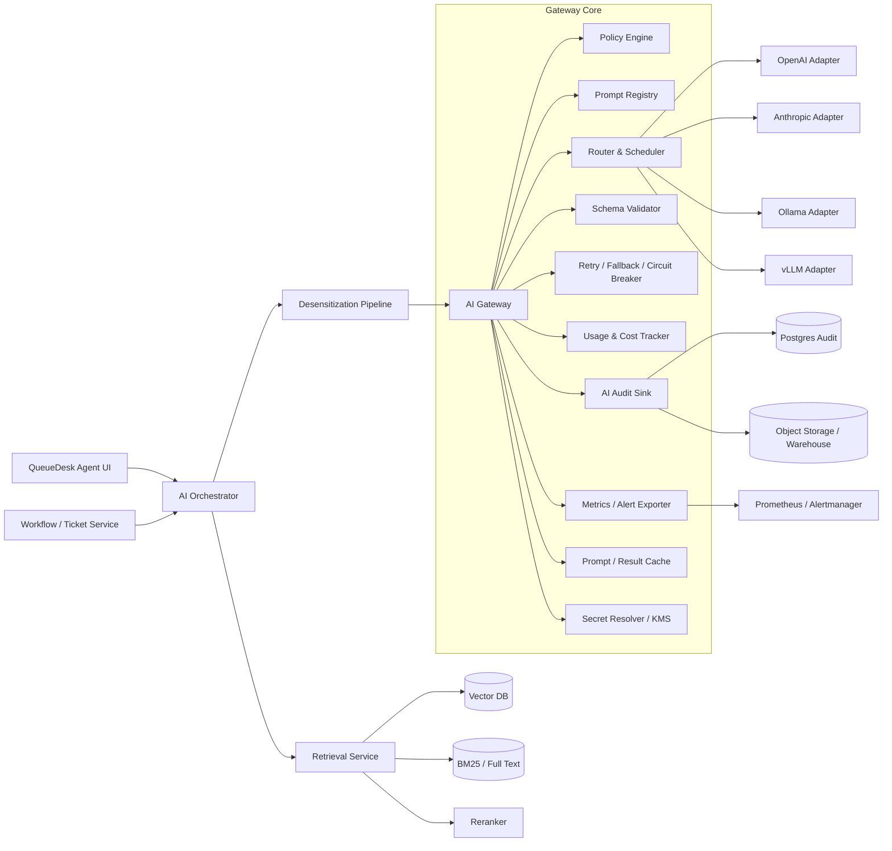

# QueueDesk 企业内部服务台 AI 模块的可落地架构与实现方案

## 执行摘要

本方案以“**AI 只提供建议，人工最终决定**”为根约束，面向 QueueDesk 这类企业内部服务台产品，给出一套可直接进入工程实施阶段的设计：统一的 AI Gateway、多提供方插件化适配、提示词版本治理、强制脱敏、可关联工单的 AI 审计日志，以及面向托管与私有化两类模型供应方式的一致接口层。这与您上传资料中 QueueDesk 作为内部服务台与 AI 增强协作平台的定位是一致的。fileciteturn0file0

从官方接口能力看，OpenAI 当前建议新的文本生成项目优先使用 Responses API，并提供 Structured Outputs、内置工具、状态管理、Usage/Costs/Admin APIs；Anthropic 以 Messages API 为主，强调无状态对话、`output_config.format` 结构化输出、引用、提示缓存、Rate Limits API 与 Usage and Cost API；Ollama 同时提供本地原生 API 与 OpenAI compatibility，并暴露 usage、`keep_alive`、embeddings 等能力；vLLM 提供 OpenAI-compatible server、Prometheus `/metrics`、embeddings/rerank、tensor/pipeline/data parallel 等面向自托管规模化的能力。citeturn37search7turn36search0turn36search1turn14search5turn31search5turn31search11turn33search2turn27search1turn27search2turn4view1turn31search0turn31search4turn23search0turn23search2turn23search3turn23search5turn23search6turn24search0turn24search1turn24search12turn24search13turn26search9

因此，QueueDesk 的最佳落地方式不是把 AI 能力散落在工单服务、知识库服务和前端中，而是建立一个**“脱敏优先、策略驱动、带审计的统一 AI Gateway”**。所有 AI 功能——工单分类、摘要生成、建议回复、知识库 RAG、异常检测解释——都走统一入口；所有外发数据先过脱敏；所有返回结果都做 schema 校验、置信度计算、引用校验和审计归档；所有最终写回工单系统的动作都必须经过人工确认。即便 OpenAI API 默认不使用 API 数据训练，Anthropic 也提供 ZDR/HIPAA-ready 等数据处理安排，QueueDesk 仍应把“出站前脱敏”作为供应商无关的固定边界，因为这能在多提供方、混合云以及私有化部署之间保持一致的数据治理模型。citeturn28search0turn28search9turn28search12turn29search1

## 设计原则与总体蓝图

先说原则。第一，**human-in-the-loop 不是 UI 文案，而是体系结构边界**。AI 生成的是 suggestion object，而不是 side effect。无论是建议队列、建议优先级、建议回复，还是异常检测解释，写回工单、修改 SLA、改变路由、触发通知，都应由明确的人工接纳、编辑或拒绝动作来完成。第二，**所有进入模型的文本必须是脱敏后的视图**。第三，**所有模型输出必须结构化**，或至少在网关层被校验、修复、重试，直到转成可验证的结构。第四，**引用与证据优先**。尤其是建议回复和摘要，不能只追求“写得像”，而要追求“可追责、可回放、可校验”。第五，**异常检测走 signals first、LLM later**：先由规则、统计或向量异常检测产出 anomaly event，再交给 LLM 生成自然语言解释与人工处置建议，而不是让生成模型直接做一跳自动判定。

从接口演进上看，OpenAI 的 Responses API 更适合做统一的未来向抽象，因为它原生支持更现代的响应对象、工具与状态管理；Anthropic 的 Messages API 则要求应用自己管理完整对话历史；Ollama 与 vLLM 都能通过 OpenAI-compatible 方式被吸收到统一的“消息/结构化输出/嵌入/重排序”抽象中。也因此，QueueDesk 不应把供应商差异暴露到业务层，而应在网关中定义一套**canonical request / response**：消息、schema、模型等级、超时、缓存、限流、审计、置信度、引用，全部先标准化，再由 provider adapter 做下沉转换。citeturn36search4turn36search2turn33search2turn27search10turn23search3turn24search0

在这个蓝图里，异常检测是一个值得单独点明的模块。它不应完全依赖 LLM。更稳妥的做法是：工单事件流进入规则引擎与统计检测器，识别 queue backlog spike、重复工单暴涨、SLA 即将违约、某类故障模式突然集中出现等事件；再把这些 anomaly signals 送入 AI Gateway，由模型生成**“异常说明 + 可能原因 + 建议排查路径 + 风险等级 + 需人工确认项”**。这样既能降低误报成本，也符合“AI 只建议、不自动执行”的治理模型。

## AI Gateway 架构

AI Gateway 的职责不是“转发 HTTP 请求”，而是提供一个**策略控制平面 + 供应商抽象层 + 观测与审计平面**。推荐将其拆成以下逻辑组件：Policy Engine、Prompt Registry、Redaction Service、Router/Scheduler、Provider Adapters、Schema Validator、Fallback Orchestrator、Usage & Cost Tracker、Audit Sink、Metrics Exporter、Key/Secret Resolver、Result Cache 和 Retrieval Bridge。OpenAI 与 Anthropic 都提供了可管理的限流、用量、成本与管理 API；Ollama 会在响应体中返回 usage 与耗时；vLLM 则暴露 Prometheus metrics，并提供 OpenAI-compatible server 以缩小接入差异。网关应把这些异构接口统一成一个可编排的控制面。citeturn14search5turn30search6turn31search5turn31search11turn22search0turn31search0turn31search4turn23search5turn23search6turn24search12



上图建议把“脱敏”放在 Orchestrator 与 Gateway 之间，而不是把它做成 Provider Adapter 的一部分。原因很直接：一旦脱敏逻辑被下沉到 adapter，业务层就很难保证**任何**模型调用都已经被清洗过；同时审计也无法可靠记录“脱敏前后的哈希与替换摘要”。如果把 Redaction 作为独立强制拦截器，网关就可以天然做到“先脱敏，再路由，再调用，再审计”。

### Provider 抽象与插件化

OpenAI 的新项目推荐 Responses API；Anthropic 的主入口是 Messages API；Ollama 提供本地 `/api/*` 与 OpenAI compatibility；vLLM 则适合以 OpenAI-compatible server 的形式进入统一网关。建议在 QueueDesk 中定义“**provider plugin + capability contract**”，而不是为每个厂商硬编码业务逻辑。citeturn37search7turn36search0turn33search2turn23search3turn24search0

```ts
export type ProviderKind = "openai" | "anthropic" | "ollama" | "vllm";
export type AiFeature =
  | "ticket_classification"
  | "thread_summary"
  | "reply_draft"
  | "rag_answer"
  | "anomaly_explainer";

export type Capability =
  | "chat"
  | "structured_output"
  | "embeddings"
  | "rerank"
  | "citations"
  | "prompt_caching"
  | "streaming";

export interface PromptRef {
  id: string;
  version: string;
  variant?: string;
}

export interface CanonicalMessage {
  role: "system" | "user" | "assistant";
  content: string;
}

export interface CanonicalSchema {
  name: string;
  jsonSchema: Record<string, unknown>;
  strict: boolean;
}

export interface CanonicalUsage {
  inputTokens?: number;
  outputTokens?: number;
  cachedInputTokens?: number;
  reasoningTokens?: number;
  promptEvalCount?: number;   // Ollama native usage compatibility
  evalCount?: number;         // Ollama native usage compatibility
  providerCostUsd?: number;   // self-estimated or provider-reconciled
}

export interface CanonicalGenerationRequest {
  requestId: string;
  tenantId: string;
  ticketId?: string;
  feature: AiFeature;
  promptRef: PromptRef;
  modelClass: "fast" | "balanced" | "quality";
  messages: CanonicalMessage[];
  schema?: CanonicalSchema;
  temperature?: number;
  maxTokens: number;
  stop?: string[];
  timeoutMs: number;
  idempotencyKey: string;
  metadata?: Record<string, string>;
}

export interface CanonicalGenerationResponse<T = unknown> {
  provider: ProviderKind;
  model: string;
  providerRequestId?: string;
  output: T;
  rawText?: string;
  stopReason?: string;
  latencyMs: number;
  usage: CanonicalUsage;
}

export interface ProviderAdapter {
  readonly kind: ProviderKind;
  readonly capabilities: Capability[];
  supports(capability: Capability): boolean;
  healthcheck(): Promise<{ ok: boolean; detail?: string }>;
  generate<T = unknown>(
    req: CanonicalGenerationRequest
  ): Promise<CanonicalGenerationResponse<T>>;
  embed?(
    input: { texts: string[]; modelClass?: "fast" | "quality" }
  ): Promise<{ vectors: number[][]; provider: ProviderKind; model: string }>;
  rerank?(
    input: { query: string; documents: string[]; topK: number }
  ): Promise<{ scores: number[]; provider: ProviderKind; model: string }>;
}
```

这个接口的关键不是类型漂亮，而是**把供应商差异压缩到 adapter 内部**。例如，OpenAI 可以把 canonical `schema` 映射到 Structured Outputs；Anthropic 可以映射到 `output_config.format`；Ollama/vLLM 如果所选模型或部署方式不保证 schema，则走“生成 JSON -> 本地 validator 校验 -> 一次 repair prompt -> 失败则 fallback”的补救路径。OpenAI 官方明确建议在可用时优先使用 Structured Outputs 而不是仅靠 JSON mode；Anthropic 也把结构化输出作为保证格式一致性的首选机制。citeturn36search1turn27search1turn27search4

### Provider、参数与成本项对比

| Provider | 推荐接入形态 | 主要能力抽象 | 成本治理重点 | 适合的 QueueDesk 位置 |
|---|---|---|---|---|
| OpenAI | Responses API 为主，必要时兼容 Chat Completions | chat、structured output、tools、state、usage/cost/admin | input / cached input / output / tool 调用 / project cost reconciliation | 外部托管主路由、结构化生成主力 |
| Anthropic | Messages API | chat、structured output、citations、prompt caching、usage/cost/rate-limit APIs | input / cache write / cache hit / output / search requests | 长上下文摘要、带引用回复、备用主路由 |
| Ollama | 本地原生 API 或 OpenAI compatibility | chat、embeddings、usage、keep_alive、OpenAI 兼容 | GPU/CPU 占用、模型驻留、节点利用率 | 严格内网、低延迟本地推理、嵌入服务 |
| vLLM | OpenAI-compatible server | chat、embeddings、rerank、metrics、distributed serving | GPU 利用率、并发吞吐、KV/cache、集群调度 | 自托管大模型主路由、精排/重排、规模化部署 |

| Canonical 字段 | OpenAI | Anthropic | Ollama | vLLM |
|---|---|---|---|---|
| 高优先级指令 | `instructions` 或 developer/system role | 顶层 `system` + `messages` | OpenAI-compatible `instructions/messages` 或 native chat messages | OpenAI-style messages |
| 输出 token 上限 | `max_output_tokens`（Responses）/ `max_completion_tokens`（Chat） | `max_tokens` | OpenAI compatibility `max_output_tokens`；native API 走 generation options | OpenAI-compatible 参数，额外采样参数可放 `extra_body` |
| 结构化输出 | Structured Outputs / JSON Schema | `output_config.format` / strict tools | 建议网关层 validator + repair | 建议网关层 validator；部分 server/model 可走额外 structured params |
| 引用 | 业务层自管或工具能力 | 原生 citations | 业务层自管 | 业务层自管 |
| 观测 | `x-request-id`、Usage/Costs API、project/admin APIs | `request-id`、Rate Limits API、Usage and Cost API | usage/耗时字段 | `/metrics`、`x-request-id`、OpenAI-compatible responses |

上表中的差异，分别来自 OpenAI 对 Responses/Structured Outputs/Usage/Costs/Admin 和 request-id 的说明，Anthropic 对 Messages/结构化输出/引用/Rate Limits API/Usage and Cost API 的说明，以及 Ollama 与 vLLM 对 OpenAI compatibility、usage、embeddings、rerank、metrics、parallelism 的说明。citeturn36search0turn36search1turn37search9turn37search3turn31search5turn31search11turn34search1turn33search2turn27search1turn27search2turn31search0turn31search4turn33search4turn23search3turn23search5turn23search6turn23search2turn24search0turn24search12turn24search1turn26search9

### Fallback、限流、并发与熔断

Fallback 不应只是“失败了换一家”，而应是**按数据域、特性风险与能力等级分层**：

1. **同 provider 重试优先**：仅对超时、429、5xx/529、短暂网络故障做指数退避重试。Anthropic 文档明确说明 429 可能来自常规限流或 acceleration limits，529 表示 overloaded；OpenAI 文档则说明可以从响应头读取限流信息与 request id 用作观测与诊断。citeturn22search0turn22search1turn30search0turn34search1  
2. **同数据域 fallback**：如果某租户的策略是“严格内网”，则只能在 Ollama/vLLM 池内降级，不得自动切到外部托管模型。  
3. **同能力等级 fallback**：建议回复、摘要这类强结构化与高可读场景，只能切到支持 schema 校验且通过离线评测门槛的模型；不能因为托管主路由抖动就自动切到一个没有经过格式与质量认证的本地小模型。  
4. **熔断是 feature-aware 的**：例如 `reply_draft` circuit open 不应连带切断 `ticket_classification`；分类可以继续走 fast lane，回复则进入 degraded mode（只给 KB 检索结果，不生成草稿）。

限流与并发控制建议做成两级。第一级是**provider-aware quota**：OpenAI 可按 project 读取和设置按模型的 requests/min、tokens/min；Anthropic 可通过 Rate Limits API 读取组织与工作区限制，且其速率限制按 RPM、ITPM、OTPM 计量。第二级是**tenant-aware weighted fair queue**：按租户、功能和优先级（P1/P2 工单高于普通摘要）做分桶，保证单个大租户不会挤占全局配额。citeturn14search5turn30search6turn22search0turn31search4

并发控制不要只看请求数，应看**预计 token footprint**。推荐采用基于 token budget 的 semaphore：  
`inflight_budget = Σ (estimated_input_tokens + estimated_output_tokens * output_weight)`。  
分类和摘要的 token footprint 可通过历史统计估计；建议回复则应把检索上下文长度也纳入预算。这样可以更真实地控制 vLLM/Ollama 的 GPU 压力，以及托管模型的 TPM 消耗。

### 认证、密钥管理与监控告警

认证上，OpenAI 适合使用 project service accounts 或组织级管理能力，而不是个人 API key；Anthropic 适合按 workspace 分隔 key 和花费；Ollama 云端模式要求 API key，而本地模式默认 API 暴露在本机；vLLM 可通过 `--api-key` 开启 Bearer 鉴权，但其文档也说明认证中间件只对 `/v1` 路径生效，因此生产环境仍应放在私有网络、ingress、service mesh 或 API gateway 之后。citeturn19search10turn19search1turn31search12turn22search13turn23search0turn23search1turn23search7turn24search11turn30search8

对 QueueDesk 而言，最稳妥的建议是：  
服务进程不直接保存第三方明文 key；统一从 Vault/KMS 取短期凭据；OpenAI 与 Anthropic 的 key/管理 key 分开；本地 Ollama 不对办公网或公网直接暴露；vLLM 只允许 AI Gateway 所在 namespace 或子网访问。OpenAI 官方文档还展示了工作负载身份模式与 `_request_id` 观测能力，这进一步说明“服务账号 + 工作负载身份 + request-id 链路追踪”的组合是正确方向。citeturn34search3turn34search1turn19search10

监控与告警建议至少覆盖以下指标：

| 指标域 | 指标 | 告警建议 |
|---|---|---|
| 可用性 | success rate、timeout rate、provider 429/5xx/529 比例 | 5 分钟窗口 success rate < 99% 或 429 持续攀升 |
| 时延 | p50/p95/p99 latency、queue wait time | `reply_draft` p95 > 6s，`classification` p95 > 2s |
| 成本 | 每工单 token、每租户日成本、每 provider 成本偏差 | 单租户日成本超预算 80%/100% 阈值 |
| 质量 | schema valid rate、citation coverage、fallback rate、人工接受率 | schema valid rate < 99.5% 或 citation coverage < 85% |
| 安全 | redaction hit rate、secret leak detector、audit sink lag | 检出未脱敏邮箱/凭证，或审计写入延迟 > 60s |
| 自托管 | GPU utilization、KV cache hit、model load/unload、vLLM `/metrics` | GPU 饱和且 queue depth 持续增加 |

## Prompt、接口与 RAG 设计

这四类高频场景建议统一采用“**静态 system + 少量 assistant few-shot + 结构化 user payload + 强制 schema**”的模板。OpenAI 文档强调 developer/system 指令优先级高于 user，并建议在可用时优先使用 Structured Outputs；Anthropic 提供 Messages API、assistant 预填充、`output_config.format`、citations；Ollama 与 vLLM 都可以通过 OpenAI-compatible 或 chat 接口承接统一的消息格式。citeturn14search2turn36search1turn36search2turn33search2turn27search1turn23search3turn24search0

对于非托管或不保证 schema 的环境，建议统一使用以下执行策略：  
**第一轮生成** → **本地 JSON Schema 校验** → **若失败则一次 repair prompt** → **若仍失败则 fallback**。  
这样可以把 Prompt 设计与 Provider 能力解耦，同时保证业务层始终拿到可验证对象。

### 工单自动分类

工单分类不要直接把原始工单文本扔给模型，让模型从零开始猜。工程上更稳的方法是先做**候选队列生成**：规则引擎（关键字、服务映射、来源系统、历史同类工单）+ 语义召回（标题/正文对队列定义与队列 exemplars 的向量相似度）生成 top-N queue candidates，再让模型在候选集合内做裁决与解释。这样可以显著提高可控性，也更适合做置信度校准。

```ts
export interface TicketClassificationInput {
  locale: "zh-CN" | "en-US";
  title: string;
  body: string;
  queueCandidates: Array<{
    queueId: string;
    queueName: string;
    description: string;
    scoreSemantic: number;
    scoreRule: number;
    examples: string[];
  }>;
  priorityPolicy: {
    levels: Array<"P1" | "P2" | "P3" | "P4">;
    rules: string[];
  };
}

export interface TicketClassificationOutput {
  queueSuggestion: {
    queueId: string;
    queueName: string;
    reason: string;
  };
  prioritySuggestion: {
    level: "P1" | "P2" | "P3" | "P4";
    reason: string;
  };
  confidence: number; // 0.0 ~ 1.0
  signals: Array<{
    name: string;
    source: "semantic" | "rule" | "llm";
    weight: number;
  }>;
  requiresHumanReview: boolean;
}
```

```json
[
  {
    "role": "system",
    "content": "你是 QueueDesk 的工单分流助手。你只能在给定的候选队列中选择一个 queueId，并根据优先级政策给出建议等级。严格输出 JSON。禁止输出候选列表之外的 queueId。若信息不足，仍需给出最可能建议，但将 requiresHumanReview 设为 true。"
  },
  {
    "role": "assistant",
    "content": "示例输入：标题=VPN 无法连接；正文=大量员工今早开始无法通过公司 VPN 登陆；候选队列=[网络、终端支持]；优先级政策=[影响多人且核心办公阻断=>P1/P2]。\n示例输出：{\"queueSuggestion\":{\"queueId\":\"network\",\"queueName\":\"网络支持\",\"reason\":\"症状集中在 VPN 连接失败，且候选中网络队列语义分数最高\"},\"prioritySuggestion\":{\"level\":\"P2\",\"reason\":\"影响多人核心办公，但尚无全公司网络中断证据\"},\"confidence\":0.86,\"signals\":[{\"name\":\"vpn_keyword\",\"source\":\"rule\",\"weight\":0.25},{\"name\":\"semantic_margin\",\"source\":\"semantic\",\"weight\":0.41},{\"name\":\"policy_match\",\"source\":\"llm\",\"weight\":0.20}],\"requiresHumanReview\":false}"
  },
  {
    "role": "user",
    "content": "标题: {{title}}\n正文: {{body}}\n候选队列(JSON): {{queue_candidates_json}}\n优先级策略(JSON): {{priority_policy_json}}\n请输出 JSON 字段: queueSuggestion, prioritySuggestion, confidence, signals, requiresHumanReview。"
  }
]
```

| 参数 | 建议值 |
|---|---|
| temperature | 0.0 ~ 0.1 |
| maxTokens | 220 |
| stop | schema 模式下留空；非 schema 模式可用 `\"<END_JSON>\"` |
| modelClass | fast 或 balanced |

**置信度计算**建议不要直接信任模型自报分数，而应由网关二次计算：  
`raw = 0.45 * semantic_margin + 0.25 * rule_agreement + 0.20 * llm_candidate_agreement + 0.10 * schema_validity`  
其中 `semantic_margin = top1 - top2`（来自候选队列召回阶段），`rule_agreement` 表示模型结论是否与规则优先候选一致，`llm_candidate_agreement` 表示模型是否选择了综合得分最高候选。最终再按模型/租户/队列做 isotonic calibration，得到最终 `confidence`。如果 `confidence < 0.6`，强制 `requiresHumanReview = true`。

```json
{
  "promptRef": { "id": "ticket-classification", "version": "1.2.0" },
  "input": {
    "locale": "zh-CN",
    "title": "无法连接公司 VPN",
    "body": "今天早上开始，笔记本连接 VPN 报 691 错误，多个同事也有同样情况。",
    "queueCandidates": [
      {
        "queueId": "network",
        "queueName": "网络支持",
        "description": "VPN、代理、DNS、内外网访问故障",
        "scoreSemantic": 0.91,
        "scoreRule": 0.80,
        "examples": ["VPN 登录失败", "DNS 解析异常"]
      },
      {
        "queueId": "endpoint",
        "queueName": "终端支持",
        "description": "电脑、系统、驱动、办公软件",
        "scoreSemantic": 0.63,
        "scoreRule": 0.20,
        "examples": ["蓝屏", "摄像头不可用"]
      }
    ],
    "priorityPolicy": {
      "levels": ["P1", "P2", "P3", "P4"],
      "rules": ["影响多人且核心办公受阻=>至少P2", "全公司范围中断=>P1"]
    }
  }
}
```

```json
{
  "queueSuggestion": {
    "queueId": "network",
    "queueName": "网络支持",
    "reason": "问题集中于 VPN 登录失败，且网络支持在候选中语义和规则分都最高。"
  },
  "prioritySuggestion": {
    "level": "P2",
    "reason": "描述显示影响多人核心办公，但尚未证明为全公司网络级中断。"
  },
  "confidence": 0.88,
  "signals": [
    { "name": "vpn_keyword", "source": "rule", "weight": 0.24 },
    { "name": "candidate_margin", "source": "semantic", "weight": 0.46 },
    { "name": "llm_alignment", "source": "llm", "weight": 0.18 }
  ],
  "requiresHumanReview": false
}
```

### 工单摘要生成

摘要的目标不是“写一段总结”，而是为人工接手、转派、升级和复盘提供一个**结构化状态快照**。因此输出字段应包含事实、状态、缺口、下一步，而不仅是 prose summary。Anthropic Messages API 明确是无状态模式，需要应用自己传递完整历史；OpenAI 也建议对状态与评测做系统化管理。因此摘要场景特别适合以“结构化字段 + evidence ids”的方式治理。citeturn33search2turn32search1turn32search9

```ts
export interface ThreadMessage {
  messageId: string;
  authorRole: "requester" | "agent" | "system";
  authorName?: string;
  createdAt: string;
  content: string;
}

export interface TicketSummaryInput {
  locale: "zh-CN" | "en-US";
  ticketId: string;
  subject: string;
  messages: ThreadMessage[];
}

export interface TicketSummaryOutput {
  issueSummary: string;
  customerImpact: string;
  currentStatus: string;
  actionsTaken: string[];
  pendingActions: string[];
  blockers: string[];
  importantFacts: string[];
  timeline: Array<{
    at: string;
    event: string;
    evidenceMessageIds: string[];
  }>;
  openQuestions: string[];
  sentiment: "positive" | "neutral" | "frustrated";
  confidence: number;
}
```

```json
[
  {
    "role": "system",
    "content": "你是 QueueDesk 的工单摘要助手。你的任务是把完整线程压缩成可交接、可升级、可审计的结构化摘要。只提取在线程中出现过的事实；不确定的信息放入 openQuestions；每条 timeline 必须附 evidenceMessageIds。严格输出 JSON。"
  },
  {
    "role": "assistant",
    "content": "示例输出：{\"issueSummary\":\"用户无法重置 MFA 绑定，导致无法登录 VPN。\",\"customerImpact\":\"单个用户远程办公受阻。\",\"currentStatus\":\"已重置后端绑定，等待用户重新注册 MFA。\",\"actionsTaken\":[\"坐席核验身份\",\"管理员重置 MFA 绑定\"],\"pendingActions\":[\"等待用户确认重新注册成功\"],\"blockers\":[],\"importantFacts\":[\"用户已通过工号与手机号二次校验\"],\"timeline\":[{\"at\":\"2026-05-06T09:12:00Z\",\"event\":\"用户首次报告无法登录 VPN\",\"evidenceMessageIds\":[\"m1\"]}],\"openQuestions\":[],\"sentiment\":\"neutral\",\"confidence\":0.84}"
  },
  {
    "role": "user",
    "content": "工单主题: {{subject}}\n线程消息(JSON): {{messages_json}}\n输出字段: issueSummary, customerImpact, currentStatus, actionsTaken, pendingActions, blockers, importantFacts, timeline, openQuestions, sentiment, confidence。"
  }
]
```

| 参数 | 建议值 |
|---|---|
| temperature | 0.1 ~ 0.2 |
| maxTokens | 450 |
| stop | schema 模式下留空 |
| modelClass | balanced |

**置信度计算**建议基于覆盖率与一致性，而非生成模型自信度：  
`raw = 0.35 * field_completeness + 0.30 * evidence_coverage + 0.20 * chronology_consistency + 0.15 * contradiction_penalty_inverse`  
这里 `field_completeness` 关注应填字段是否有值，`evidence_coverage` 关注 timeline / facts 是否能回指 message id，`chronology_consistency` 校验时间线是否单调，`contradiction_penalty_inverse` 用于惩罚同一摘要中前后矛盾的状态表述。最终仍通过离线标注集校准。

```json
{
  "promptRef": { "id": "thread-summary", "version": "2.1.0" },
  "input": {
    "locale": "zh-CN",
    "ticketId": "T-10001",
    "subject": "邮箱收不到重置密码验证码",
    "messages": [
      {
        "messageId": "m1",
        "authorRole": "requester",
        "createdAt": "2026-05-06T08:30:00Z",
        "content": "我从昨晚开始收不到重置密码验证码，已尝试 3 次。"
      },
      {
        "messageId": "m2",
        "authorRole": "agent",
        "createdAt": "2026-05-06T08:41:00Z",
        "content": "已确认邮件网关正常，请用户检查垃圾箱并提供备用邮箱。"
      }
    ]
  }
}
```

```json
{
  "issueSummary": "用户无法收到密码重置验证码邮件。",
  "customerImpact": "用户当前无法完成密码重置流程。",
  "currentStatus": "已初步排除全局邮件网关异常，等待用户反馈垃圾箱与备用邮箱情况。",
  "actionsTaken": ["坐席检查邮件网关状态", "建议用户检查垃圾箱并提供备用邮箱"],
  "pendingActions": ["等待用户反馈是否在垃圾箱中找到邮件", "必要时改用备用邮箱发送验证码"],
  "blockers": ["缺少用户对垃圾箱与备用邮箱的反馈"],
  "importantFacts": ["用户表示从昨晚开始连续 3 次未收到验证码"],
  "timeline": [
    {
      "at": "2026-05-06T08:30:00Z",
      "event": "用户首次报告无法收到验证码邮件",
      "evidenceMessageIds": ["m1"]
    },
    {
      "at": "2026-05-06T08:41:00Z",
      "event": "坐席确认邮件网关正常并要求进一步核实",
      "evidenceMessageIds": ["m2"]
    }
  ],
  "openQuestions": ["用户是否检查过垃圾箱", "是否有可用的备用邮箱"],
  "sentiment": "neutral",
  "confidence": 0.82
}
```

### 建议回复生成

建议回复是最容易“看起来对，其实不可追责”的场景，所以必须做 source-grounded 设计。Anthropic 提供原生 citations；OpenAI 更适合用业务层自管 source ids + Structured Outputs；自托管模型则统一采用“**每一条事实陈述都要绑定来源 chunk id**”的应用层引用协议。Anthropic 文档说明 citations 可用于跟踪和验证文档来源；OpenAI 则建议在可用时用 Structured Outputs 保证 schema；Ollama/vLLM 可作为生成层，但引用仍应回到应用层 chunk ids。citeturn27search2turn27search3turn36search1turn23search3turn24search0

```ts
export interface KnowledgeSnippet {
  sourceId: string;
  title: string;
  chunkId: string;
  text: string;
  score: number;
  updatedAt?: string;
}

export interface ReplyDraftInput {
  locale: "zh-CN" | "en-US";
  ticketSubject: string;
  ticketBody: string;
  threadContext?: string;
  kbSnippets: KnowledgeSnippet[];
  tone: "professional" | "warm" | "direct";
  responsePolicy: {
    requireCitations: true;
    forbidUnsupportedClaims: true;
    allowClarifyingQuestion: true;
  };
}

export interface ReplyDraftOutput {
  subject: string;
  draftMarkdown: string;
  citations: Array<{
    sourceId: string;
    chunkId: string;
    usedFor: string;
  }>;
  followUpQuestions: string[];
  unsupportedClaims: string[];
  confidence: number;
}
```

```json
[
  {
    "role": "system",
    "content": "你是 QueueDesk 的坐席回复助手。你只能基于给定工单内容与知识库片段生成可编辑草稿。任何事实性陈述都必须在句末附带来源标记，例如 [SRC-01]。若知识不足，请明确写出需要人工确认，而不是猜测。严格输出 JSON。"
  },
  {
    "role": "assistant",
    "content": "示例输出：{\"subject\":\"关于您 VPN 登录失败问题的处理建议\",\"draftMarkdown\":\"您好，我们已经确认当前 VPN 服务没有出现全局中断。[SRC-01]\\n\\n请您先按以下步骤排查：\\n1. 重新同步系统时间。[SRC-02]\\n2. 清理旧的 VPN 凭据后重试。[SRC-03]\\n\\n如果仍失败，请回复错误截图与发生时间，我们将继续协助。\",\"citations\":[{\"sourceId\":\"SRC-01\",\"chunkId\":\"c1\",\"usedFor\":\"说明无全局中断\"}],\"followUpQuestions\":[\"请提供错误代码或截图\"],\"unsupportedClaims\":[],\"confidence\":0.79}"
  },
  {
    "role": "user",
    "content": "工单主题: {{ticket_subject}}\n工单正文: {{ticket_body}}\n线程上下文: {{thread_context}}\n知识库片段(JSON): {{kb_snippets_json}}\n风格: {{tone}}\n请输出 JSON 字段: subject, draftMarkdown, citations, followUpQuestions, unsupportedClaims, confidence。"
  }
]
```

| 参数 | 建议值 |
|---|---|
| temperature | 0.2 ~ 0.35 |
| maxTokens | 700 |
| stop | schema 模式下留空；非 schema 模式可用 `<END_JSON>` |
| modelClass | quality |

**置信度计算**建议聚焦 groundedness：  
`raw = 0.40 * mean_top3_rerank + 0.30 * citation_coverage + 0.20 * freshness_score + 0.10 * unsupported_claim_penalty_inverse`  
如果 `citation_coverage < 0.8` 或 `unsupportedClaims.length > 0`，则强制把 `confidence` 压低到 0.55 以下，并在 UI 上默认展开“需要人工复核”提示。

```json
{
  "promptRef": { "id": "reply-draft", "version": "3.0.2" },
  "input": {
    "locale": "zh-CN",
    "ticketSubject": "VPN 登录失败",
    "ticketBody": "输入账号密码后提示 691，今天早上开始出现。",
    "threadContext": "用户表示同部门多人也受影响。",
    "kbSnippets": [
      {
        "sourceId": "SRC-01",
        "title": "VPN 故障排查手册",
        "chunkId": "c-11",
        "text": "错误 691 通常与凭据、时间偏差或账号策略有关；若多人同发，则先排查认证服务状态。",
        "score": 0.93,
        "updatedAt": "2026-04-19"
      },
      {
        "sourceId": "SRC-02",
        "title": "终端时间同步 SOP",
        "chunkId": "c-07",
        "text": "设备时间与域时间偏差过大可能导致身份认证失败，可先执行时间同步。",
        "score": 0.84,
        "updatedAt": "2026-03-02"
      }
    ],
    "tone": "professional",
    "responsePolicy": {
      "requireCitations": true,
      "forbidUnsupportedClaims": true,
      "allowClarifyingQuestion": true
    }
  }
}
```

```json
{
  "subject": "关于您 VPN 登录失败问题的处理建议",
  "draftMarkdown": "您好，结合当前信息，错误 691 常见于凭据、设备时间偏差或账号策略问题；若多人同时发生，也需要先排查认证服务状态。[SRC-01]\n\n建议您先尝试以下步骤：\n1. 先同步设备时间后再重试登录。[SRC-02]\n2. 如果仍失败，请回复具体报错截图与发生时间，以便我们继续核查认证服务状态。[SRC-01]\n\n如您所在部门有更多同事受影响，也请一并告知受影响人数。",
  "citations": [
    { "sourceId": "SRC-01", "chunkId": "c-11", "usedFor": "错误 691 的常见原因与多人受影响排查方向" },
    { "sourceId": "SRC-02", "chunkId": "c-07", "usedFor": "时间同步排查步骤" }
  ],
  "followUpQuestions": ["请提供错误截图", "请确认受影响人数"],
  "unsupportedClaims": [],
  "confidence": 0.83
}
```

### 知识库 RAG 检索策略

RAG 不建议只有“向量检索 + topK”。在 QueueDesk 这种内部服务台场景里，最稳的做法是**三段式**：  
**召回**（lexical + dense + metadata filters）→ **重排**（cross-encoder/rerank）→ **答案合成**（带来源约束）。  
OpenAI、Ollama、vLLM 都提供 embeddings 能力；Ollama 文档特别建议索引和查询使用同一个 embedding 模型；vLLM 还支持 OpenAI-compatible embeddings 与单独的 rerank API。因此，网关应把 embeddings 与 rerank 视为一等能力，而不是把“搜索”完全塞给聊天模型。citeturn26search0turn26search2turn23search2turn26search1turn26search9

**推荐的检索流水线**如下：

| 阶段 | 建议实现 |
|---|---|
| Query normalize | 归一化大小写、错误码、产品别名、部门缩写；提取 ticket entities |
| Query rewrite | 规则优先，LLM 只做补充重写，不改变核心实体 |
| Recall | BM25 top 20 + dense top 40 + 精确 FAQ/标签命中 top 10 |
| Merge | 按 `sourceId + chunkId` 去重；同文档相邻 chunk 合并 |
| Rerank | top 50 输入 cross-encoder/rerank，保留 top 8 |
| Compose | 仅把高置信上下文送入生成阶段；要求引用 sourceId |

**阈值建议**不要写死成单一 cosine 值，因为 embedding 模型不同，分值分布会明显不一样。更稳妥的起点是：  
召回阶段**不设绝对硬门槛**，优先保证 recall；精排阶段设置两个门槛——`keepThreshold` 与 `strongThreshold`。一个可实施的默认值是：  
`keepThreshold = 0.18`，`strongThreshold = 0.32`（针对标准化 rerank score，必须用你自己的标注集校准）。  
最终送入大模型的上下文规则是：保留 `score >= strongThreshold` 的全部 chunk，再从 `keepThreshold ~ strongThreshold` 区间按 source 多样性补齐到 4~8 条。若最终有效证据不足 2 条，则让模型返回“依据不足，需要人工确认”。

缓存策略分三层。第一层是**embedding cache**，键为 `sha256(normalized_text + embedding_model + kb_version)`，只要文档版本未变就可复用。第二层是**retrieval cache**，键为 `tenantId + normalized_query + metadata_filters + kb_version`，TTL 取 2~10 分钟。第三层是**prompt cache / prefix cache**，把 system、schema、引用规则、输出模板等静态前缀固定在最前面，以提高 OpenAI 与 Anthropic 的缓存命中率。OpenAI 明确说明 prompt caching 对 exact prefix match 生效；Anthropic 则支持自动或显式 `cache_control`，默认 5 分钟 TTL、可扩展到 1 小时。citeturn35search0turn35search1turn4view1turn5view1

```ts
export interface RagSearchInput {
  locale: "zh-CN" | "en-US";
  query: string;
  ticketContext?: string;
  filters?: {
    product?: string[];
    queueId?: string[];
    tags?: string[];
    language?: string;
  };
  topK?: number;
}

export interface RagChunk {
  sourceId: string;
  chunkId: string;
  title: string;
  text: string;
  scoreDense?: number;
  scoreLexical?: number;
  scoreRerank?: number;
  updatedAt?: string;
}

export interface RagAnswerOutput {
  answerMarkdown: string;
  citedSources: Array<{ sourceId: string; chunkId: string }>;
  confidence: number;
  evidenceSufficiency: "strong" | "partial" | "weak";
  shouldEscalateToHuman: boolean;
}
```

```json
[
  {
    "role": "system",
    "content": "你是 QueueDesk 的知识库问答助手。你只能根据给定知识库片段作答。每个事实句必须附引用 [sourceId]。若证据不足，明确说明“依据不足，需要人工确认”，不要编造流程。严格输出 JSON。"
  },
  {
    "role": "assistant",
    "content": "示例输出：{\"answerMarkdown\":\"执行时间同步后重新尝试登录。[KB-17] 若仍报 691，请联系网络支持检查认证服务。[KB-04]\",\"citedSources\":[{\"sourceId\":\"KB-17\",\"chunkId\":\"c2\"},{\"sourceId\":\"KB-04\",\"chunkId\":\"c5\"}],\"confidence\":0.81,\"evidenceSufficiency\":\"strong\",\"shouldEscalateToHuman\":false}"
  },
  {
    "role": "user",
    "content": "问题: {{query}}\n工单上下文: {{ticket_context}}\n知识片段(JSON): {{retrieved_chunks_json}}\n必须输出 JSON 字段: answerMarkdown, citedSources, confidence, evidenceSufficiency, shouldEscalateToHuman。"
  }
]
```

| 参数 | 建议值 |
|---|---|
| temperature | 0.0 ~ 0.2 |
| maxTokens | 500 |
| stop | schema 模式下留空 |
| modelClass | balanced 或 quality |

```json
{
  "promptRef": { "id": "rag-answer", "version": "1.4.0" },
  "input": {
    "locale": "zh-CN",
    "query": "VPN 报 691 先排查什么？",
    "ticketContext": "用户反馈多人同发。",
    "retrievedChunks": [
      {
        "sourceId": "KB-04",
        "chunkId": "c5",
        "title": "VPN 故障排查手册",
        "text": "若 691 且多人同发，先检查认证服务状态。",
        "scoreDense": 0.89,
        "scoreLexical": 12.4,
        "scoreRerank": 0.44
      },
      {
        "sourceId": "KB-17",
        "chunkId": "c2",
        "title": "时间同步 SOP",
        "text": "设备时间偏差也可能导致认证失败，应先执行时间同步。",
        "scoreDense": 0.82,
        "scoreLexical": 9.7,
        "scoreRerank": 0.35
      }
    ]
  }
}
```

```json
{
  "answerMarkdown": "建议先执行设备时间同步后重试登录。[KB-17]\n\n由于工单上下文显示多人同时发生，也应尽快检查 VPN 认证服务状态。[KB-04]",
  "citedSources": [
    { "sourceId": "KB-17", "chunkId": "c2" },
    { "sourceId": "KB-04", "chunkId": "c5" }
  ],
  "confidence": 0.84,
  "evidenceSufficiency": "strong",
  "shouldEscalateToHuman": false
}
```

## Prompt 版本治理与实验发布

OpenAI 与 Anthropic 都强调：先定义成功标准，再做 eval，再迭代 prompt；OpenAI 还建议把生产环境固定到具体模型快照，并持续评估版本变化影响。对 QueueDesk 而言，最可落地的治理策略是：**代码仓库作为 Prompt Source of Truth，控制台/平台能力作为辅助工具**。OpenAI 的平台支持创建、保存、版本化与分享 prompts，但对于企业内部工单系统，审查、回滚、灰度与跨 provider 兼容性，仍然更适合放在 Git + CI/CD 流水线中管理。citeturn5view2turn5view3turn32search1turn32search7turn14search2turn35search7

推荐的目录结构如下：

```text
ai/
  prompts/
    ticket-classification/
      ticket-classification@1.2.0/
        meta.yaml
        system.md
        user.mustache
        assistant_examples.jsonl
        schema.json
        eval.dataset.jsonl
        eval.graders.yaml
        changelog.md
    thread-summary/
      thread-summary@2.1.0/
        meta.yaml
        system.md
        user.mustache
        assistant_examples.jsonl
        schema.json
    reply-draft/
      reply-draft@3.0.2/
        meta.yaml
        system.md
        user.mustache
        assistant_examples.jsonl
        schema.json
    rag-answer/
      rag-answer@1.4.0/
        meta.yaml
        system.md
        user.mustache
        assistant_examples.jsonl
        schema.json
  providers/
    openai/
    anthropic/
    ollama/
    vllm/
  evals/
    offline/
    online/
```

```yaml
# meta.yaml
id: reply-draft
version: 3.0.2
feature: reply_draft
owner: ai-platform@queuedesk.internal
status: canary
supported_providers:
  - openai
  - anthropic
  - ollama
  - vllm
response_schema: ./schema.json
default_params:
  temperature: 0.3
  maxTokens: 700
  stop: []
routing:
  modelClass: quality
  allowExternalFallback: false
quality_gates:
  minSchemaValidity: 0.995
  minCitationCoverage: 0.85
  minOfflineGroundedness: 0.80
release:
  previousStable: 2.9.4
  canaryPercent: 10
  rollbackOn:
    - schema_valid_rate < 0.99
    - accept_rate_drop > 0.05
    - p95_latency_ms > 8000
```

A/B 测试应做成**确定性分流**，而不是随机数随手打点。建议以 `hash(tenantId + ticketId + feature + experimentSalt) % 100` 决定 bucket，这样同一张工单在一次生命周期内会稳定落在同一 prompt 变体。离线阶段重点看 schema validity、citation coverage、exact match、Rouge/BERTScore、grader score；在线阶段重点看人工接受率、编辑距离、首次响应时间、升级率、7 天重开率、摘要二次编辑率、低置信度被接受比例等。OpenAI 的 eval best practices 与 Anthropic 的 success criteria/evals 指南都强调“连续评测”而不是凭感觉改提示词。citeturn32search1turn32search7turn32search9turn5view3

灰度发布建议采用**固定门槛 + 自动回滚**：  
先 1% 内部队列 → 10% 非关键队列 → 25% 所有普通工单 → 50% → 100%。  
回滚触发条件要尽量客观，例如：

- `schema_valid_rate < 99%`
- `reply_accept_rate` 较 stable 下降超过 5 个百分点
- `summary_edit_distance` 增长超过 20%
- `fallback_rate > 15%`
- `p95_latency` 超预算
- 安全检查出现一次“未脱敏敏感字段泄露”

这样 Prompt 发布就像普通代码发布一样可审计、可回滚、可灰度，而不是运营人员在控制台里“改了一句 system prompt”之后谁也说不清行为为何变化。

## 审计与脱敏 Pipeline

审计设计的目标不是“留痕即可”，而是让任何一个 AI 建议都能回答以下问题：**谁发起的、用了哪个 prompt 版本、走了哪个 provider、输入输出是什么摘要、脱敏是否生效、花了多少钱、人工是否采纳、最终影响了哪条工单日志**。OpenAI 的 Administration/Audit Logs、Usage/Costs API 与 request-id 能力，Anthropic 的 request-id、Rate Limits/Usage and Cost APIs，再加上 NIST 与 OWASP 对日志管理与敏感数据最小化的建议，共同说明了：AI 调用必须被当成一类一等审计事件来建模。citeturn31search11turn31search5turn34search1turn34search3turn33search4turn31search0turn25search0turn25search1turn25search15

### AI 动作审计字段与关联模型

建议每次 AI 调用记录如下字段：

| 字段 | 说明 |
|---|---|
| action_id | AI 调用全局唯一 ID |
| correlation_id | 与工单事件流、HTTP 请求、trace span 关联 |
| ticket_id / thread_id | 关联工单与线程 |
| caller_user_id / caller_service_id | 发起人或服务账号 |
| feature | `ticket_classification` / `thread_summary` / `reply_draft` / `rag_answer` / `anomaly_explainer` |
| provider / model | 实际模型供应方与模型名 |
| provider_request_id | OpenAI/Anthropic/vLLM 等的请求 ID；若无则写内部 ID |
| prompt_id / prompt_version / prompt_variant | 提示词版本上下文 |
| request_summary | 输入摘要，不存全量原文 |
| response_summary | 输出摘要，不存全量原文 |
| pre_redaction_hmac | 脱敏前内容的 HMAC-SHA256 |
| post_redaction_hmac | 脱敏后内容的 HMAC-SHA256 |
| redaction_hits | 脱敏类型与数量摘要 |
| schema_name / schema_valid | 所用 schema 及是否校验通过 |
| confidence | 网关计算后的置信度 |
| citations_count / citation_coverage | 引用统计 |
| input_tokens / output_tokens / cached_tokens / reasoning_tokens | 标准化用量 |
| estimated_cost_usd / reconciled_cost_usd | 当次估算成本与后续对账成本 |
| started_at / finished_at / latency_ms | 时间信息 |
| human_decision | accepted / edited / rejected / ignored |
| applied_ticket_event_id | 如果被采纳，关联哪条工单审计事件 |
| retention_class | hot / warm / cold |
| security_flags | secret_detected / policy_violation / low_confidence 等 |

推荐的数据模型如下：

```ts
export interface AiActionAuditRecord {
  actionId: string;
  correlationId: string;
  ticketId?: string;
  threadId?: string;
  callerUserId?: string;
  callerServiceId?: string;
  feature: string;

  provider: "openai" | "anthropic" | "ollama" | "vllm";
  model: string;
  providerRequestId?: string;

  promptId: string;
  promptVersion: string;
  promptVariant?: string;

  requestSummary: string;
  responseSummary: string;

  preRedactionHmac: string;
  postRedactionHmac: string;
  redactionHits: Array<{ kind: string; count: number }>;

  schemaName?: string;
  schemaValid: boolean;

  confidence: number;
  citationsCount: number;
  citationCoverage?: number;

  usage: {
    inputTokens?: number;
    outputTokens?: number;
    cachedTokens?: number;
    reasoningTokens?: number;
  };

  estimatedCostUsd?: number;
  reconciledCostUsd?: number;

  startedAt: string;
  finishedAt: string;
  latencyMs: number;

  humanDecision?: "accepted" | "edited" | "rejected" | "ignored";
  appliedTicketEventId?: string;

  securityFlags?: string[];
  retentionClass: "hot" | "warm" | "cold";
}
```

工单审计日志与 AI 审计日志建议采用**双向链接**：  
`ticket_audit_log.ai_action_id -> ai_action_audit.action_id`，以及  
`ai_action_audit.applied_ticket_event_id -> ticket_audit_log.event_id`。  
这样前端在查看工单时，就能直接跳到“这条回复草稿来自哪个 AI 调用”；而在 AI 控制台查看某次调用时，也能追溯“它最终对应哪条人工采纳的工单动作”。

### 存储方案、保留策略与查询示例

存储建议采用三层：

1. **OLTP 明细表**：Postgres，保留 30~90 天，供工单页面、审计检索、线上排障。  
2. **Append-only 对象存储**：按天导出为 Parquet，保留 1~3 年，用于取证、数据科学、成本分析。  
3. **列式查询仓库**：用于周/月报、实验分析、租户账单与运营看板。  

原始 prompt/response 全文默认不写入明细表；若确需保留，必须单独加密、单独 retention class、单独 ACL，并通过 break-glass 流程访问。OWASP 明确建议中央日志系统不要接收未过滤的 PII、password、API keys 等敏感值；NIST 也强调日志基础设施应覆盖生成、传输、存储、访问与销毁全生命周期。citeturn25search0turn25search1turn25search15

```sql
create table ai_action_audit (
  action_id text primary key,
  correlation_id text not null,
  ticket_id text,
  feature text not null,
  provider text not null,
  model text not null,
  provider_request_id text,
  prompt_id text not null,
  prompt_version text not null,
  request_summary text not null,
  response_summary text not null,
  pre_redaction_hmac text not null,
  post_redaction_hmac text not null,
  redaction_hits jsonb not null default '[]'::jsonb,
  schema_name text,
  schema_valid boolean not null,
  confidence numeric(5,4) not null,
  citations_count int not null default 0,
  citation_coverage numeric(5,4),
  usage jsonb not null,
  estimated_cost_usd numeric(12,6),
  reconciled_cost_usd numeric(12,6),
  started_at timestamptz not null,
  finished_at timestamptz not null,
  latency_ms int not null,
  human_decision text,
  applied_ticket_event_id text,
  security_flags jsonb not null default '[]'::jsonb,
  retention_class text not null
);

create index idx_ai_action_audit_ticket on ai_action_audit(ticket_id, started_at desc);
create index idx_ai_action_audit_prompt on ai_action_audit(prompt_id, prompt_version, started_at desc);
create index idx_ai_action_audit_provider on ai_action_audit(provider, model, started_at desc);
```

```sql
-- 查看某张工单的全部 AI 建议及最终人工决策
select
  action_id,
  feature,
  provider,
  model,
  prompt_id,
  prompt_version,
  confidence,
  human_decision,
  applied_ticket_event_id,
  estimated_cost_usd,
  started_at
from ai_action_audit
where ticket_id = 'T-10001'
order by started_at desc;
```

```sql
-- 找出“低置信度但仍被直接采纳”的回复草稿，用于复盘与策略收紧
select
  prompt_id,
  prompt_version,
  count(*) as accepted_low_confidence_count
from ai_action_audit
where feature = 'reply_draft'
  and confidence < 0.60
  and human_decision = 'accepted'
group by prompt_id, prompt_version
order by accepted_low_confidence_count desc;
```

### 脱敏 Pipeline 的字段、规则、可逆性与实现

脱敏字段建议至少覆盖以下几类：

| 类别 | 必须处理的字段 |
|---|---|
| 个人身份信息 | 姓名、邮箱、手机号、座机、地址、身份证号/护照号 |
| 网络与设备信息 | IPv4/IPv6、主机名、MAC、设备序列号、浏览器指纹片段 |
| 企业身份 | 工号、员工邮箱别名、组织结构路径、内部用户名 |
| 凭证与密钥 | 密码、API key、OAuth token、JWT、Cookie、SSH key、Access Key、私钥块 |
| 业务敏感信息 | 合同金额、供应商报价、未公开产品代号、财务编号、客户名单、事故根因细节 |
| 附件元数据 | 文件名中的人名/项目名、图片 OCR 中的邮箱或手机号 |

规则建议采用“**规则匹配 + NER/分类器 + 业务字典 + token vault**”的组合，而不是只靠正则。对于邮箱、IP、Access Key、JWT、私钥块等高模式性字段，正则足够快且可靠；对于人名、部门、项目代号、客户名称，则需要结合业务词典或实体识别；对于供应商报价、敏感合同号、事故编号等内部字段，则应引入 tenant-specific dictionary。OWASP 的日志与 AI Agent/MCP 安全建议都强调了：日志与上下文中应当屏蔽 PII 与 secrets。citeturn25search0turn25search9turn25search12

另外，一个特别容易被忽略的点是：**不要把敏感值塞进 JSON schema / enum / regex pattern**。Anthropic 的 HIPAA/ZDR 文档明确指出，结构化输出与 strict tools 场景中的 schema 会被单独缓存，PHI 不应出现在 schema 定义本身；对 QueueDesk 来说，这个结论完全可以推广到工号、邮箱、客户名等所有敏感业务值。换句话说，敏感值只能出现在消息内容中，而且要先脱敏；不能出现在 schema、tool parameter enum、prompt constants 中。citeturn29search1

```ts
import crypto from "node:crypto";

export type RedactionKind =
  | "EMAIL"
  | "IPV4"
  | "IPV6"
  | "EMPLOYEE_ID"
  | "SECRET"
  | "JWT"
  | "PHONE"
  | "PERSON"
  | "SENSITIVE_BUSINESS";

export interface RedactionHit {
  kind: RedactionKind;
  originalPreview: string;
  replacement: string;
}

export interface TokenVault {
  put(input: {
    tenantId: string;
    kind: RedactionKind;
    plaintext: string;
  }): Promise<string>;
}

export interface RedactionOptions {
  tenantId: string;
  hmacKey: string;
  mode: "irreversible" | "reversible";
  tokenVault?: TokenVault;
}

export interface RedactionResult {
  text: string;
  hits: RedactionHit[];
  preRedactionHmac: string;
  postRedactionHmac: string;
}

const RULES: Array<{
  kind: RedactionKind;
  regex: RegExp;
  replacer: (value: string, options: RedactionOptions) => Promise<string>;
}> = [
  {
    kind: "EMAIL",
    regex: /\b[A-Z0-9._%+-]+@[A-Z0-9.-]+\.[A-Z]{2,}\b/gi,
    replacer: async (value, options) =>
      options.mode === "reversible" && options.tokenVault
        ? `<EMAIL:${await options.tokenVault.put({
            tenantId: options.tenantId,
            kind: "EMAIL",
            plaintext: value,
          })}>`
        : "<EMAIL>",
  },
  {
    kind: "IPV4",
    regex: /\b(?:(?:25[0-5]|2[0-4]\d|1?\d?\d)\.){3}(?:25[0-5]|2[0-4]\d|1?\d?\d)\b/g,
    replacer: async () => "<IPV4>",
  },
  {
    kind: "EMPLOYEE_ID",
    regex: /\b(?:工号|EMP|EID)[:#\s-]*([A-Z0-9]{4,12})\b/gi,
    replacer: async () => "<EMPLOYEE_ID>",
  },
  {
    kind: "JWT",
    regex: /\beyJ[A-Za-z0-9_-]+\.[A-Za-z0-9_-]+\.[A-Za-z0-9_-]+\b/g,
    replacer: async () => "<JWT>",
  },
  {
    kind: "SECRET",
    regex: /\b(?:sk-[A-Za-z0-9_-]{16,}|AKIA[0-9A-Z]{16}|ghp_[A-Za-z0-9]{20,})\b/g,
    replacer: async () => "<SECRET>",
  },
];

function hmacSha256(input: string, key: string): string {
  return crypto.createHmac("sha256", key).update(input, "utf8").digest("hex");
}

export async function redactText(
  input: string,
  options: RedactionOptions,
): Promise<RedactionResult> {
  const hits: RedactionHit[] = [];
  let output = input;

  for (const rule of RULES) {
    const matches = Array.from(output.matchAll(rule.regex));
    for (const match of matches) {
      const original = match[0];
      const replacement = await rule.replacer(original, options);
      output = output.replace(original, replacement);
      hits.push({
        kind: rule.kind,
        originalPreview: original.slice(0, 6),
        replacement,
      });
    }
  }

  return {
    text: output,
    hits,
    preRedactionHmac: hmacSha256(input, options.hmacKey),
    postRedactionHmac: hmacSha256(output, options.hmacKey),
  };
}
```

```ts
import { describe, it, expect } from "vitest";
import { redactText } from "./redact";

describe("redactText", () => {
  it("redacts email, employee id, ipv4 and secrets", async () => {
    const input =
      "邮箱 alice@corp.example，工号 EMP-12345，来源 IP 10.1.2.3，token sk-abc1234567890xyz";
    const result = await redactText(input, {
      tenantId: "tenant-a",
      hmacKey: "test-key",
      mode: "irreversible",
    });

    expect(result.text).toContain("<EMAIL>");
    expect(result.text).toContain("<EMPLOYEE_ID>");
    expect(result.text).toContain("<IPV4>");
    expect(result.text).toContain("<SECRET>");
    expect(result.hits.length).toBeGreaterThanOrEqual(4);
    expect(result.preRedactionHmac).not.toEqual(result.postRedactionHmac);
  });

  it("supports reversible tokenization via token vault", async () => {
    const fakeVault = {
      async put() {
        return "tok_001";
      },
    };

    const result = await redactText("联系邮箱 bob@corp.example", {
      tenantId: "tenant-a",
      hmacKey: "test-key",
      mode: "reversible",
      tokenVault: fakeVault,
    });

    expect(result.text).toContain("<EMAIL:tok_001>");
  });
});
```

**可逆性策略**建议默认关闭。只有当业务明确要求“模型返回后还原占位符，用于 UI 回显或后处理”时，才启用可逆 tokenization，并且必须满足三条附加约束：  
其一，re-identification 只允许在同租户、同工单上下文中进行；其二，映射值用 envelope encryption 存入 token vault，DEK 由 KMS/HSM 管理；其三，任何解密与还原都要再写一条审计日志。  
对于纯外部供应商调用，推荐使用**不可逆脱敏 + 占位符抽象**，而不是可逆加密值直出，这样最能降低泄露面。

## 私有化部署适配层

私有化适配层的目标，是让 Ollama 与 vLLM 在 QueueDesk 中看起来也像“合法 provider”，而不是“另外一套系统”。Ollama 的特点是接入简单、适合本地或单节点内网推理，原生 API 与 OpenAI compatibility 都比较直观；vLLM 的优势是更强的吞吐、OpenAI-compatible server、Prometheus `/metrics`、embeddings / rerank，以及 tensor/pipeline/data parallel 的规模化能力。Ollama 文档说明其 API 默认在本地 `localhost:11434/api` 暴露，云端 API 需要 key，并支持 local-only 模式；vLLM 文档则明确支持 OpenAI-compatible server、Docker/CLI 启动、分布式并行与 `/metrics`。citeturn23search0turn23search1turn23search7turn24search0turn24search1turn24search12turn24search13

一个很关键的工程事实是：**vLLM 适合做标准化的集群服务，Ollama 适合做轻量驻留服务**。如果 QueueDesk 要在一个内网机房里快速启动“内部知识库问答 + 摘要 + 分类”的本地能力，Ollama 是很高性价比的入口；如果要长期支撑高并发建议回复、批量摘要、重排序与大上下文模型，vLLM 更合理。另一个关键事实是：vLLM 处理 chat 请求时依赖模型 chat template；文档明确指出，没有 chat template 的模型会让 chat 请求失败。因此私有化适配层必须把“模型镜像 + tokenizer/chat template + smoke test”一起当作部署制品，而不是只拉一个权重。citeturn26search5turn26search9

### 自托管适配器接口

```ts
export interface SelfHostedModelConfig {
  alias: string;
  provider: "ollama" | "vllm";
  model: string;
  task: "chat" | "embedding" | "rerank";
  maxContextTokens: number;
  gpuClass?: string;
  tensorParallel?: number;
  pipelineParallel?: number;
  concurrencyLimit: number;
  timeoutMs: number;
  supportsStructuredOutput?: boolean;
  supportsCitations?: boolean;
}

export interface NetworkPolicyConfig {
  internalOnly: boolean;
  allowedCidrs?: string[];
  allowedNamespaces?: string[];
  requireMtls: boolean;
}

export interface SelfHostedProviderConfig {
  id: string;
  provider: "ollama" | "vllm";
  baseUrl: string;
  apiKeySecretRef?: string;
  models: SelfHostedModelConfig[];
  networkPolicy: NetworkPolicyConfig;
  resourceIsolation: {
    dedicatedNodePool: boolean;
    gpuExclusive: boolean;
    cpuRequestsMillicores?: number;
    memoryRequestsMiB?: number;
  };
  imagePolicy: {
    pinByDigest: boolean;
    requireSbom: boolean;
    vulnerabilityScan: boolean;
  };
}
```

```yaml
providers:
  - id: ollama-local
    provider: ollama
    baseUrl: http://ollama.ai.svc.cluster.local:11434
    models:
      - alias: qd-classify-fast
        provider: ollama
        model: qwen3:8b
        task: chat
        maxContextTokens: 16384
        concurrencyLimit: 16
        timeoutMs: 4000
      - alias: qd-embed
        provider: ollama
        model: embeddinggemma
        task: embedding
        maxContextTokens: 8192
        concurrencyLimit: 64
        timeoutMs: 2000
    networkPolicy:
      internalOnly: true
      allowedNamespaces: ["queuedesk-ai", "queuedesk-api"]
      requireMtls: true
    resourceIsolation:
      dedicatedNodePool: true
      gpuExclusive: false
    imagePolicy:
      pinByDigest: true
      requireSbom: true
      vulnerabilityScan: true

  - id: vllm-primary
    provider: vllm
    baseUrl: http://vllm.ai.svc.cluster.local:8000/v1
    apiKeySecretRef: secret://ai/vllm/api-key
    models:
      - alias: qd-reply-quality
        provider: vllm
        model: Qwen/Qwen3-32B-Instruct
        task: chat
        maxContextTokens: 32768
        gpuClass: A100-80G
        tensorParallel: 2
        concurrencyLimit: 12
        timeoutMs: 8000
      - alias: qd-rerank
        provider: vllm
        model: BAAI/bge-reranker-v2-m3
        task: rerank
        maxContextTokens: 4096
        gpuClass: L40S
        concurrencyLimit: 64
        timeoutMs: 1500
    networkPolicy:
      internalOnly: true
      allowedNamespaces: ["queuedesk-ai"]
      requireMtls: true
    resourceIsolation:
      dedicatedNodePool: true
      gpuExclusive: true
      cpuRequestsMillicores: 4000
      memoryRequestsMiB: 32768
    imagePolicy:
      pinByDigest: true
      requireSbom: true
      vulnerabilityScan: true
```

### API 兼容层、模型镜像与资源隔离

API 兼容层建议统一暴露 OpenAI-style 与 canonical 两种接口：  
对 Gateway 外部只暴露 canonical；对内部自托管 provider 则优先使用其最稳的 API 形态。对于 Ollama，若你已经有大量 OpenAI SDK 代码，可以走其 OpenAI compatibility；如果更看重 `keep_alive`、native usage 和本地运维，则使用原生 `/api/chat` / `/api/embed` 更直接。对于 vLLM，则优先走 OpenAI-compatible server，并用 `extra_body` 承接非 OpenAI 标准的高级采样参数。citeturn23search3turn23search5turn24search0turn26search15

模型镜像管理建议做成“**模型清单 + 制品仓库 + smoke test**”三件套。  
对 Ollama，是 `ollama pull` / `ollama cp` 级别的模型清单管理；对 vLLM，是指定 Hugging Face 或镜像仓库中的精确模型版本、chat template、tokenizer 和 task（chat / embedding / rerank）。任何模型上线前必须经过：

- chat template 渲染测试  
- schema 输出一致性测试  
- 中文内部知识问答基准  
- 摘要与回复的离线评测  
- 压测下的 p95 latency 与 OOM 风险检查

资源隔离上，应至少做到“**模型池级隔离**”。建议把 reply-quality、rerank、embedding 分成不同 Deployment/StatefulSet，分别绑定不同节点池与 HPA 指标。对于高价值、长上下文模型，优先整卡独占；对 embeddings/rerank 这类吞吐驱动任务，可优先考虑更高并发的共享池。vLLM 已经提供 tensor parallel、pipeline parallel 与 data parallel 部署能力，因此 QueueDesk 的自托管规划不应停留在“单机起个容器”，而要从一开始就把多模型池、外部负载均衡与集群调度纳入设计。citeturn24search1turn24search2turn24search13

### 网络策略与安全边界

网络策略方面，建议采用以下边界：

| 边界 | 建议 |
|---|---|
| 入站 | Ollama/vLLM 只接受来自 AI Gateway 或 service mesh sidecar 的访问 |
| 出站 | 自托管推理集群默认禁止公网出站；若需拉模型，仅开放制品仓库/镜像仓库目的地址 |
| 认证 | Gateway 到 self-hosted provider 走 mTLS + Bearer/JWT 双层控制 |
| 告警 | 未授权来源访问、异常高频访问、模型服务重启风暴、权重拉取失败 |
| 数据面 | 工单正文在进入 provider 前已脱敏；provider 不持久化原始请求日志 |
| 运维面 | `/health`、`/metrics` 与推理接口分开 ACL；vLLM 的 `/health` 不应暴露给非运维网段 |

特别要强调两点。第一，Ollama 的默认本地部署体验非常友好，但也意味着你不能把那个默认端口直接裸露给企业内网所有机器；它应该始终被放在网关之后。第二，vLLM 的 `--api-key` 只是最基础的 Bearer 检查，且文档说明其认证中间件会跳过某些非 `/v1` 路径，因此不能把它当成完整的企业级边界控制。真正的安全边界应由私网、ingress、mTLS、网络策略与审计共同构成。citeturn23search0turn23search7turn24search11turn30search8

最终，如果把上述设计落到 QueueDesk 的工程组织形式上，可以把 AI 能力分成三层：  
**业务编排层**负责工单语境、人工确认与 UI；  
**AI Gateway 层**负责策略、路由、结构化输出、置信度、成本与审计；  
**Provider 层**负责 OpenAI、Anthropic、Ollama、vLLM 的适配。  
这样做的好处是，未来无论你替换模型、引入新的企业私有模型、增加新的提示词版本，还是将建议回复改成更强的带引用草稿，都不会破坏 QueueDesk 主业务系统的边界与审计闭环。