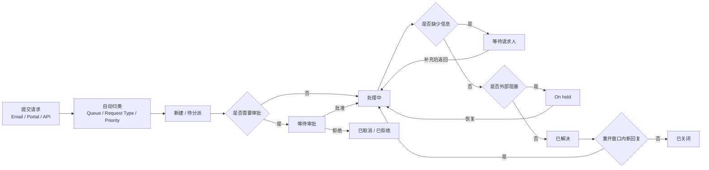
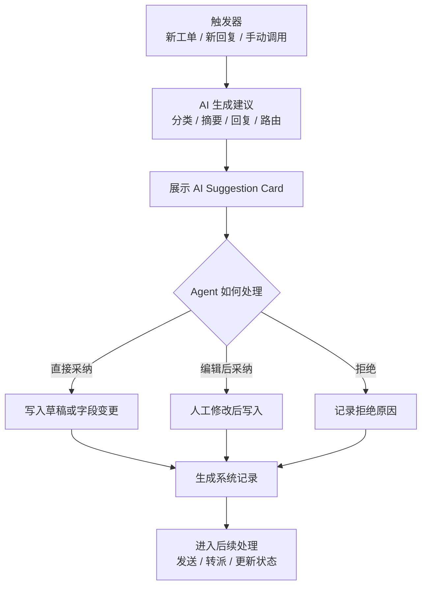
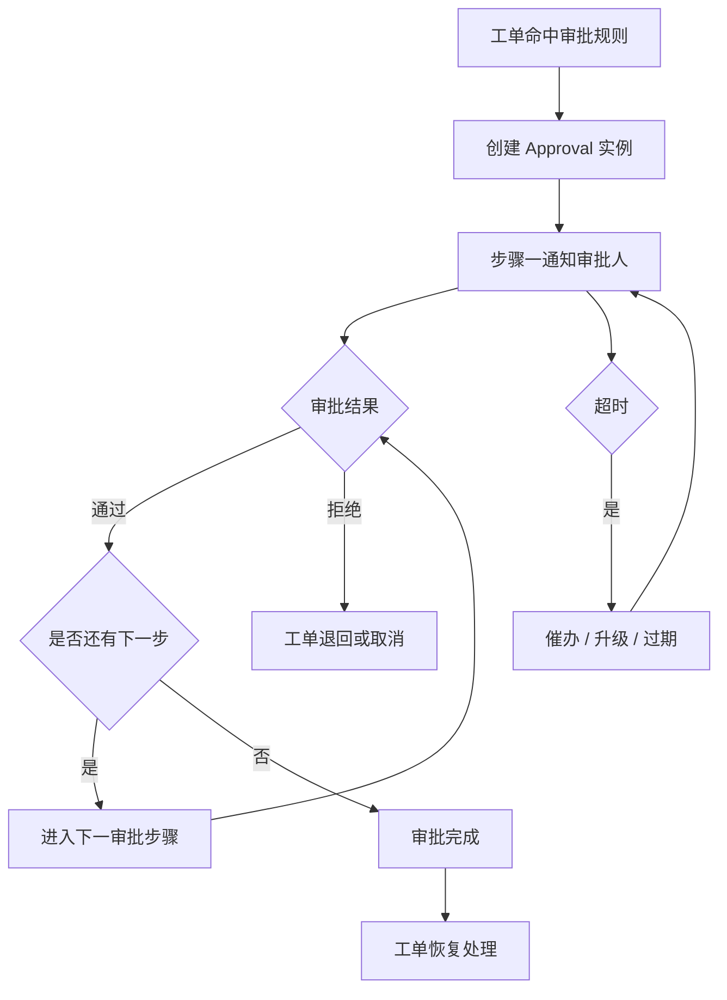

# QueueDesk 前端 UI/UX 设计规范

## 设计原则与产品约束

QueueDesk 的产品定位已经很清楚：它不是面向外部客服的“大而全 Zendesk”，而是面向 20–500 人企业内 IT、HR、财务、运营团队的 AI-first 内部服务台；角色以 Agent、Requester、Admin 为主，核心对象围绕 Queue、Ticket、SLA、Approval、Comment、Audit 组织；AI 默认只提供建议，由人类保留发送、审批和执行权限。这个约束非常重要，因为它决定了前端不能把 AI 做成“自动执行 UI”，而必须做成“可审阅、可采纳、可拒绝、可追踪”的协作层。fileciteturn0file0 fileciteturn0file3

从参考产品看，Linear 明确把“按钮、快捷键、上下文菜单、命令菜单”做成同一套动作入口，以建立肌肉记忆；Notion 证明了可折叠/可缩放侧边栏、列表视图与看板视图并存、块级编辑与评论通知可以在高密度信息界面中共存；Front 把共享收件箱、内部评论、规则、工单状态与客户门户做成一个连贯工作流；Jira Service Management 则把 queues、SLAs、approvals、portal 都做成一等能力。QueueDesk 最合理的 UI 方向不是“炫技型 AI”，而是“高密度、低负担、状态透明、键盘高效、可审计”的现代内部工具。citeturn1search4turn5view0turn5view3turn5view4turn6search0turn6search2turn6search8turn6search12turn7search0turn7search1turn7search2turn7search3

因此，QueueDesk 的体验原则建议固定为下表这一套“产品级约束”，后续所有页面和组件都不要偏离。

| 原则 | 规范说明 | 前端落地方式 |
|---|---|---|
| 高密度但不拥挤 | 这是内部工具，不是营销网站；信息密度要高，但层级必须清晰 | 以 8px 节奏、强对齐、弱装饰、明确分区替代大面积留白 |
| 命令优先 | 高频动作必须可通过键盘、命令面板、右键、按钮四路完成 | 全局 Command Palette + 局部 Context Actions |
| 状态可见 | 工单状态、owner、SLA、审批、下一步动作必须始终可见 | Ticket Header 固定显示状态、责任人、SLA、审批摘要 |
| AI 永远是建议层 | AI 不直接改状态、不直接发送、不直接审批 | AI Suggestion Card 只提供 Accept / Edit / Reject |
| 公共与内部严格分层 | Public / Internal 不能只靠颜色区别，必须靠结构、图标、标签、权限共同约束 | CommentThread 明确双轨；发送前二次确认可见范围 |
| 运行态与配置态同名 | Admin 中的队列、状态、SLA、审批模板命名，应和 Agent 端一致 | 避免“后台术语”和“前台术语”不一致 |
| 可撤销优先 | 高频轻操作尽量允许短时 undo，而不是强制确认 | Resolve、Assign、Archive、Merge 采用 Toast Undo 模式 |

## 设计语言与视觉规范

QueueDesk 的视觉基线建议建立在“现代内部工具”而不是“企业后台模板”之上：底层采用 token 化设计语言，空间节奏以 8px 为主节拍，局部细节允许 4px 微调；布局层级依赖间距、对比、边框和轻阴影来表达，而不是依赖大面积高饱和色块。Carbon 将 8px mini unit 作为几何基础，并用 2/4/8 的倍数组织 spacing；Fluent 也强调通过 spacing、hierarchy、responsive/adaptive layout 来建立关系；WCAG 2.2 对文字和非文字控件分别提出了对比度与可见焦点要求。对 QueueDesk 来说，这意味着：主界面应以中性层为主、品牌色只用于主操作和焦点、语义色只承担状态表达、而不是承担页面分区。citeturn15search11turn14search2turn14search1turn15search10turn9search0turn9search5turn9search12

在材质层面，Fluent 将 solid、mica、acrylic、smoke 区分为不同用途；其中 acrylic 明确适用于 transient、light-dismiss 的表面，例如 popover、menu、浮层，而 Microsoft 也明确提醒不要堆叠多个 acrylic 面、不要把模糊材质铺满大型内容区，并且要注意性能、可读性和对比度。QueueDesk 因此可以使用“轻毛玻璃”来增强现代感，但只能放在命令面板、AI 浮层、顶部壳层、快捷筛选条、悬浮菜单等短驻留界面；工单正文、列表、表格、评论流、表单主区必须保持实色 surface，保证扫描效率与长期阅读舒适度。citeturn18view0turn16search1turn16search0turn17search6

**推荐色彩系统**

| 角色 | Light | Dark | 用法 |
|---|---:|---:|---|
| Brand Primary | `#5B6CFF` | `#7C8BFF` | 主 CTA、选中态、聚焦强调、链接高阶态 |
| Brand Primary Hover | `#4656F0` | `#94A0FF` | 主按钮 hover / selected press |
| Brand Subtle | `#EEF2FF` | `rgba(124,139,255,.18)` | 轻背景、高亮行、选中容器 |
| Accent Teal | `#0EA5A3` | `#2DD4BF` | 二级强调、辅助 badge、健康态增强 |
| AI Violet | `#7C3AED` | `#A78BFA` | AI 建议、智能摘要、AI 入口 |
| Success | `#16A34A` | `#22C55E` | 已满足、成功、通过 |
| Warning | `#D97706` | `#F59E0B` | 风险、即将违约、待补充 |
| Danger | `#DC2626` | `#F87171` | breached、拒绝、阻断、破坏性操作 |
| Info | `#0284C7` | `#38BDF8` | 信息提示、系统提示、帮助 |
| Canvas | `#F6F8FC` | `#0B1020` | 应用最底层背景 |
| Surface | `#FFFFFF` | `#141B2D` | 卡片、列表、正文容器 |
| Subtle Surface | `#EEF2F8` | `#101728` | 次级背景、侧栏、分组容器 |
| Border Subtle | `rgba(15,23,42,.08)` | `rgba(208,215,226,.09)` | 常规分割线 |
| Border Strong | `rgba(15,23,42,.14)` | `rgba(208,215,226,.16)` | 聚焦边框、强调分隔 |
| Text Primary | `#111827` | `#F5F7FB` | 主文本 |
| Text Secondary | `#475467` | `#D0D7E2` | 次要文本 |
| Text Tertiary | `#667085` | `#97A3B6` | Meta、时间、辅助说明 |

**语义映射**

| 状态 | 颜色 | 规范 |
|---|---|---|
| `new` / `submitted` | Brand Subtle + Brand Primary | 默认新建，不使用红橙夸张提示 |
| `in_progress` | Brand Primary | 处理中的工作态 |
| `waiting_on_requester` | Warning | 用户需要补充信息 |
| `waiting_on_approval` | AI Violet / Warning | 审批是阻断流程，不等同错误 |
| `on_hold` | Text Tertiary | 外部依赖阻塞，弱化但不隐藏 |
| `resolved` | Success | 已处理、可重开窗口内 |
| `closed` | Neutral | 终态完成 |
| `rejected` / `cancelled` | Danger | 审批拒绝、撤回、取消 |

**字体规范**

现代内部工具通常采用稳定、跨平台、在中英混排场景下表现一致的 sans-serif 体系。Fluent 强调 type ramp 与 token 化 typography；Carbon 则将 typography 作为 token 体系的一部分。QueueDesk 建议统一采用“英文优先 Inter / 系统字体，中文优先苹方 / 思源黑体 / 微软雅黑”的混合栈，并对所有数字信息启用 tabular numerals，保证 SLA 计时、工单编号、报表数字在垂直扫描时严格对齐。citeturn15search0turn15search3turn15search7

| 文本角色 | 字号 / 行高 | 粗细 | 用法 |
|---|---|---|---|
| Display | `32 / 40` | 600 | Portal 首页大标题、Admin 一级页头 |
| H1 | `24 / 32` | 600 | 页面标题 |
| H2 | `20 / 28` | 600 | 分区标题、卡片头 |
| H3 | `18 / 26` | 600 | 抽屉标题、弹层标题 |
| Body | `14 / 22` | 400 | 主正文、评论、表单说明 |
| Body Strong | `14 / 22` | 500 | 元数据标签、列表重点信息 |
| Label | `13 / 20` | 500 | 输入标签、按钮文字、Badge |
| Meta | `12 / 18` | 500 | 时间、SLA、小号说明 |
| Mono Meta | `12 / 18` | 500 | 工单编号、秒表、日志字段 |

**间距与布局网格**

| Token | 数值 | 主要用途 |
|---|---:|---|
| Space 1 | `4px` | 图标与文案微距、chip 内边距 |
| Space 2 | `8px` | 控件内部 gap、小型栅格 |
| Space 3 | `12px` | 表单行、列表次级信息间距 |
| Space 4 | `16px` | 卡片 padding、小抽屉内边距 |
| Space 5 | `20px` | 面板段落、组件组 |
| Space 6 | `24px` | 页面 section gap、桌面边距 |
| Space 8 | `32px` | 大型区块切换 |
| Space 10 | `40px` | Portal Hero、大型模块间距 |
| Space 12 | `48px` | 宽屏页面节奏 |
| Space 16 | `64px` | 首页大段隔离 |

**栅格建议**

| 设备 | 栅格 | 边距 | gutter | 说明 |
|---|---|---:|---:|---|
| Desktop | 12 栏 | `24px` | `24px` | 主工作台；允许固定 rail + fluid content |
| Tablet | 8 栏 | `24px` | `20px` | 双栏压缩；详情改抽屉 |
| Mobile | 4 栏 | `16px` | `16px` | 以 Portal 为主；Console 仅保留关键动作 |

**应用壳层尺寸建议**

| 区域 | 推荐宽度 | 说明 |
|---|---:|---|
| Global Rail | `72px` | Logo、全局导航、通知、头像 |
| Context Sidebar | `280px` | Queue / Views / Filters / Request types |
| Ticket List Pane | `420px` | 主列表扫描区 |
| Detail Pane | `min 560px` | 工单详情、评论、元数据 |
| AI Panel | `360px` | 固定右栏或浮层 |
| Top Bar Height | `56px` | 搜索、命令、次级操作 |

**阴影、圆角、光效与毛玻璃**

| Token | 数值 | 用法 |
|---|---|---|
| Radius S | `8px` | Input、Badge、小菜单 |
| Radius M | `12px` | Button、Card、List item |
| Radius L | `16px` | Drawer、Modal、小面板 |
| Radius XL | `20px` | 大浮层、Portal Hero 卡片 |
| Radius Pill | `999px` | 状态标签、计时器 |
| Shadow S | `0 1px 2px rgba(16,24,40,.06), 0 1px 3px rgba(16,24,40,.10)` | 常规卡片 |
| Shadow M | `0 8px 24px rgba(16,24,40,.12), 0 2px 8px rgba(16,24,40,.08)` | Drawer / Hover panel |
| Shadow L | `0 18px 48px rgba(16,24,40,.18), 0 8px 24px rgba(16,24,40,.10)` | Modal / Command palette |
| Glass Blur | `16px` | Search、AI 面板、Popover |
| Glass Saturation | `140%` | Frosted 视觉增强 |
| Focus Ring | 双层外描边 | 见下方 CSS 示例，满足显著焦点可见性 |

**CSS 变量示例**

```css
:root {
  --qd-font-sans: Inter, "SF Pro Text", "Segoe UI", "PingFang SC",
    "Hiragino Sans GB", "Noto Sans SC", "Microsoft YaHei", sans-serif;
  --qd-font-mono: "SF Mono", "JetBrains Mono", "Cascadia Code",
    "Fira Code", monospace;

  --qd-fs-display: 32px;
  --qd-lh-display: 40px;
  --qd-fs-h1: 24px;
  --qd-lh-h1: 32px;
  --qd-fs-h2: 20px;
  --qd-lh-h2: 28px;
  --qd-fs-body: 14px;
  --qd-lh-body: 22px;
  --qd-fs-label: 13px;
  --qd-lh-label: 20px;
  --qd-fs-meta: 12px;
  --qd-lh-meta: 18px;

  --qd-space-1: 4px;
  --qd-space-2: 8px;
  --qd-space-3: 12px;
  --qd-space-4: 16px;
  --qd-space-5: 20px;
  --qd-space-6: 24px;
  --qd-space-8: 32px;
  --qd-space-10: 40px;
  --qd-space-12: 48px;
  --qd-space-16: 64px;

  --qd-radius-sm: 8px;
  --qd-radius-md: 12px;
  --qd-radius-lg: 16px;
  --qd-radius-xl: 20px;
  --qd-radius-pill: 999px;

  --qd-brand-500: #5b6cff;
  --qd-brand-600: #4656f0;
  --qd-brand-soft: #eef2ff;
  --qd-accent-500: #0ea5a3;
  --qd-ai-500: #7c3aed;

  --qd-success-500: #16a34a;
  --qd-success-soft: #e8f7ec;
  --qd-warning-500: #d97706;
  --qd-warning-soft: #fff4e5;
  --qd-danger-500: #dc2626;
  --qd-danger-soft: #fdecec;
  --qd-info-500: #0284c7;
  --qd-info-soft: #e8f4fb;

  --qd-bg-canvas: #f6f8fc;
  --qd-bg-subtle: #eef2f8;
  --qd-bg-surface: #ffffff;
  --qd-bg-elevated: rgba(255, 255, 255, 0.82);
  --qd-bg-overlay: rgba(15, 23, 42, 0.42);

  --qd-fg-primary: #111827;
  --qd-fg-secondary: #475467;
  --qd-fg-tertiary: #667085;
  --qd-fg-inverted: #f8fafc;

  --qd-border-subtle: rgba(15, 23, 42, 0.08);
  --qd-border-strong: rgba(15, 23, 42, 0.14);

  --qd-focus-inner: #ffffff;
  --qd-focus-outer: #111827;

  --qd-shadow-sm: 0 1px 2px rgba(16, 24, 40, 0.06),
    0 1px 3px rgba(16, 24, 40, 0.10);
  --qd-shadow-md: 0 8px 24px rgba(16, 24, 40, 0.12),
    0 2px 8px rgba(16, 24, 40, 0.08);
  --qd-shadow-lg: 0 18px 48px rgba(16, 24, 40, 0.18),
    0 8px 24px rgba(16, 24, 40, 0.10);

  --qd-blur-glass: 16px;
  --qd-saturate-glass: 140%;

  --qd-duration-fast: 120ms;
  --qd-duration-base: 180ms;
  --qd-duration-slow: 240ms;
  --qd-ease-standard: cubic-bezier(.2, 0, 0, 1);

  --qd-shell-nav: 72px;
  --qd-shell-sidebar: 280px;
  --qd-shell-list: 420px;
  --qd-shell-ai: 360px;
  --qd-shell-topbar: 56px;
}

[data-theme="dark"] {
  --qd-brand-500: #7c8bff;
  --qd-brand-600: #94a0ff;
  --qd-brand-soft: rgba(124, 139, 255, 0.18);

  --qd-success-500: #22c55e;
  --qd-success-soft: rgba(34, 197, 94, 0.16);
  --qd-warning-500: #f59e0b;
  --qd-warning-soft: rgba(245, 158, 11, 0.16);
  --qd-danger-500: #f87171;
  --qd-danger-soft: rgba(248, 113, 113, 0.16);
  --qd-info-500: #38bdf8;
  --qd-info-soft: rgba(56, 189, 248, 0.16);

  --qd-bg-canvas: #0b1020;
  --qd-bg-subtle: #101728;
  --qd-bg-surface: #141b2d;
  --qd-bg-elevated: rgba(20, 27, 45, 0.72);
  --qd-bg-overlay: rgba(2, 6, 23, 0.62);

  --qd-fg-primary: #f5f7fb;
  --qd-fg-secondary: #d0d7e2;
  --qd-fg-tertiary: #97a3b6;
  --qd-fg-inverted: #0b1020;

  --qd-border-subtle: rgba(208, 215, 226, 0.09);
  --qd-border-strong: rgba(208, 215, 226, 0.16);

  --qd-focus-inner: #0b1020;
  --qd-focus-outer: #ffffff;

  --qd-shadow-sm: 0 1px 2px rgba(0, 0, 0, 0.32),
    0 1px 3px rgba(0, 0, 0, 0.22);
  --qd-shadow-md: 0 10px 30px rgba(0, 0, 0, 0.36),
    0 2px 8px rgba(0, 0, 0, 0.24);
  --qd-shadow-lg: 0 24px 56px rgba(0, 0, 0, 0.40),
    0 8px 24px rgba(0, 0, 0, 0.24);
}

.qd-surface-glass {
  background: var(--qd-bg-elevated);
  border: 1px solid var(--qd-border-subtle);
  backdrop-filter: blur(var(--qd-blur-glass)) saturate(var(--qd-saturate-glass));
  -webkit-backdrop-filter: blur(var(--qd-blur-glass)) saturate(var(--qd-saturate-glass));
  box-shadow: var(--qd-shadow-md);
}

.qd-focusable:focus-visible {
  outline: none;
  box-shadow:
    0 0 0 2px var(--qd-focus-inner),
    0 0 0 4px var(--qd-focus-outer);
}

.qd-timer,
.qd-ticket-no {
  font-family: var(--qd-font-mono);
  font-variant-numeric: tabular-nums;
}
```

这套 token 结构同时适合 Figma Variables、CSS Variables 和 React/Next.js 主题系统：颜色按“global → semantic → alias”组织，间距/排版/圆角都能稳定映射到组件 props；Dark Mode 不做简单反相，而是通过中性阶、品牌色亮度修正和语义色 soft background 重新配平阅读舒适度。citeturn15search10turn17search0turn17search4turn14search2turn15search3

## 三端信息架构

QueueDesk 的信息架构应围绕“同一对象，不同视角”展开：Agent 面向处理和协作，Requester 面向提交和跟踪，Admin 面向配置和治理。JSM 的 queues 为 agent 提供集中工作视图，portal 为请求人提供提交与跟踪入口；Front 的 customer portal 也是“提交新请求 + 查看已有请求状态”；QueueDesk 文档则要求 Org → Workspace → Team → Queue → Ticket 的层级清晰可见。前端 IA 应该把这个模型直接翻译成导航结构，而不是再造一套不对应业务实体的 UI 命名。fileciteturn0file0 citeturn7search0turn7search3turn19search3turn6search12

**Agent Console**

| 层级 | 导航项 | 页面结构 | 关键说明 |
|---|---|---|---|
| 全局 | Command Palette、Search、Notifications、Workspace Switcher、Create Ticket | 顶部 56px 条 | 搜索与命令必须全局可达 |
| 一级 | Inbox、My Tickets、Queues、Approvals、Mentions、Views | 左侧 Global Rail | 图标优先，hover 展开文案 |
| 二级 | Queue Tree、Saved Views、Filters、SLA Risk、Unassigned | Context Sidebar | 可折叠、可拖拽排序、支持 pin |
| 主区 | TicketList / Backlog | 列表或看板双模式 | 筛选、排序、分组、批量操作、滚动虚拟化 |
| 详情区 | Ticket Detail | 固定三段：Header → Thread → Metadata Rail | 单屏完成阅读、协作、状态推进 |
| 智能区 | AI Panel | 可固定右侧，也可抽屉化 | 摘要、分类建议、推荐回复、知识证据 |

**Agent Console 典型页面结构**

| 页面 | 布局 | 必备模块 |
|---|---|---|
| 工单列表 | `Sidebar + List + Peek/Detail` | 过滤器栏、批量操作栏、Ticket rows、空态 |
| 工单详情 | `Thread-first` | Header、Public/Internal Composer、Comment Timeline、SLA、Approval、Assignee、Attachments、Audit Lite |
| 队列视图 | `List / Board toggle` | Group by、WIP 显示、SLA 风险、队列统计 |
| AI 建议面板 | `Side panel / drawer` | Summary、Suggested fields、Suggested reply、Evidence、Actions |
| 评论/内部备注 | `Embedded in Detail` | Public / Internal 双轨、@mentions、附件、草稿恢复 |

**Requester Portal**

JSM portal 的本质是 customer-facing website，用于收集与管理请求；Front portal 也明确支持“提交新请求并查看现有请求状态”。因此 QueueDesk 的 Requester Portal 不应该做成“缩水过的后台”，而应该做成 task-first 的帮助入口：先找 request type，再填表单，再跟踪我的工单，再查看审批结果。请求类型文案必须面向用户任务，而不是后台对象名。Atlassian 也明确建议 request types 使用用户能理解的语言，而不是内部术语。citeturn7search3turn6search12turn19search5

| 层级 | 导航项 | 页面结构 | 关键说明 |
|---|---|---|---|
| 首页 | 搜索、常用请求、最近工单、知识推荐 | Hero + 分类卡片 + 最近活动 | 首屏优先解决“我该点哪个入口” |
| 提交工单 | Request Type、Dynamic Form、Suggested KB | 单列表单页 | 表单说明、条件字段、自动保存 |
| 我的工单 | Open、Waiting for me、Resolved、Closed | 列表页 | 显示状态、最近更新时间、审批摘要 |
| 工单详情 | Public Thread、Status Timeline、Approval Progress | 主内容 + 右侧摘要 | 绝不显示 internal note |
| 审批状态 | Pending / Approved / Rejected | 时间轴或步骤条 | 允许查看当前卡在哪一步 |

**Admin Console**

Admin Console 必须让配置项和运行时对象一一对应。JSM 将 queues、request types、forms、SLAs、approvals、portal、reports 都直接放在管理结构中；Front 则把 rules、ticket statuses、analytics、portal 作为可配置对象。QueueDesk 的 Admin 也应该如此。citeturn7search4turn7search10turn7search1turn7search2turn19search0turn19search1turn6search2turn6search8turn6search14

| 分组 | 导航项 | 页面重点 |
|---|---|---|
| 工作区 | Workspace Profile、Branding、Locales、Business Hours | Logo、名称、默认语言、工作时间 |
| 队列治理 | Queues、Routing Rules、Assignment Strategy、Saved Views | 手动 / 轮询 / 规则 / 负载均衡 |
| 请求建模 | Request Types、Form Builder、Portal Categories、Field Visibility | 入口建模、表单字段、portal 可见性 |
| 服务级别 | SLA Policies、Calendars、Breach Rules | 初响、解决、暂停条件、升级动作 |
| 审批 | Approval Templates、Approver Pools、Escalations | 步骤定义、`all_of` / `any_of` |
| 人员权限 | Users、Teams、Roles、Approver Access | 角色、队列范围、轻审批权限 |
| 自动化 | Rules、Macros、Notifications、Webhooks | 触发器、条件、动作、消息模板 |
| 报表合规 | Dashboards、Exports、Audit Log | Backlog、SLA、Resolution、AI 采纳、审计 |

**状态文案映射建议**

为减少认知负担，面向 Agent 的系统状态可以细，面向 Requester 的文案应更自然。Front 的默认票单状态保持为 Open / Waiting / Resolved 这种简洁表述，而 QueueDesk 内部仍可保留更丰富的状态机。citeturn6search8turn19search5

| 系统状态 | Agent 显示 | Requester 显示 |
|---|---|---|
| `new` | 新建 | 已提交 |
| `in_progress` | 处理中 | 正在处理 |
| `waiting_on_requester` | 待请求人补充 | 等待你补充信息 |
| `waiting_on_approval` | 待审批 | 审批中 |
| `on_hold` | 挂起 | 正等待外部处理 |
| `resolved` | 已解决 | 已处理 |
| `closed` | 已关闭 | 已关闭 |
| `cancelled` / `rejected` | 已取消 / 已拒绝 | 请求未通过 |

对于只参与审批的人，建议提供**轻量审批视图**，可以从邮件、Slack、门户或移动端打开，看到：申请摘要、风险字段、前后影响、Approve / Reject / Delegate 三个核心动作，而不要求其进入完整 Agent Console。JSM 之所以能让 approver 不需要完整 license，也是在强调审批人界面应该轻、窄、任务化。citeturn7search2turn7search9

## 核心页面流程

QueueDesk 的流程设计应当体现三件事：第一，Ticket 生命周期是主线，审批和 AI 都是附着其上的能力；第二，AI 只能生成 suggestion object，不能直接产生 side effect；第三，审批是阻断式流程，必须显式展示当前所在步骤和下一步责任人。这个方向和 QueueDesk 自身的 AI 架构说明，以及 JSM 对 approvals / SLAs / portal 的建模是一致的。fileciteturn0file3 fileciteturn0file0 citeturn7search1turn7search2turn7search3

**工单全生命周期**



**AI 建议采纳流程**



**审批流程**



## 关键组件规范

这些组件建议直接作为 QueueDesk 的 design primitives。TicketList / Queue Backlog 借鉴了 JSM queues 的“focused work view”与 Linear、Notion 的 list/board 双形态；CommentThread 要严格遵循 Front 与 Zendesk 的 public vs internal 分层；SLA Badge / Timer 参考 JSM 与 Front 的时间目标、违约与升级逻辑；Approval Step Indicator 以 JSM approval step 为基线；Form Builder 则应吸收 JSM request types 与 conditional forms 的能力；AI Suggestion Card 则必须遵循 QueueDesk 文档里“AI 只建议，不自动执行”的边界。citeturn7search0turn1search2turn5view3turn6search0turn8search2turn8search15turn7search1turn6search3turn6search7turn7search2turn19search0turn19search1 fileciteturn0file3

| 组件 | 结构规范 | 交互规范 | 视觉规范 | 开发与可访问性规范 |
|---|---|---|---|---|
| TicketCard / TicketList | 每行包含：选择框、状态点、工单号、标题、请求人、队列/分类、SLA、Assignee、最后更新时间 | 行 hover 显示二级动作；`Enter` 打开详情；`Shift+Enter` 侧边 peek；支持多选批量操作 | 默认密度 68px；Compact 52px；Comfy 84px；选中态用 brand-soft 背景 + 左侧 3px active bar | 列表优先用语义化 table/list；仅在确有网格交互时使用复杂 ARIA；对超长 title 截断但 hover 可读全 |
| CommentThread | 时间轴序列：头像、作者、时间、可见范围、正文、附件、反应、回复上下文 | Agent 在公共回复与内部备注之间切换时，不切 tab，而切 composer mode；草稿自动保存；@mention 仅在有权限范围内生效 | Public：白底或常规 surface；Internal：subtle tinted panel + lock 图标 + `Internal` label；System note：更轻、更窄 | Public / Internal 必须同时以颜色、图标、标签区分；禁止只靠颜色；internal 发送前不要求确认，但 internal→public 切换应弹轻确认 |
| AI Suggestion Card | 标题、动作类型、模型/版本、置信度、证据来源、建议正文、Accept/Edit/Reject | 默认折叠摘要；展开后看 diff；Accept 不可自动发送外部内容，必须再经过一次人工提交动作 | AI 专色使用 violet；证据 chips 可点击跳到消息或 KB chunk；低置信度给 warning outline | 必须记录采纳人与时间；建议内容可 copy，但不可在无人工动作下直接变更工单主体 |
| SLA Badge / Timer | 同时支持首响与解决两个 badge；badge 内含状态、剩余时间、risk 标记 | timer 不必每秒刷新；页内可 30–60 秒 refresh，精确值依赖服务端；hover 展示 pause reason / due time | `On track` 用 neutral/brand，`At risk` 用 warning，`Breached` 用 danger，`Paused` 用 tertiary | 数字统一 `tabular-nums`；badge 不能只用颜色表达状态，必须带文案或图标 |
| Approval Step Indicator | 由步骤名、审批人、状态、截止时间、决策模式组成；Desktop 横向，移动端纵向 | 点击节点可查看审批意见；当前步骤保持 sticky；拒绝时自动聚焦 rejection detail | 当前步骤用 brand，完成用 success，拒绝用 danger，过期用 warning | 若作为 Tabs 替代器，不要混淆语义；若为状态时间线，使用 list/timeline 结构更稳妥 |
| Queue Backlog View | 顶部为 filter bar + saved view + density + list/board toggle；内容支持按 status/assignee/priority/SLA 分组 | 过滤、排序、分组在 list 和 board 间保持同一套状态；多选出现 bulk action bar；大量数据启用虚拟滚动 | 默认用 list；board 仅用于 triage 与 WIP 管理；列头固定，风险列可着色但不铺满大面积底色 | 保持 list/board 快捷键与操作一致；空态应建议新建 view 或清除 filter |
| Form Builder | 左侧字段库 / 中间画布 / 右侧属性面板 / 顶部版本与预览；字段分 requester-visible、agent-only、system-hidden | 支持 drag & drop、条件显示、必填、默认值、预设隐藏、portal preview、agent preview | 表单构建器用 3-pane，属性面板统一 320–360px；实时校验但不打断拖拽 | 搜索型选择器遵循 combobox 模式；字段排序支持键盘；发布动作应有 review step |

**表单与工单建模的几个关键细节**

JSM 明确支持为 request type 添加带条件分区、rich formatting 和 linked fields 的 form；同时也区分 request form 与 work item view 里的字段可见性。QueueDesk 建议完全吸收这套能力：同一 request type 应至少维护三种可见性——`requester visible`、`agent visible`、`hidden with preset value`。这能很好地覆盖“提交时隐藏、处理时可见、自动化时可写”的企业内部流程。citeturn19search0turn19search1

如果某个 request type 绑定 email intake，JSM 明确要求 Summary 和 Description 可见，且额外可见字段应尽量保持可选，否则邮件建单会失败。QueueDesk 的 Form Builder 也应在 admin 端直接做**渠道兼容性校验**：当表单被绑定到 email channel 时，界面应实时提醒“这会阻断邮件建单”。citeturn19search4

在评论与协作层，Front 的 internal comments 支持 @mention，并在涉及 private conversation sharing 时给出确认；Zendesk 则把 Public reply 与 Internal note 明确区分。QueueDesk 因而应把 internal note 设计成**结构上独立的协作层**，而不是公共评论里的一个小 toggle。更具体地说，推荐把回复区域拆成两个明确按钮：`公开回复` 与 `内部备注`，而不是单个 editor 上方一个细小下拉。citeturn6search0turn8search2turn8search15

## 响应式与布局适配

QueueDesk 应明确采用 **Desktop-first、Tablet-supported、Mobile-simplified** 的策略。原因不是“移动端不重要”，而是 Agent Console 的核心价值来自高密度 triage、命令式操作、列表/看板切换和多面板协作；Linear、Notion 都把键盘和多视图工作流做成桌面主体验，Linear 还特别强调桌面 app 能更好承载快捷键和原生通知。与之相对，Requester Portal 的主要任务是提交、跟踪、补充信息、审批确认，因此更适合做完整移动支持。citeturn1search4turn1search11turn4view0turn5view0turn6search14

| 设备 | 断点建议 | 壳层策略 | Agent Console | Requester Portal | Admin Console |
|---|---|---|---|---|---|
| Desktop | `>= 1280px` | 72px Global Rail + 280px Context Sidebar + 420px List + Detail + 可选 AI Panel | 完整三栏 / 四栏；键盘优先；批量操作；Board/List 并存 | 双列信息布局；详情侧栏显示审批摘要 | 完整配置页；Form Builder 三栏；报表多图 |
| Tablet | `768px – 1279px` | Rail 图标化；Sidebar 可滑出；Detail 改 overlay | 列表 + 全屏详情；AI panel 改 bottom drawer；看板列数压缩 | 单列表单；我的工单为卡片列表；审批步骤纵向 | 允许轻配置、浏览与审批模板编辑；复杂 builder 阉割 |
| Mobile | `<= 767px` | 以单列流式为主 | 仅保留：我的待办、审批、评论、改状态、查看 SLA；不提供复杂 backlog 管理 | 完整支持：提交、补充、查看状态、审批确认、附件上传 | 建议只读 + 关键开关；不提供可视化 Form Builder 与复杂报表编辑 |

**布局行为建议**

| 模块 | Desktop | Tablet | Mobile |
|---|---|---|---|
| TicketList | 固定左侧扫描区 | 占满主区 | 卡片化，减少列 |
| Ticket Detail | 与列表并存 | 全屏盖板 | 单页详情 |
| AI Panel | 固定右栏 | 抽屉 | 底部弹层 |
| Approval Indicator | 横向步骤条 | 横向压缩 / 纵向 | 纵向时间线 |
| Filter Bar | 完整常驻 | 收纳为 chips + drawer | 折叠进底部筛选面板 |

**交互取舍**

| 能力 | Desktop | Tablet | Mobile |
|---|---|---|---|
| 批量处理 | 必须 | 有限支持 | 不支持 |
| 看板拖拽 | 必须 | 支持少量列 | 不支持 |
| 表单构建 | 完整 | 简化 | 不支持 |
| 审批操作 | 必须 | 必须 | 必须 |
| 评论与附件 | 必须 | 必须 | 必须 |
| AI 采纳 | 必须 | 必须 | 仅查看与简单采纳 |

## 可用性与交互规范

Linear 把快捷键、命令菜单、上下文菜单、多选和撤销做成统一工作体系；Notion 同样将 keyboard shortcuts、slash commands、sidebar collapse、comments/inbox 做成高频行为。QueueDesk 应直接继承这种“探索路径统一”的思路：任何高频动作都应该在按钮、右键、命令面板、快捷键之间形成一致映射。并且，和 Linear 一样，**可逆操作优先给 Undo，而不是前置确认**；只有真正不可逆或有审批/财务/权限后果的操作才使用阻断式确认。citeturn1search4turn1search5turn1search9turn4view0turn5view2turn20search16

**键盘快捷键建议**

| 范围 | 快捷键 | 动作 |
|---|---|---|
| 全局 | `Cmd/Ctrl + K` | 打开 Command Palette |
| 全局 | `/` | 聚焦全局搜索 |
| 全局 | `G` `Q` | 跳转到队列 |
| 全局 | `G` `A` | 跳转到审批 |
| 全局 | `?` | 打开快捷键帮助 |
| 列表 | `J / K` | 上下移动高亮行 |
| 列表 | `X` | 选中当前工单 |
| 列表 | `Shift + X` | 扩展范围选择 |
| 列表 | `Enter` | 打开详情 |
| 列表 | `Shift + Enter` | 侧边 Peek |
| 列表 | `A` | 指派 |
| 列表 | `I` | 指派给自己 |
| 列表 | `.` | 切换状态菜单 |
| 列表 | `L` | 标签 |
| 详情 | `R` | 公开回复 |
| 详情 | `Shift + R` | 内部备注 |
| 详情 | `Cmd/Ctrl + Enter` | 发送或保存当前 composer |
| 详情 | `B` | 打开 AI 建议面板 |
| 详情 | `[` / `]` | 切换上一条 / 下一条工单 |
| 表单 | `Cmd/Ctrl + S` | 保存草稿 |
| 通用 | `Esc` | 关闭弹层 / 清空当前选择 |

**实现规则**

| 规则 | 说明 |
|---|---|
| 输入框优先 | 当光标在 input / textarea / editor 中时，禁用除 `Esc`、`Cmd/Ctrl+Enter` 外的大多数全局快捷键 |
| 可发现性 | 所有核心动作在按钮 hover、菜单项尾部显示 shortcut hint |
| 可撤销性 | Resolve、Assign、Archive、Remove label 采用 5 秒 Toast Undo |
| 一致性 | 同一动作在列表、详情、右键菜单、命令面板中的命名保持一致 |

**通知设计**

Notion 的 inbox 证明通知中心不应只是“消息堆积区”，而应允许筛选 unread/read/archived、跳转到具体上下文、直接回复评论线程；WCAG 对 status messages 的要求则明确指出：不改变上下文的状态提示不应强行夺取焦点，而应该通过合适的 ARIA 角色被辅助技术感知。QueueDesk 因而应该采用“四层通知模型”：实时 toast、页面 banner、Notification Center、阻断式 alert/dialog。citeturn5view2turn20search1turn20search9turn20search12

| 层级 | 用途 | 展现规则 | ARIA / 焦点规则 |
|---|---|---|---|
| Toast | 成功保存、已指派、已采纳 AI、已复制链接 | 右上角堆叠；4–6 秒自动消失；带 Undo 时延长 | 不抢焦点；`role="status"` |
| Banner | SLA 危险、审批阻断、权限不足、表单多字段错误 | 紧贴页面顶部或模块顶部；可常驻 | 若仅信息提示，可 `role="status"`；若为严重错误可 `role="alert"` |
| Notification Center | @mention、assigned to me、approval pending、breach risk、portal reply | 可筛选、可归档、可跳转上下文 | 自身是页面区域，不自动转移焦点 |
| Modal / Alert Dialog | 删除、拒绝审批、关闭高风险工单、不可逆导出 | 阻断当前流；必须明确主次按钮 | 使用 modal dialog / alertdialog，焦点陷阱、关闭后焦点返回触发源 |

**错误提示规范**

W3C 对 Error Identification、Error Suggestion、Status Messages、Error Prevention 都有明确要求：错误必须被识别出来，最好能给出如何修正的建议；状态消息不应偷偷出现而不被感知；涉及法律、财务或数据后果的表单应提供 review/confirm/correct 机制。QueueDesk 的表单、审批、导出、关单与批处理界面，应完全按这套规则做。citeturn20search0turn20search2turn20search4turn20search16turn20search10turn20search18

| 场景 | 规范 | 例子 |
|---|---|---|
| 单字段错误 | 直接标红字段，字段下方给出可操作说明，不只写“格式错误” | “邮箱格式不正确，请输入公司邮箱，例如 name@company.com” |
| 多字段错误 | 顶部 Error Summary + 各字段 anchor link | “还有 3 个字段需要修正：部门、开始日期、审批人” |
| 异步失败 | 保留用户已输入内容，不清空 editor；提供 Retry | “发送失败，草稿已保留。重试 / 复制内容 / 下载草稿” |
| 不可逆动作 | 先 Review，再 Confirm | “关闭后将不再重开；若有新回复将创建 follow-up ticket” |
| 风险提交 | 对财务 / 权限 / 删除类表单提供确认页 | “请确认被申请人、系统范围、审批链无误” |

**前端无障碍基线**

| 项目 | 最低要求 | 规范依据 |
|---|---|---|
| 正文字体对比度 | 至少 `4.5:1` | WCAG Contrast (Minimum) |
| 大号文字 / 强调文字 | 至少 `3:1` | WCAG Contrast (Minimum) 技术说明 |
| UI 控件边界、选中、焦点 | 至少 `3:1` | WCAG Non-text Contrast |
| 焦点环 | 必须明显、连续、不可被 sticky 内容遮挡 | WCAG Focus Appearance / Focus Not Obscured |
| Dialog | 打开时焦点进入，Tab 不得逃逸，Esc 可关闭，关闭后返回触发源 | WAI-ARIA Dialog Pattern |
| Tabs | Conversation / Details / Activity 标签遵循 `tablist` / `tab` / `tabpanel` | WAI-ARIA Tabs Pattern |
| Combobox | 搜索型下拉、用户选择器、队列选择器遵循 combobox 模式 | WAI-ARIA Combobox Pattern |
| 状态消息 | “已保存”“0 条结果”“上传完成”不抢焦点，但应可被读屏感知 | `role="status"` |
| 表单错误 | 字段使用 `aria-invalid`，错误说明与字段用 `aria-describedby` 关联 | WCAG ARIA 技术 |

这些规范并不是“为了无障碍而牺牲效率”，而是为了让 QueueDesk 在高密度、高频、多人协作、强状态驱动的真实内部服务场景下，依然保持稳定、可学、可审计、可扩展。特别是对 Agent Console 而言，最重要的 UX 目标不是“看起来轻”，而是“在 8 小时持续使用中依然不累，在压力场景下依然不乱，在审批与 SLA 风险出现时依然一眼看清下一步该做什么”。citeturn9search0turn9search1turn9search3turn9search5turn13view0turn13view1turn13view2turn20search1turn20search9turn20search10