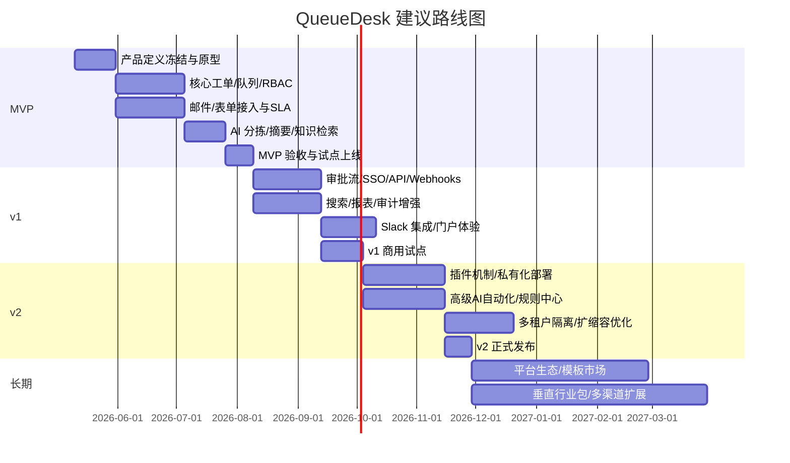
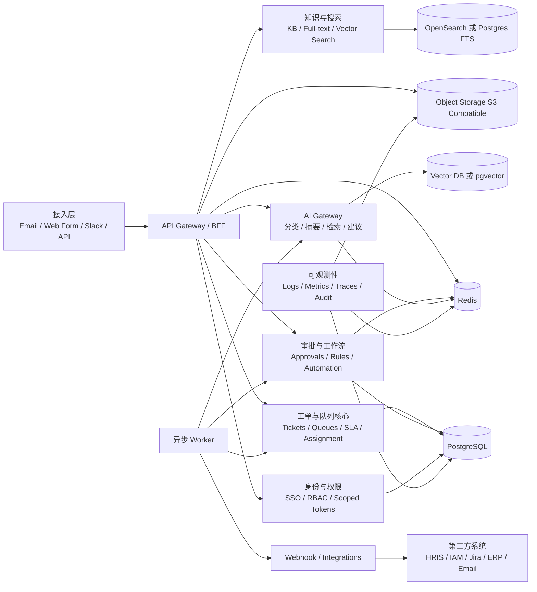
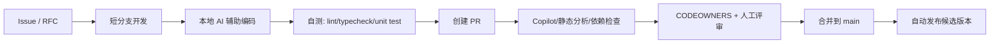
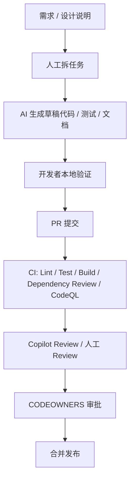

# QueueDesk 开发与增长研究报告

## 执行摘要

本报告在你上传的《AI时代蓝海项目机会研究报告》基础上继续完善，并结合公开官方文档、竞品官网、GitHub 官方文档、合规法规与安全规范进行综合分析。核心结论是：**QueueDesk 最值得切入的不是“泛客服平台”，而是“AI-first 的内部服务台与队列协同平台”**，优先服务 **20–500 人、IT/HR/财务/运营共享服务并存、又没有 ServiceNow 预算与实施能力** 的团队；产品上要走 **“共享邮箱的易用性 + 工单/SLA/审批的治理能力 + 私有化/合规可落地 + AI 仅在边界内行动”** 的路线。与此同时，**“QueueDesk”名称已存在公开同名产品与同名轻量工单系统**，这会直接影响品牌、SEO、域名与开源仓库识别，应该尽快处理。fileciteturn0file0 citeturn41search1turn41search0turn32view0turn33view0turn5view0turn7view0turn37view0turn35view0turn36view0

当前公开市场已经被验证成熟：Front 官方称其服务 9,000+ 企业，Hiver 官方称其服务 10,000+ 客服/财务/IT 团队，Chatwoot 官方称其服务 15,000+ 组织，Help Scout 官方称其有 12,000+ 公司使用。这说明赛道不是“有没有需求”，而是“你切哪一段价值链、用什么交付模型把复杂度降下来”。QueueDesk 的最佳机会，不是再做一个更重的 Zendesk，也不是仅做一个更轻的共享邮箱，而是做 **面向内部请求与跨部门队列的、规则驱动的 AI 协同桌面**。citeturn5view0turn7view0turn13search3turn9search0

### 最高优先级行动项

- **先冻结产品定位**：把 QueueDesk 定义为“AI-first Internal Ops Desk”，首批场景锁定 **IT 支持、HR 服务请求、软件/硬件权限申请、财务/AP/供应商协同**，不要第一阶段就做全渠道外部客服。这个切口能避开 Zendesk/Freshdesk 的正面竞争，也能与 Front/Hiver 的共享邮箱形成差异。citeturn32view0turn33view0turn5view0turn7view0turn37view0
- **尽快处理命名与域名策略**：公开市场已存在同名 QueueDesk 内部服务台产品与同名轻量工单系统；继续用“QueueDesk”作为唯一品牌，将显著增加 SEO 成本、品牌混淆和潜在商标风险。建议至少增加公司前缀或副品牌名，并同步确定中英文品牌策略。citeturn41search1turn41search0
- **按“规则优先，AI 限权”设计 MVP**：先做队列、工单、SLA、审批、审计日志、权限与 AI 分拣/总结，不要一开始让 AI 自动执行高风险动作。中国和欧盟法规都要求最小必要、可解释边界、记录与安全措施，而 GitHub/Copilot 官方文档也明确说明 AI 评审不能替代人工评审。citeturn24search6turn25search0turn24search7turn38view3turn38view1turn39view1turn21search1turn21search3
- **仓库立即上治理基线**：为仓库补齐 `README`、`LICENSE`、`CONTRIBUTING`、`SECURITY`、`CODEOWNERS`、Issue Forms、PR Template、分支保护、CI、Dependabot、Secret Scanning、CodeQL。GitHub 官方文档支持 CODEOWNERS 自动拉审、受保护分支强制状态检查、Issues/PR 模板标准化输入。citeturn15search0turn15search2turn17search2turn17search5turn18search0turn19search2turn20search0turn20search5
- **把私有化与合规做成 v1/v2 的商业抓手**：公开竞品里，Chatwoot 与 Zammad 都把自托管/私有化当成明确卖点；QueueDesk 若面向亚洲企业和内部服务台场景，私有化部署、数据驻留、审计与对接企业身份系统，会是比“更花哨的 AI”更稳定的付费理由。citeturn35view0turn36view0

## 产品概述与市场定位

QueueDesk 最适合被定义为：**面向中小到中型企业内部服务团队的 AI-first 队列协同平台**。它解决的不是“全世界所有客服场景”，而是一个非常具体的问题：**当 IT、HR、财务/采购、运营、共享邮箱和审批流程混在邮件、Slack、Excel 与口头协作里时，如何用更轻的产品形态，把请求 intake、分派、SLA、审批、知识库和 AI 辅助整合起来**。公开竞品显示，Zendesk 偏广义服务平台，Freshdesk 偏客户支持，Jira Service Management 偏 ITSM/服务治理，Front/Hiver 偏共享邮箱协作，Chatwoot/Zammad 偏开源自托管支持平台；这恰好为 QueueDesk 留出了“内部服务台 + 队列工作台 + 轻实施 + AI 规则化”的空位。citeturn32view0turn33view0turn5view0turn7view0turn37view0turn35view0turn36view0

更重要的是，公开的同名产品 `queuedesk.com` 已经在用几乎同样的“AI-first internal service desk”叙事，面向 10–500 人企业，强调 IT/HR/Ops 请求、同日上线、固定月费；另一个 `queuedesk.org` 则是轻量自托管工单系统。这意味着 **QueueDesk 作为名字本身已经不是白地**。如果你坚持保留这个名字，产品叙事必须在“内部服务台”之上再加一个更强差异：例如 **QueueDesk Flow / QueueDesk Ops / QueueDesk Inbox**，并配套一个中文品牌名，用来切开英文同名与中文搜索词。citeturn41search2turn41search0

### 建议的目标用户与价值主张

| 用户段 | 典型痛点 | 建议价值主张 | 建议优先级 |
|---|---|---|---|
| 20–100 人创业/成长团队 | 请求散落在邮箱、Slack、私聊；没人想上重 ITSM | “从邮件/表单/Slack 把内部请求拉回一个桌面，AI 先分拣，负责人再处理” | 很高 |
| 100–500 人中型企业 | 多部门共享服务并存，SLA、审批、审计开始重要 | “比共享邮箱更可治理，比传统 ITSM 更轻、更快、更便宜” | 很高 |
| 500+ 企业分支团队/区域团队 | 总部工具太重、上线慢、个性化低 | “分团队快速部署的轻量服务台，可与总部系统集成” | 中 |
| 外部客户服务团队 | 需要全渠道、客服质检、营销衔接 | “后续扩展场景，不应作为第一性切入” | 低 |

### 竞品对比与对 QueueDesk 的启发

| 产品 | 关键功能 | 公开价格 | 部署方式 | 开源/闭源 | 目标行业/团队 | 对 QueueDesk 的启发 | 依据 |
|---|---|---:|---|---|---|---|---|
| Zendesk | 工单、全渠道、AI agents、Copilot、知识库、SLA、审计日志、HIPAA/Data location | $19 / $55 / $115 / $169 每坐席每月（年付） | SaaS | 闭源 | 从初创到企业；零售、金融、技术、政府、教育、制造、医疗等 | 不能正面复制“全能平台”，应反向强调更快上线、内部场景、轻实施 | citeturn32view0 |
| Freshdesk | 工单、共享收件箱、门户、线程与任务、多语种、路由、审计日志、审批流、技能分派 | $19 / $55 / $89 每坐席每月（年付） | SaaS | 闭源 | 客户支持与成长型服务团队 | QueueDesk 需在“内部请求 + 审批 + AI 边界控制”上更聚焦 | citeturn33view0 |
| Front | 协作共享收件箱、工单、全渠道、知识库、自动化、AI Copilot/Autopilot、分析 | $25 / $65 / $105 每坐席每月；AI 功能另购/含于企业版 | SaaS | 闭源 | 客服、运营、销售、客户成功；技术、金融、物流、制造等 | Front 证明“共享邮箱协作”需求很强；QueueDesk 要把它升级为规则化的队列工作台 | citeturn5view0 |
| Hiver | Gmail 原生共享邮箱、工单、客户门户、知识库、审批、自动化、AI Agents/Copilot | Free / $25 / $55 / $85 每用户每月 | SaaS | 闭源 | 客服、财务、ITSM、HR | Hiver 说明“邮箱原生产能”有市场；QueueDesk 可做邮箱无关、渠道无关的统一 intake 层 | citeturn7view0 |
| Jira Service Management | 多渠道支持、表单、工作流、队列、SLA、资产管理、虚拟服务台、变更/事件管理 | 免费（3 agents）；Standard $20；Premium $51.42；Enterprise 定制 | SaaS Cloud | 闭源 | IT、营销、产品、企业服务团队 | JSM 的强项是治理与流程；QueueDesk 要保留治理能力，但避免 Atlassian 式复杂度 | citeturn37view0 |
| Chatwoot | 全渠道支持、帮助中心、自动化、报表、AI credits、可云端可自托管 | 云端 $0 / $19 / $39 / $99；自托管 $0 / $19 / $99 | SaaS + Self-hosted | 开源 + 商业版 | 成长型支持团队 | Chatwoot 证明“开源 + 商业支持 + 私有化”是成立的商业模式 | citeturn34view0turn35view0 |
| Zammad | 工单、SLA、角色权限、知识库、社媒/WhatsApp、GitHub/GitLab 集成、可托管可自托管 | 托管 €7 / €16 / €25；自托管支持 €2999/年起 | Hosted + Self-hosted | 开源 + 商业支持 | 企业、成长业务、初创；IT Service Desk/零售/产品服务 | Zammad 证明“欧洲合规、自托管、轻 ITSM”有长期需求 | citeturn36view0 |

### 建议的产品定位陈述

**QueueDesk = 面向 20–500 人团队的内部服务与队列协同平台。**  
它不是“又一个客服系统”，而是把 **邮件/表单/Slack 等入口 → 队列 → 工单 → SLA → 审批 → 知识 → AI 辅助** 连成一个低实施成本的闭环。和 Zendesk/Freshdesk/JSM 相比，QueueDesk 应更轻、更快、更内部导向；和 Front/Hiver 相比，应更有规则能力、更适合审批与审计；和 Chatwoot/Zammad 相比，应更强调 **AI-first、企业工作流、中文/亚洲落地与商业交付**。citeturn32view0turn33view0turn5view0turn7view0turn37view0turn35view0turn36view0

## 规则与合规

产品规则的设计原则应当直接从合规与治理要求倒推。GDPR 第 5 条要求合法、公平、透明、目的限制、数据最小化、准确性、存储期限限制、完整性/保密性与可问责；第 25 条要求“设计时和默认状态下的数据保护”；第 30 条要求处理活动记录；第 32 条要求与风险相适应的安全措施。中国《个人信息保护法》则要求合法、正当、必要和诚信原则，明确目的、最小范围、不得过度收集，并赋予个人知情、决定、查阅、复制等权利；跨境提供个人信息须通过安全评估、认证或标准合同等机制。《数据安全法》要求数据分类分级、全流程数据安全管理、风险监测与事件处置；《网络安全法》规定境内网络建设、运营与信息安全义务；如果 QueueDesk 的 AI 能力直接面向中国境内公众提供生成式服务，则《生成式人工智能服务管理暂行办法》中的训练数据来源、输入记录保护、不得收集非必要个人信息等要求也会触发。citeturn24search6turn25search0turn24search7turn38view3turn38view0turn38view1turn39view1turn26search0turn26search6turn26search7turn23search0

### 建议的核心业务规则

| 规则域 | 建议规则 | 为什么重要 |
|---|---|---|
| 请求接入 | 所有入口统一落到 Ticket/Conversation 实体；必须记录来源渠道、提交人、组织、时间、原始载荷摘要 | 便于审计、去重、路由与跨渠道一致性 |
| 去重与线程 | 邮件按 Message-ID/主题/发件人做线程归并；重复表单/Slack 请求允许人工或规则合并 | 降低重复工单与 SLA 误伤 |
| 优先级 | 默认由规则 + AI 建议产生，但最终优先级可被有权限角色改写；敏感类工单禁止纯 AI 提级/降级 | 保证 AI 只做建议，不做高风险裁决 |
| 分派 | 支持轮询、最低负载、技能分派、固定归属、升级链路 | 这是 QueueDesk 的核心差异之一 |
| SLA | SLA 要支持工作时间、暂停/恢复、等待用户状态、审批等待状态 | 内部服务台场景里，“等待审批/等待补充信息”非常常见 |
| 审批 | 任何涉及权限、采购、财务、员工数据变更的动作，都必须先进入审批节点 | 满足合规与内控，而非只做对话流 |
| 关闭与重开 | 关闭前要求结论码/处理摘要；支持 3–14 天内重开；自动关闭前通知用户 | 兼顾统计稳定性与体验 |
| AI 辅助 | AI 可做分类、摘要、检索、建议回复、建议下一步；高风险动作只能“建议”，不能自动执行 | 限制 AI 的失误半径 |
| 敏感信息 | 进入日志、搜索、向量库前先脱敏；附件按风险级别扫描与访问控制 | 避免把 PII/凭证“二次泄露”到系统内部 |
| 导出/删除 | 支持按租户、队列、工单、用户进行导出与删除申请 | 响应 GDPR/PIPL 权利请求 |

### 建议的权限模型

QueueDesk 不应只有“管理员/坐席”两层。至少建议以下角色：

| 角色 | 关键权限 | 不应具备的权限 |
|---|---|---|
| Org Owner | 计费、租户级配置、密钥与合规设置、数据导出审批 | 默认不访问全部工单正文，除非另行授权 |
| Workspace Admin | 队列、字段、自动化、SLA、集成配置 | 不应绕过审计日志 |
| Team Lead | 队列视图、再分派、SLA 升级、报表 | 不应修改计费/保留策略 |
| Agent | 处理/评论/转派/关闭工单 | 不应更改租户级安全配置 |
| Approver | 只能审批相关流程，不必能看全量历史 | 不应修改工单主体记录 |
| Viewer/Auditor | 只读访问、导出审计数据 | 不应写操作 |
| External Requester | 提交与跟踪自己工单 | 不应查看其他请求 |
| Integration Bot | 通过 scoped token 执行限定 API | 不应拥有人工角色权限 |

建议再加两层控制：**字段级访问**（如 HR 数据、薪酬字段不可见）与 **动作级授权**（如“关闭高优先级工单”“导出全租户数据”“修改 SLA”需更高权限）。这类设计更契合 GDPR 的最小权限与中国数据最小必要原则。citeturn24search6turn25search0turn38view3

### 隐私、日志与审计策略

日志与审计不能等到后期补。NIST 的日志管理指南强调日志应作为组织级能力去规划、实施和维护；OWASP 的 Logging Cheat Sheet 强调应用日志必须覆盖安全事件，并明确指出不应直接记录源代码、会话标识、访问令牌、密码、数据库连接串、加密密钥和敏感个人数据，而应进行删除、遮蔽、哈希或加密。citeturn29search5turn29search0

因此，QueueDesk 的审计策略建议如下：

| 维度 | 建议 |
|---|---|
| 事件模型 | 统一 `actor`、`tenant`、`object_type`、`object_id`、`action`、`before`、`after`、`ip`、`ua`、`trace_id` |
| 分类 | 认证类、授权类、配置变更、工单变更、审批、数据导出、AI 动作、集成调用、安全事件 |
| 存储 | 审计日志单独存储，业务表与审计表分离；生产环境建议“追加写入、不可篡改”策略 |
| 可见性 | 默认只开放聚合查询；原始日志仅审计员/安全角色可见 |
| 脱敏 | 日志、搜索索引、AI 向量化前统一走 redaction pipeline |
| 保留 | 业务记录与审计日志分层保留；支持租户自定义保留策略，但必须有合规底线 |
| 权利响应 | 支持数据导出、删除、限制处理和数据定位说明 |
| 事件通知 | 登录异常、令牌滥用、敏感导出、大规模失败任务、AI 越界动作要触发告警 |

如果未来面向医疗、支付或公共部门扩展，还应额外纳入对应行业规则。Zendesk 已经把 HIPAA 与数据驻留作为高阶卖点，Atlassian 也把多区域数据驻留、审计日志、Guard/身份管理作为高阶计划的重要项，这说明**企业买单时，安全与治理并不是“附属功能”，而是成交前提**。citeturn32view0turn37view0

## 分阶段开发计划

建议用“**MVP → v1 → v2 → 长期平台化**”四段法，而不是一开始就追求完整 ITSM。原因很简单：公开竞品里，Zendesk、JSM、Freshdesk 都已经把“大而全”的平台做到了非常成熟；新产品若在第一阶段就同时做全渠道、语音、质检、自动化市场、资产管理、复杂报表、开放平台，几乎必然在交付速度上失败。QueueDesk 应先把“内部请求 intake + 队列协同 + 审批 + SLA + AI 辅助”这一核心链路做透。citeturn32view0turn33view0turn37view0

### 建议时间线



### 阶段功能、角色建议与验收标准

| 阶段 | 核心目标 | 主要功能清单 | 负责人角色建议 | 验收标准 |
|---|---|---|---|---|
| MVP | 把“内部请求进来并被稳定处理”跑通 | 租户/队列/工单、邮件/表单接入、基础 RBAC、评论/附件、标签、SLA、基础报表、知识库、AI 分类/摘要/建议回复、审计日志基础版 | 产品负责人、后端、前端/全栈、设计/测试兼职 | 能在真实团队中替代共享邮箱处理至少一个部门请求；首响/关闭/责任人都可追踪 |
| v1 | 把“企业可采购”能力补齐 | 审批流、SSO（Google/Microsoft/SAML 可分阶段）、OpenAPI、Webhooks、搜索、Slack 接入、报表导出、字段级权限、数据保留策略 | 产品、后端、前端、QA、安全/DevOps | 一个 50–300 人团队可正式落地；支持审计、权限、审批与基础集成 |
| v2 | 把“可扩展、可私有化、可复用”补齐 | 插件机制、私有化部署包、规则中心、AI 动作策略、租户级配置、全文检索/向量检索、高级运营报表 | 架构/平台负责人、后端、前端、DevOps、安全 | 支持 SaaS 与私有部署双交付；新入口/新 AI 提供方可在不改主干的情况下接入 |
| 长期 | 进入平台化与行业化 | 模板市场、行业包、更多渠道、生态合作、企业治理加强、跨系统自动化 | 产品、平台、解决方案、开发者关系 | 能形成生态飞轮，而不是单一功能堆叠 |

### 工时与团队规模情景

| 阶段 | 估算人周 | 小型团队 1–3 人 | 中型团队 4–10 人 | 大型团队 10+ 人 |
|---|---:|---|---|---|
| MVP | 30–45 人周 | 10–16 周 | 6–10 周 | 4–6 周 |
| v1 | 35–55 人周 | 12–18 周 | 8–12 周 | 5–8 周 |
| v2 | 45–70 人周 | 16–24 周 | 10–16 周 | 6–10 周 |
| 长期能力建设 | 持续投入 | 按季度主题推进 | 可双轨并行 | 可形成平台/行业双团队 |

### 关键风险与缓解措施

| 风险 | 具体表现 | 缓解建议 |
|---|---|---|
| 命名与品牌冲突 | SEO 成本高、品牌混淆、文档搜索难 | 立刻制定主品牌/副品牌/中文名方案 |
| 范围失控 | 第一版想做成“迷你 ServiceNow” | 强制使用阶段门：不进 MVP 的功能必须有延期理由 |
| AI 幻觉与越权 | 自动分派、自动回复误判，甚至执行敏感操作 | 先做 human-in-the-loop；高风险动作必须审批或人工确认 |
| 邮件线程与交付复杂度 | Reply-To、转发、附件、退信等边界复杂 | 先把 Email 做成“稳定但不花哨”，高级线程特殊规则放 v1 |
| 合规与数据跨境 | 中国/欧盟客户对驻留与导出敏感 | SaaS 默认区域化；v2 提供私有化与数据驻留选项 |
| 开源与商业边界模糊 | 核心与商业版切不清，团队失焦 | 一开始就定义“开源核心层”和“商业增强层”的边界 |

## 技术架构与可拓展性

对于 1–10 人团队，最稳妥的技术路线不是一开始就做一堆微服务，而是 **“模块化单体 + 异步工作流 + 明确扩展接口”**。也就是说：部署上像一个系统，代码组织上像多个模块，只有在吞吐、团队规模、合规隔离需求真正到来后，再拆成独立服务。这样能同时获得更快的交付速度、较低的运维复杂度以及对 AI 编码工具更友好的上下文一致性。这个路线与 GitHub Actions、CodeQL、Dependabot、Dependency Review 等仓库级工具链也更容易集成。citeturn16search0turn19search2turn20search0turn20search5

### 建议架构图



### 建议技术选型

| 层 | MVP 建议 | v1/v2 演进建议 |
|---|---|---|
| 前端 | Next.js + TypeScript + 组件库 | 多应用拆分：Agent Console / Requester Portal / Admin Console |
| 后端 | TypeScript 模块化单体（NestJS/Fastify 风格均可） | 当 worker、AI gateway、integrations 成长后再拆服务 |
| 数据库 | PostgreSQL | 读写分离、分区、租户级归档、必要时分库 |
| 缓存/队列 | Redis | BullMQ / Redis Streams；更大规模后替换为 Kafka/NATS 也可 |
| 搜索 | MVP 先用 Postgres FTS | v1/v2 用 OpenSearch 做复杂查询与分析 |
| 向量检索 | pgvector 即可起步 | 数据量大后独立向量库 |
| 对象存储 | S3 兼容 | 私有化部署支持 MinIO/企业对象存储 |
| AI 模块 | 独立 AI Gateway，屏蔽具体模型厂商差异 | 做多提供方适配、回退策略、提示词版本化 |
| 可观测性 | 结构化日志 + Metrics + Traces + 审计流水 | 统一观测平台与安全告警联动 |

### 扩展点与插件机制

QueueDesk 的可拓展性不要等“平台化那天”再谈，应该从一开始就把几个核心接口定义清楚：

| 扩展点 | MVP 做法 | 中期做法 |
|---|---|---|
| Intake Adapters | 邮件、表单作为内建适配器 | Slack/API/IM/企业微信/飞书适配器 |
| Rule Engine | 内建条件 + 动作 | 可插拔条件、动作、审批节点 |
| AI Providers | OpenAI / Anthropic / 自托管模型适配层 | 模型选择、回退、策略路由、审计 |
| Auth Providers | Google / Microsoft 先行 | SAML / SCIM / 企业 IdP |
| Export Sinks | CSV / JSON | BI、数据仓库、审计外发 |
| UI Extensions | 暂不开放 | v2 以后开放运营面板组件与嵌入块 |

一个稳妥的策略是：**MVP 阶段只提供“内部稳定接口”，不承诺对外插件兼容性；v1 开放 Webhooks 与 OpenAPI；v2 才开放签名插件/Marketplace。** 这样能避免过早把架构锁死。

### API 设计与版本策略

建议 **外部 API 采用 REST + Webhooks**，而不是一开始引入公共 GraphQL。原因是工单、审批、审计、导出、集成本身更偏资源与事件驱动，REST 更容易被外部系统和自动化平台消费。版本策略建议：

- 公共 HTTP API：`/api/v1/...`
- SDK/CLI：使用 SemVer
- Webhooks：事件名称稳定、payload 字段增量兼容
- 破坏性变更：至少一个小版本弃用期，随后再升 MAJOR

SemVer 官方规范建议用 `MAJOR.MINOR.PATCH` 表示破坏性变更、向后兼容新功能与 bugfix；同时 GitHub Actions 工作流应放在 `.github/workflows` 下，并建议对使用的 actions 进行明确版本管理。citeturn40search0turn16search0turn16search2

### 水平与垂直扩展策略

| 扩展方向 | 建议 |
|---|---|
| 垂直扩展 | 在 MVP 和早期商用阶段优先提高单节点规格，减少运维变量 |
| 水平扩展 | 无状态 API、BFF、Worker 应尽早设计为可横向扩展 |
| 数据扩展 | PostgreSQL 优先分表/分区/读副本，再考虑分库；大租户后可做 tenant shard |
| 队列扩展 | 按租户、队列或任务类型分组；避免单全局热点队列 |
| AI 扩展 | 通过 AI Gateway 做 provider failover、速率控制、成本治理 |
| 搜索扩展 | 报表和全文检索从事务库剥离，减少核心写路径干扰 |
| 私有化扩展 | 设计成单租户可打包部署，商业上可升级为专属实例或本地化交付 |

## GitHub 仓库战略

我**无法通过公开网页检索确认你提供的 Oasis-Company-QueueDesk 仓库内容是否可公开读取**，因此这一部分不给出“代码级审计结论”，而给出可以立即落地的**仓库治理方案**。对当前团队规模而言，我的明确建议是：**优先采用 monorepo，而不是 polyrepo**。原因不是“monorepo 永远更先进”，而是对于一个尚在快速打磨产品定义、并且计划大量使用 AI 辅助编码的团队，monorepo 在共享类型、统一 lint/test/build、原子化重构、文档集中以及上下文一致性方面更有利。GitHub 官方也为此类仓库提供了完整的 CODEOWNERS、保护分支、Issue Forms、PR 模板与工作流基础设施。citeturn15search0turn15search2turn17search2turn17search5turn16search0

### 建议的仓库结构

```text
/
├─ .github/
│  ├─ workflows/
│  ├─ ISSUE_TEMPLATE/
│  ├─ PULL_REQUEST_TEMPLATE.md
│  ├─ CODEOWNERS
│  └─ SECURITY.md
├─ apps/
│  ├─ web-agent/
│  ├─ web-portal/
│  ├─ admin/
│  ├─ api/
│  └─ worker/
├─ packages/
│  ├─ ui/
│  ├─ types/
│  ├─ sdk/
│  ├─ config/
│  ├─ prompts/
│  └─ eslint-tsconfig-shared/
├─ infra/
│  ├─ docker/
│  ├─ k8s/
│  └─ terraform/
├─ docs/
│  ├─ product/
│  ├─ architecture/
│  ├─ adr/
│  ├─ api/
│  └─ operations/
├─ examples/
├─ scripts/
├─ README.md
├─ CONTRIBUTING.md
├─ LICENSE
└─ CHANGELOG.md
```

### 推荐的分支与评审策略

对于 QueueDesk，我建议采用 **trunk-based development**：

- `main`：唯一受保护主干，随时可发布
- `feat/*`、`fix/*`、`chore/*`：短生命周期分支
- 必要时才开 `release/*`
- 禁止直接 push `main`
- 合并条件：CI 通过、CODEOWNERS 审核通过、至少一名人工 reviewer 批准

GitHub 官方文档说明，`CODEOWNERS` 可自动请求代码所有者评审；受保护分支可以要求状态检查、评审、代码所有者批准和线性历史。对于小团队，这个机制比 GitFlow 更契合快节奏迭代。citeturn15search0turn15search2

### 推荐的 PR 流程



GitHub 官方文档指出，Issue Forms 可以在 `/.github/ISSUE_TEMPLATE` 中定义输入、校验、标签和指派；PR 模板可以标准化变更说明；Pull Request 是 GitHub 的核心协作单元。对 QueueDesk 来说，这意味着**不要把需求和 AI 对话散落在聊天工具里**，而是强制回到仓库。citeturn17search2turn17search5turn17search10

### 建议的治理与自动化清单

| 主题 | 建议 | 官方依据 |
|---|---|---|
| 代码所有权 | 为 `apps/api`、`packages/sdk`、`infra`、`docs/product` 设置不同 owners | citeturn15search0 |
| 分支保护 | `main` 启用 required checks、required reviews、require code owner review、linear history | citeturn15search2 |
| 工作流 | 所有 CI/CD 放到 `.github/workflows`，按 PR / push / release / schedule 分开 | citeturn16search0turn16search2 |
| 模板 | Issue Forms + PR Template + Security Policy | citeturn17search2turn17search5turn17search7 |
| 泄露防护 | Secret Scanning 默认开启；组织仓库启用 push protection/secret policies | citeturn18search0 |
| 依赖安全 | Dependency Review + Dependabot Alerts + security updates | citeturn19search2turn20search0 |
| 代码扫描 | CodeQL 默认配置；第三方安全工具结果用 SARIF 上传 | citeturn20search5turn20search1 |

### 建议的 CI 配置示例

```yaml
name: ci

on:
  pull_request:
  push:
    branches: [main]

jobs:
  quality:
    runs-on: ubuntu-latest
    steps:
      - uses: actions/checkout@v4
      - name: Setup Node
        uses: actions/setup-node@v4
        with:
          node-version: 22
          cache: npm
      - run: npm ci
      - run: npm run lint
      - run: npm run typecheck
      - run: npm run test -- --runInBand
      - run: npm run build

  dependency-review:
    if: github.event_name == 'pull_request'
    runs-on: ubuntu-latest
    steps:
      - uses: actions/checkout@v4
      - uses: actions/dependency-review-action@v4

  codeql:
    uses: github/codeql-action/init@v3
```

生产仓库里，建议进一步把 actions 固定到明确版本甚至 SHA，避免供应链漂移；这也是 GitHub 官方对工作流依赖的明确建议方向。citeturn16search2

### 发布、版本与许可建议

版本管理建议使用 **SemVer + 自动生成变更日志**。所有 API breaking change 必须触发 MAJOR，新增向后兼容功能走 MINOR，修复走 PATCH。对于 SDK 和 API 文档，务必让“版本承诺”成为外部开发者能依赖的契约，而不是仅靠口头说明。citeturn40search0

许可策略上，我建议你先明确商业模式，再定 LICENSE：

| 策略 | 适合 QueueDesk 的情况 | 优点 | 风险 |
|---|---|---|---|
| Apache-2.0 | 以 GitHub 增长、生态采纳、商业增强模块为主 | 友好、易合作、企业接受度高 | 难防止别人做托管分叉 |
| AGPLv3 | 以保护自有托管收入为主 | 抑制“拿源码即托管” | 会降低部分企业接入意愿 |
| Source-available + 商业许可 | 强商业控制 | 保护强 | 社区增长慢、开源吸引力弱 |

如果你希望把社区增长和商业化两端都兼顾，**更建议“Apache-2.0 的核心仓库 + 私有商业增强包/私有部署工具链”**。同时用 SPDX 规范化 license ID、SBOM 与依赖合规描述。SPDX 已是国际标准化的软件物料清单与许可证表达体系。citeturn19search1turn19search0

## 宣传、商业化与社区战略

先说结论：QueueDesk 的增长方式，应该是 **“产品型文档 + 场景模板 + GitHub 开源增长 + 试点式 B2B 商用”** 的混合模式，而不是一开始就做很重的销售。原因在于，内部服务台/队列协同的购买决策通常来自“现有方式太乱、太慢、太难审计”的切身痛点；这类产品最有效的获客方式，往往是让目标用户**在 1 小时内看到模板与 demo，2–7 天内试跑一个真实队列**。公开竞品里，Hiver、Front 和同名 QueueDesk 产品都在不断强调“即刻上手、减少邮箱混乱、AI 先分拣、人处理例外”这一价值链。citeturn5view0turn7view0turn41search2

### 品牌与命名建议

由于已有公开同名产品，建议你不要把品牌系统完全压在“QueueDesk”四个英文单词上。更稳妥的方式是：

- **公司品牌** 与 **产品名** 分离
- 产品展示使用 **QueueDesk + 副标题**
- 同时定义 **中文品牌名**
- SEO 上避免与同名站点单点竞争，而是抢占更具体关键词

建议产品副标题示例：

- QueueDesk for Internal Ops
- QueueDesk Inbox
- QueueDesk Flow
- QueueDesk Service Workspace

中文建议词池：

- 内部服务台
- 队列工作台
- 共享邮箱工单台
- AI 内部请求中心
- 审批型工单平台

### 内容与开发者增长资产

最值得优先建设的宣传资产，不是泛品牌海报，而是以下可转化内容：

| 资产 | 目标 | 最佳形式 |
|---|---|---|
| 官网首页 | 讲清“做什么 / 给谁 / 为什么不是 Zendesk/JSM” | 强叙事 landing page + 3 分钟视频 |
| 文档站 | 降低评估与接入成本 | 中英双语、快速开始、权限/部署/AI/合规分区 |
| 示例模板 | 让用户立即代入 | IT 支持、HR 请求、AP Inbox、供应商 onboarding 四套模板 |
| Demo 数据集 | 减少试用空白感 | 模拟 tickets、审批、SLA、报表 |
| ROI 计算器 | 支持 B2B 转化 | “减少邮件往返 / 缩短首响 / 降低 backlog” |
| GitHub 示例工程 | 带来开发者信任 |  webhook demo、SSO demo、导入脚本 demo |
| 案例页 | 建立可信度 | “3 天上线一个部门”“替代 support@ 共享邮箱” |

### SaaS 与自托管商业化路径

Chatwoot 和 Zammad 的官方定价都表明：**同一类产品完全可以同时经营 SaaS 与自托管/商业支持**。对 QueueDesk 来说，最合理的商业路径不是“二选一”，而是分阶段推进。citeturn35view0turn36view0

| 模式 | 适合阶段 | 优势 | 风险 | 建议 |
|---|---|---|---|---|
| SaaS | MVP ～ v1 | 反馈快、上线快、试点成本低 | 驻留/合规顾虑、企业采购门槛 | 作为默认模式先跑通 |
| 专属实例 | v1 ～ v2 | 对中型企业更友好 | 运维复杂度上升 | 作为高价计划提供 |
| 自托管/私有化 | v2 起 | 面向亚洲企业、合规与大型合同更有吸引力 | 交付与支持压力大 | 作为商业增强包/企业版推出 |
| 开源核心 + 付费增强 | v1 起可筹备 | GitHub 增长强，品牌传播快 | 边界设计要求高 | 若你想做社区飞轮，值得考虑 |

### 建议的定价思路

由于公开同名 QueueDesk 已经打出 “$79/月、最多 10 agents 的固定价” 这类叙事，如果你继续沿用同名且给出近似 pricing，会进一步放大品牌混淆。更好的做法，是在**产品定义**与**商业包装**上同时做差异。citeturn41search1turn41search2

建议的定价模型可以是：

| 计划 | 目标客户 | 建议定价逻辑 |
|---|---|---|
| Starter | 1–5 agents，小团队 | 固定月费，限制模板数/集成数 |
| Team | 5–15 agents，中型共享服务团队 | 固定月费 + 增强审批/SLA/搜索/报表 |
| Business | 15+ agents，需 SSO/审计/私有连接 | 席位＋平台费混合 |
| Enterprise | 私有化、驻留、合规、高接入复杂度 | 项目制/年约 |

### 推广计划与 KPI

| 时间段 | 重点动作 | 关键 KPI |
|---|---|---|
| 0–3 个月 | 完成官网、文档、4 套模板、GitHub 仓库治理、试点 demo、waitlist 表单 | 3–5 个真实试点；官网转化率 > 3%；GitHub Stars 100–300；文档周访客 > 1,000 |
| 3–12 个月 | 发布 v1、案例页、SEO 关键词矩阵、开发者示例、开源社区启动、技术博客/播客/会议分享 | 20–50 家付费/POC 组织；Stars 500–1,500；试用到付费转化 8–15%；社区成员 500+ |
| 12+ 个月 | 推 v2 私有化、行业包、伙伴渠道、生态集成、模板市场 | 100+ 组织使用；形成可复制销售包；私有化合同开始占收入较高比例 |

### SEO 与内容策略建议

建议围绕以下关键词群建立内容资产，而不是只写“什么是 QueueDesk”：

- 共享邮箱工单系统
- 内部服务台
- IT/HR 工单
- 软件权限申请流程
- AP Inbox / 供应商邮件协同
- 审批型工单系统
- AI 自动分派工单
- Slack/邮箱转工单
- 私有化服务台
- 中国企业内部请求平台

内容形式优先级建议是：**模板文章 > 深度对比 > 部署教程 > 合规文章 > 功能更新**。因为用户在购买这类产品前，最常搜索的不是品牌名，而是“问题 + 场景 + 可替代工具”。

## 团队使用 AI 编码注意事项与附录

AI 编码能显著提速，但如果没有治理，最容易把“研发速度”换成“代码债、合规债和安全债”。GitHub 官方文档明确指出，Copilot code review 不是保证能发现所有问题的工具，团队必须始终进行人工验证；同时 GitHub 还提供了内容排除（content exclusion）、secret scanning、dependency review、Dependabot、CodeQL/SARIF 等机制来降低生成代码引入的风险。citeturn21search1turn21search3turn21search5turn21search7turn18search0turn19search2turn20search0turn20search1turn20search5

### AI 工具选型建议

| 场景 | 建议工具层 | 选择标准 | 关键注意事项 | 依据 |
|---|---|---|---|---|
| IDE 即时补全/重构 | GitHub Copilot | 与 PR/代码评审/仓库语境结合最紧 | 代码评审结果仍需人工验证；对敏感目录可设置内容排除，但 Copilot CLI/编码 agent 不完全支持排除 | citeturn21search1turn21search3turn21search5turn21search7 |
| 企业知识问答/产品文档生成 | OpenAI 企业产品或 API | 默认不拿业务数据训练、支持企业级控制 | 需要明确数据保留策略与内部使用规范 | citeturn18search2 |
| 长上下文代码理解/组织级编码 | Anthropic Enterprise / API | 强上下文、企业知识接入、审计/保留控制 | API 默认 30 天保留；零保留需单独批准，且适用范围有限 | citeturn22search0turn22search5turn22search4turn22search6turn22search8 |

### 团队 AI 编码治理基线

建议把 AI 编码当成“受控研发流程”，而不是“每个人各用各的”：

| 主题 | 建议做法 |
|---|---|
| Prompt 管理 | 把高价值 prompts 放入仓库 `packages/prompts/`，版本化管理 |
| 上下文输入 | 严禁向公共/未签约环境粘贴客户数据、密钥、真实生产日志 |
| 代码归属 | PR 模板中加“AI-assisted”勾选项，并说明使用了什么工具、做了什么修改 |
| 测试要求 | AI 生成代码必须带测试，且测试不低于手写代码标准 |
| 安全审查 | 高风险模块（认证、权限、导出、支付、加密、审计）不得全靠 AI 首写 |
| 依赖引入 | 每个新依赖必须经过 Dependency Review 和 License Review |
| 许可证 | 源码与生成文件统一使用 SPDX 标识，保证许可证和 SBOM 清晰 |
| 数据保护 | 对敏感仓库启用 Copilot 内容排除；仓库开启 Secret Scanning |
| 可追溯性 | 关键架构调整必须在 ADR 中记录，人类对最终结果负责 |

SPDX 官方说明其提供标准化 license ID 与 SBOM 表达；GitHub 的 Dependency Review 会在 PR 中展示依赖变更及其漏洞、许可证、年龄等信息；Dependabot 可对已知漏洞发出告警。citeturn19search0turn19search1turn19search2turn20search0

### AI 编码流程建议



### CI 中的 AI 辅助流程示例

推荐把 AI 作为“非阻塞增强层”，而不是“自动批准者”：

- PR 创建后，允许 Copilot 自动做首轮 review
- 但最终合并必须满足：
  - CI 全通过
  - 至少一名人工 reviewer 批准
  - 代码所有者批准
  - 高风险目录必须安全 reviewer 同意
- 对第三方安全扫描结果，统一转成 SARIF 回传 GitHub Security 标签页
- 对依赖与 secrets，分别使用 Dependency Review 与 Secret Scanning
- 对历史沉积漏洞，使用 Dependabot Alerts 持续治理

GitHub 的相关能力都是现成的；问题不在“有没有工具”，而在“是否形成团队制度”。citeturn20search1turn20search5turn19search2turn20search0turn18search0

### 对你仓库的初步审查要点清单

由于我无法读取仓库实际内容，以下清单不是审计结论，而是建议你按优先级自查并补齐：

- `README.md` 是否一句话说清产品定位、目标用户、差异点、部署方式
- 是否存在 `LICENSE`，且与未来商业模式一致
- 是否有 `CONTRIBUTING.md`、`CODE_OF_CONDUCT.md`、`SECURITY.md`
- 是否定义 `CODEOWNERS`
- 是否启用受保护分支、required checks、required reviews
- 是否已有 Issue Forms 与 PR Template
- 是否启用 GitHub Actions 基础 CI
- 是否启用 Secret Scanning、Dependabot、CodeQL
- 是否有 `docs/architecture/`、`docs/product/`、`docs/api/`
- 是否有本地开发脚本、`.env.example`、示例数据种子
- 是否把 Prompt、AI policy、审计策略、数据保留策略文档化
- 是否有版本发布策略（tag、CHANGELOG、release notes）
- 如果计划开源，是否已明确“开源核心 / 商业增强”边界

### 关键参考资料

本报告优先引用了官方与权威来源，包括：  
Zendesk、Freshdesk、Front、Hiver、Atlassian Jira Service Management、Chatwoot、Zammad 的官方产品/定价页；GDPR 的 EUR-Lex 正式文本；中国《个人信息保护法》《数据安全法》《网络安全法》《个人信息出境标准合同办法》《促进和规范数据跨境流动规定》《生成式人工智能服务管理暂行办法》官方页面；GitHub Docs 关于 CODEOWNERS、受保护分支、Issue/PR 模板、Actions、Secret Scanning、Dependency Review、Dependabot、CodeQL、SARIF、Copilot Code Review 与内容排除的官方文档；NIST 与 OWASP 的日志与 AI 风险资料；OpenAI、Anthropic 的企业数据与隐私说明。citeturn32view0turn33view0turn5view0turn7view0turn37view0turn35view0turn36view0turn24search6turn25search0turn24search7turn38view3turn38view1turn39view1turn26search0turn26search6turn26search7turn23search0turn15search0turn15search2turn16search0turn17search2turn17search5turn18search0turn19search2turn20search0turn20search1turn20search5turn21search1turn21search3turn21search5turn21search7turn18search2turn22search0turn22search5turn29search5turn29search0turn40search0

### 开放问题与局限

- 我未能通过公开网页检索确认你提供的 GitHub 仓库内容，因此“仓库改进建议”是基于最佳实践的结构性方案，不是基于实际代码的逐项诊断。
- 竞品价格和包装可能因地区、账期、代理商而变化，表格以我检索到的公开官方页面为准。
- 行业合规是“按客户行业触发”的：如果你后续重点卖给医疗、金融、公共部门，还需要追加 HIPAA、PCI DSS、等保/行业规范与采购条款映射。
- “QueueDesk”命名的品牌与商标风险，需要结合你计划销售地区做进一步法务检索；本报告仅指出了公开存在的同名产品与品牌冲突。