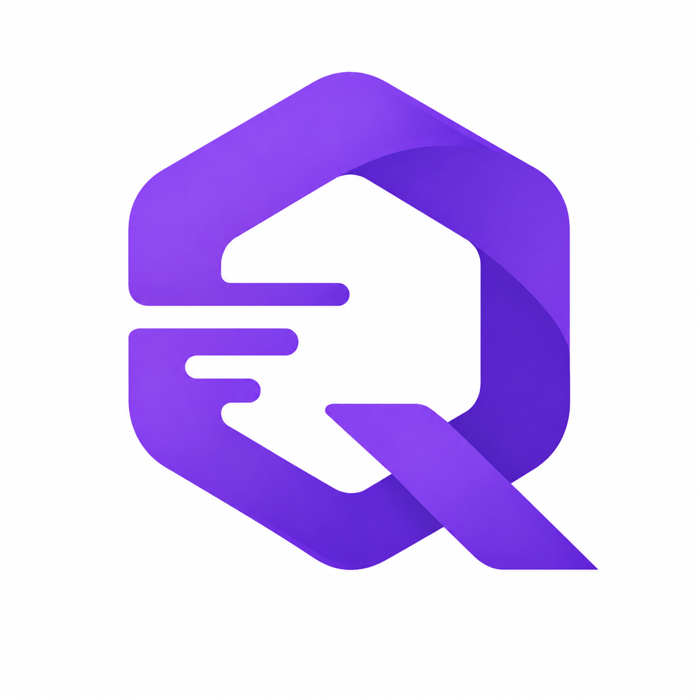

<div align="center">
  
  <h1>QueueDesk</h1>
  <p>AI-first internal service desk SaaS for modern teams</p>
</div>

---

**QueueDesk** routes, prioritises, and resolves support tickets automatically — powered by AI, built for 20–500 person companies.

## Live Demo

> ⚠️ **Setup required** — Supabase project + env vars needed before running locally (see below).

## Tech Stack

| Layer | Technology |
|-------|------------|
| Frontend | Next.js 16 (App Router) · TypeScript · Tailwind CSS |
| Database | Supabase (PostgreSQL + Auth + Realtime) |
| Auth | Supabase Auth (email/password) |
| AI | OpenAI API (user-supplied key) |
| Email | Resend (planned) |
| Hosting | Vercel (planned) |
| Queue/Workers | BullMQ (planned) |

## Three Portals

```
/ (marketing)     — Public landing page
/login, /register — Email auth
/agent/*          — Agent Console (tickets, queues, knowledge base)
/app/*            — Requester Portal (my tickets, new request)
/admin/*          — Admin Console (users, teams, SLA, queues, settings)
```

## Local Setup

### 1. Clone & Install

```bash
git clone https://github.com/your-org/QueueDesk.git
cd QueueDesk
npm install
```

### 2. Supabase

Create a project at [supabase.com](https://supabase.com) (Singapore region recommended).

Run the migration in **SQL Editor** — paste the contents of:
```
supabase/migrations/001_schema.sql
```
and click **Run**.

### 3. Environment Variables

Copy `.env.local.example` to `.env.local` and fill in:

```bash
NEXT_PUBLIC_SUPABASE_URL=https://your-project.supabase.co
NEXT_PUBLIC_SUPABASE_ANON_KEY=your-anon-key
```

Find both values in **Supabase Dashboard → Project Settings → API**.

### 4. Run

```bash
npm run dev
```

Open [http://localhost:3000](http://localhost:3000).

## Architecture

### Multi-Tenancy
Every business table carries a `tenant_id`. Row Level Security (RLS) enforces tenant isolation — a user can only see data belonging to their workspace.

```sql
-- Example RLS policy (ticket table)
CREATE POLICY "Users see own tenant tickets"
  ON ticket FOR ALL
  USING (tenant_id = app.current_tenant_id());
```

### Authentication Flow

```
Register → Supabase Auth (auth.users) + app_user (public schema)
         → tenant created simultaneously
         → auto-redirect to /login (email confirm)

Login → Supabase Auth session
      → middleware checks session cookie
      → protected routes redirect to /login
```

### Key Design Decisions

See `planning/` for full ADR, PRD, and technical specs:

| Document | Contents |
|----------|----------|
| `planning/README.md` | Project status tracker |
| `Prepare && Planning/QueueDesk MVP PRD.md` | Feature scope, user stories |
| `Prepare && Planning/QueueDesk PostgreSQL 数据模型研究报告.md` | Schema rationale |
| `Prepare && Planning/QueueDesk REST API 设计规范报告.md` | API design |
| `Prepare && Planning/QueueDesk AI 模块架构方案.md` | AI integration arch |
| `Prepare && Planning/QueueDesk Email Intake 技术设计.md` | Email intake pipeline |
| `Prepare && Planning/QueueDesk 前端 UIUX 设计规范.md` | UI/UX spec |
| `Prepare && Planning/QueueDesk 架构决策记录草案.md` | ADRs |

## What's Implemented

| Feature | Status |
|---------|--------|
| DB Migration v001 (multi-tenant schema) | ✅ Done |
| Next.js scaffold (20 routes) | ✅ Done |
| Supabase SSR client setup | ✅ Done |
| Login + Register with Supabase Auth | ✅ Done |
| Route protection via proxy (middleware) | ✅ Done |
| Toast notification system | ✅ Done |
| Landing page (marketing site) | ✅ Done |
| Agent/Requester/Admin portal shells | ✅ Done |
| Email Intake (Resend webhook) | ⬜ TODO |
| AI ticket routing | ⬜ TODO |
| SLA clock + business calendar | ⬜ TODO |
| Knowledge base with vector search | ⬜ TODO |
| BullMQ job queue | ⬜ TODO |
| Realtime ticket updates | ⬜ TODO |

## Commit Conventions

This project follows [Conventional Commits](https://www.conventionalcommits.org/):

```
feat:     New feature
fix:      Bug fix
docs:     Documentation only
refactor: Code restructure (no feature change)
chore:    Tooling, deps, config
perf:     Performance improvement
```

## License

MIT

---

<p align="center">
  <strong>🏢 Oasis Company</strong><br>
  <a href="https://github.com/zbbsdsb">GitHub Organization</a>
</p>

<p align="center">
  Explore our ecosystem:
  <a href="https://github.com/zbbsdsb/QueueDesk">QueueDesk</a> ·
  <a href="https://github.com/zbbsdsb/muserock">MuseRock</a> ·
  <a href="https://github.com/zbbsdsb/R-U-Socrates">R U Socrates</a> ·
  <a href="https://github.com/zbbsdsb/pwl-reading-companion">pwl-reading</a>
</p>
